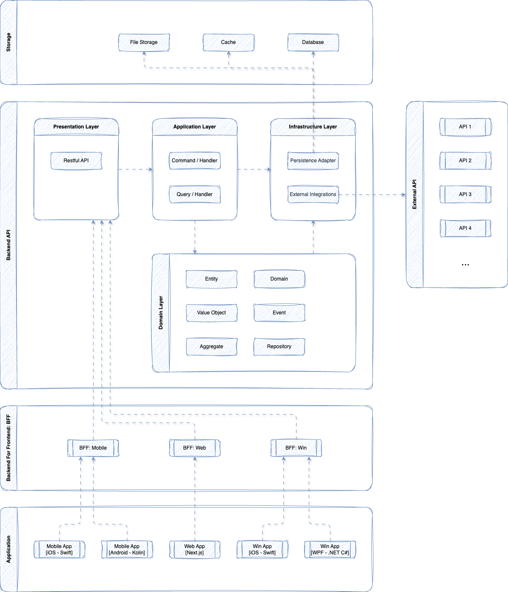
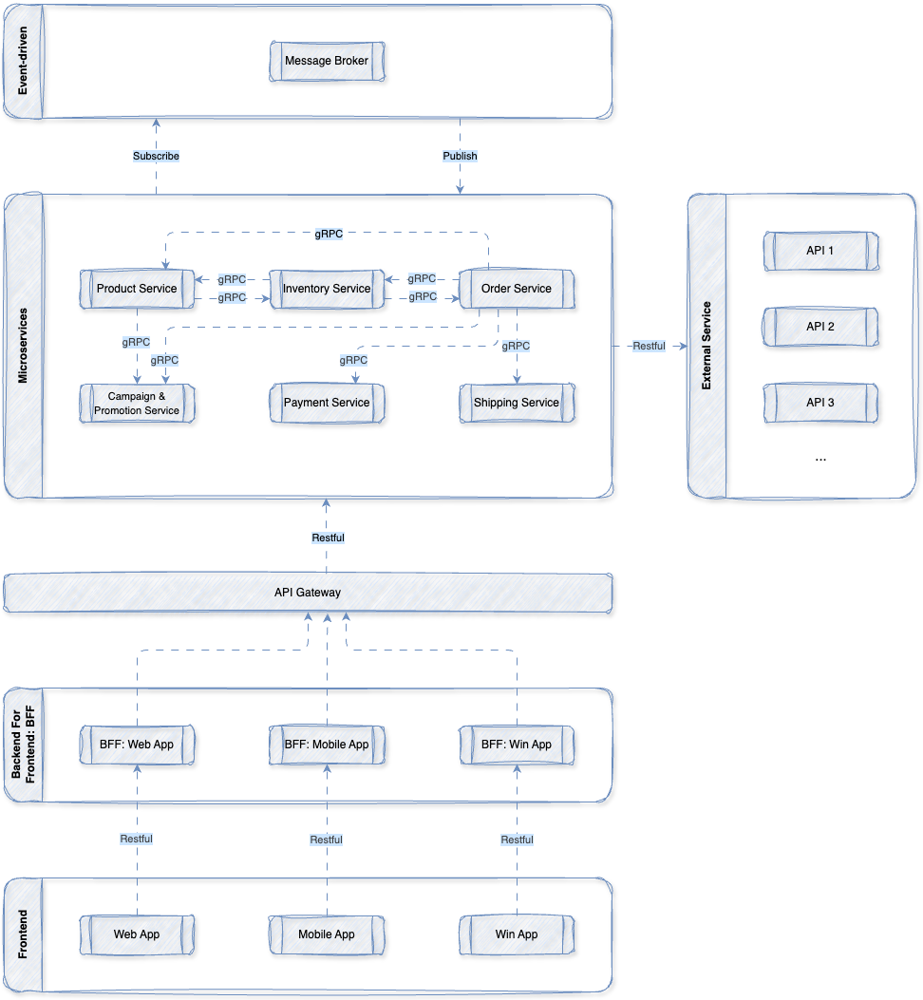
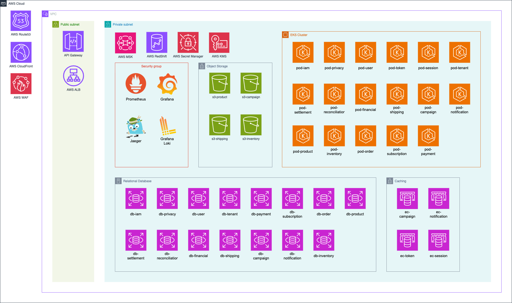

# TECHNICAL DESIGN: e-Commerce Platform

## TERMS AND DEFINITIONS

| Term                                            | Definition                                                                                                                                                                                                     |
| ----------------------------------------------- | -------------------------------------------------------------------------------------------------------------------------------------------------------------------------------------------------------------- |
| Domain-Driven Design (DDD)                      | แนวทางการออกแบบซอฟต์แวร์โดยยึด Domain หรือบริบทธุรกิจเป็นหลัก เพื่อให้โครงสร้างระบบสะท้อนกฎทางธุรกิจ คำศัพท์ทางธุรกิจ และกระบวนการทำงานจริง                                                                                           |
| Event-Driven Design (EDD)                       | แนวทางการออกแบบระบบที่ให้แต่ละส่วนสื่อสารกันผ่าน Event หรือ Event ที่เกิดขึ้นในระบบ เช่น Order Created, Payment Paid หรือ Stock Reserved                                                                                        |
| Bounded Context                                 | ขอบเขตของ Domain ที่มีความหมาย business rule, business model และ business language เพื่อป้องกันความสับสนระหว่างส่วนต่าง ๆ ของระบบที่ใช้คำเหมือนกันแต่ความหมายไม่เหมือนกัน                                                           |
| Clean Architecture                              | แนวทางการออกแบบโครงสร้างระบบโดยแยกความรับผิดชอบเป็นชั้น ๆ (Layers) เพื่อให้ business logic ไม่ผูกติดกับ framework, database, UI หรือ external service ทำให้ระบบดูแล แก้ไข และทดสอบได้ง่ายขึ้น                                        |
| Coupling                                        | ระดับการพึ่งพากันระหว่างส่วนต่าง ๆ ของระบบ ถ้า coupling สูง การแก้ส่วนหนึ่งอาจกระทบอีกหลายส่วน แต่ถ้า coupling ต่ำ ระบบจะดูแล แก้ไข และขยายต่อได้ง่ายกว่า                                                                               |
| Scalability                                     | ความสามารถของระบบในการรองรับการเติบโต เช่น ผู้ใช้มากขึ้น ข้อมูลมากขึ้น หรือ request มากขึ้น โดยยังสามารถเพิ่ม resource หรือปรับโครงสร้างเพื่อให้ระบบทำงานต่อได้อย่างเหมาะสม                                                                |
| Command Query Responsibility Segregation (CQRS) | แนวทางการออกแบบระบบที่แยกการทำงานฝั่ง Command สำหรับการเปลี่ยนแปลงข้อมูล เช่น create, update, delete ออกจากฝั่ง Query สำหรับการอ่านข้อมูล เพื่อให้แต่ละฝั่งออกแบบและ scale ได้เหมาะกับหน้าที่ของตัวเอง                                        |
| Presentation Layer                              | Layer ที่รับผิดชอบการติดต่อกับผู้ใช้หรือระบบภายนอก เช่น API Controller, Web UI หรือ Mobile UI โดยทำหน้าที่รับ request, ตรวจรูปแบบข้อมูลเบื้องต้น และส่งต่อไปยัง Application Layer                                                         |
| Application Layer                               | Layer ที่ควบคุม flow การทำงานของ use case เช่น สร้าง order, สมัครสมาชิก หรือชำระเงิน โดยประสานงานระหว่าง Domain Layer กับ Infrastructure Layer แต่ไม่ควรเก็บ business rule หลักไว้เอง                                            |
| Domain Layer                                    | Layer ที่เก็บ business logic, business rule, entity, value object และ domain behavior ที่สำคัญของระบบ เป็นหัวใจของระบบและไม่ควรผูกติดกับ framework, database หรือ external service                                           |
| Domain Layer: Entity                            | object ใน Domain ที่มี identity เป็นของตัวเอง เช่น Order, Customer หรือ Product ถึงข้อมูลบางอย่างจะเปลี่ยนไป แต่ยังถือว่าเป็นสิ่งเดิมเพราะอ้างอิงจาก identity เดิม                                                                     |
| Domain Layer: Value Object                      | object ใน Domain ที่ไม่มี identity เป็นของตัวเอง และใช้เปรียบเทียบจากค่าข้างใน เช่น Money, Address หรือ DateRange ถ้าค่าทุกอย่างเหมือนกันก็ถือว่าเป็นสิ่งเดียวกัน                                                                         |
| Domain Layer: Aggregate                         | กลุ่มของ Entity และ Value Object ที่ถูกจัดให้อยู่ภายใต้ขอบเขตเดียวกัน โดยมี Aggregate Root เป็นตัวหลักในการควบคุมการเปลี่ยนแปลง เพื่อรักษา business rule และความถูกต้องของข้อมูล                                                         |
| Domain Layer: Domain Service                    | service ที่เก็บ business logic ที่ไม่เหมาะจะอยู่ใน Entity หรือ Value Object ใดตัวหนึ่งโดยตรง มักใช้กับ logic ที่เกี่ยวข้องกับหลาย object ใน Domain                                                                                  |
| Domain Event                                    | เหตุการณ์สำคัญที่เกิดขึ้นใน Domain และมีความหมายทางธุรกิจ เช่น Order Created, Payment Completed หรือ Stock Reserved ใช้เพื่อบอกว่าสิ่งหนึ่งเกิดขึ้นแล้ว และส่วนอื่นของระบบสามารถนำ event นี้ไปทำงานต่อได้                                         |
| Infrastructure Layer                            | Layer ที่รับผิดชอบรายละเอียดทางเทคนิค เช่น database, repository implementation, external API, file storage, message queue, email service หรือ cloud service เพื่อให้ชั้นอื่นเรียกใช้งานผ่าน interface ได้โดยไม่ต้องรู้รายละเอียดภายใน  |
| Decouple Service                                | การออกแบบให้ service แต่ละตัวลดการพึ่งพากันโดยตรง เพื่อให้แต่ละ service สามารถพัฒนา แก้ไข deploy และ scale ได้อิสระมากขึ้น โดยไม่ทำให้การเปลี่ยนแปลงของ service หนึ่งกระทบ service อื่นมากเกินไป                                         |
| Eventual Consistency                            | แนวคิดที่ยอมให้ข้อมูลในแต่ละ service หรือแต่ละ database ไม่ตรงกันทันทีในช่วงเวลาสั้น ๆ แต่สุดท้ายระบบจะค่อย ๆ sync จนข้อมูลกลับมาถูกต้องตรงกัน เหมาะกับระบบแบบ distributed system หรือ microservices ที่ต้องการลดการผูกติดกันและเพิ่ม scalability  |
| Google Remote Procedure Calls (gRPC)            | รูปแบบการสื่อสารระหว่างระบบหรือ service โดยใช้ contract ที่ชัดเจนผ่านไฟล์ `.proto` เหมาะกับการสื่อสารแบบ service-to-service ที่ต้องการ performance ดีและโครงสร้างข้อมูลแน่นอน                                                        |
| RESTful                                         | รูปแบบการออกแบบ API ที่ใช้ HTTP method เช่น GET, POST, PUT, DELETE เพื่อให้ client เรียกใช้งาน resource ของระบบได้อย่างเข้าใจง่ายและเป็นมาตรฐาน                                                                               |
| Service-to-Service                              | การสื่อสารระหว่าง service ภายในระบบ เช่น Order Service เรียก Payment Service เพื่อทำงานต่อ เหมาะกับระบบที่แยกเป็นหลาย service หรือ microservices                                                                             |
| Client-to-System                                | การสื่อสารจาก client เช่น Web, Mobile App หรือ External Partner เข้ามายังระบบผ่าน API หรือช่องทางที่ระบบเปิดไว้                                                                                                             |
| Async Communication                             | การสื่อสารแบบไม่ต้องรอผลลัพธ์ทันที ผู้ส่งสามารถส่ง message หรือ event ออกไป แล้วให้ปลายทางประมวลผลภายหลัง เหมาะกับงานที่ต้องการ decouple service และรองรับ scalability                                                              |
| Sync Communication                              | การสื่อสารแบบรอผลลัพธ์ทันที ผู้เรียกต้องรอ response จากปลายทางก่อนจึงจะทำงานต่อได้ เหมาะกับงานที่ต้องการคำตอบทันที เช่น ตรวจสอบข้อมูลหรือคำนวณผลลัพธ์แบบ real-time                                                                          |
| Fault Tolerance                                 | ความสามารถของระบบในการทำงานต่อได้ แม้บางส่วนของระบบจะเกิดปัญหา เช่น service ล่ม, network ขาด, database ช้า หรือ dependency ภายนอกใช้งานไม่ได้ชั่วคราว                                                                          |
| Transient Failure                               | ความผิดพลาดแบบชั่วคราวที่มักหายได้เองหรือสำเร็จเมื่อ retry ใหม่ เช่น network timeout, service ตอบช้า, database connection หลุด หรือ external API มีปัญหาชั่วครู่                                                                      |
| Circuit Breaker                                 | pattern ที่ใช้ตัดการเรียกไปยัง service ที่มีปัญหาชั่วคราว เพื่อป้องกันไม่ให้ระบบเรียกซ้ำจนล้มเป็นลูกโซ่ และจะค่อย ๆ เปิดให้ลองเรียกใหม่เมื่อ service ปลายทางเริ่มกลับมาปกติ                                                                        |
| Idempotency                                     | คุณสมบัติของ operation ที่เรียกซ้ำหลายครั้งแล้วผลลัพธ์สุดท้ายยังเหมือนเดิม เหมาะกับงานที่เสี่ยงถูก retry เช่น create order, payment หรือ transaction ต่าง ๆ                                                                               |
| Idempotency Key                                 | key ที่ใช้ระบุว่า request นี้เคยถูกประมวลผลแล้วหรือยัง เพื่อป้องกันการทำงานซ้ำ เช่น กดจ่ายเงินซ้ำ หรือ retry request แล้วระบบสร้าง order/payment ซ้ำ                                                                                       |
| Compensating Action                             | action ที่ใช้ชดเชยหรือย้อนผลกระทบจาก step ก่อนหน้าที่ทำสำเร็จไปแล้ว เมื่อ process หลักทำงานต่อไม่สำเร็จ เช่น ถ้าตัดเงินสำเร็จแล้วแต่สร้าง order ไม่สำเร็จ ระบบอาจต้องทำ refund เพื่อชดเชยผลลัพธ์                                                      |
| Saga Pattern                                    | pattern สำหรับจัดการ transaction ที่เกี่ยวข้องกับหลาย service โดยแบ่งงานใหญ่ออกเป็นหลาย step ย่อย และถ้า step ใดล้มเหลว ระบบจะใช้ compensating action เพื่อย้อนหรือชดเชยผลกระทบที่เกิดขึ้นแทนการ rollback แบบ database transaction เดียว |
| Choreography-based Saga                         | รูปแบบของ Saga Pattern ที่แต่ละ service ทำงานต่อกันผ่าน event โดยไม่มีตัวกลางคอยสั่งงานหลัก เมื่อ service หนึ่งทำงานเสร็จจะ publish event ออกไป แล้ว service อื่นที่สนใจ event นั้นจะทำงานต่อเอง                                            |
| Outbox Pattern                                  | pattern ที่ใช้บันทึก event หรือ message ลงใน database เดียวกับ business transaction ก่อน แล้วค่อยมี process แยกไปส่ง message ออกไปภายหลัง เพื่อป้องกันปัญหา business data ถูกบันทึกสำเร็จแต่ event ส่งไม่สำเร็จ                             |
| Idempotent Consumer                             | consumer ที่ถูกออกแบบให้รับ message เดิมซ้ำได้โดยไม่ทำให้ผลลัพธ์ผิดพลาด เช่น message ถูก retry หรือส่งซ้ำ แต่ระบบไม่สร้างข้อมูลซ้ำ ไม่ตัดเงินซ้ำ และไม่เปลี่ยนสถานะผิด                                                                              |
| At-least-once Delivery                          | รูปแบบการส่ง message ที่รับประกันว่า message จะถูกส่งถึงปลายทางอย่างน้อย 1 ครั้ง แต่อาจถูกส่งซ้ำได้ ดังนั้นฝั่ง consumer ควรออกแบบให้เป็น idempotent เพื่อป้องกันการประมวลผลซ้ำแล้วเกิดผลลัพธ์ผิดพลาด                                                |

## ARCHITECTURE SNAPSHOT

### MICROSERVICES ARCHITECTURE

#### CODE STRUCTURE

- Domain-Driven Design (DDD) + Clean Architecture
  - ใช้ DDD เพื่อแยก Business Domain ของ e-commerce เช่น Order, Product, Inventory, Payment, Campaign และ Fulfillment ออกเป็น Bounded Context
  - แต่ละ Domain สามารถพัฒนาและ deploy แยกกันได้ ลด coupling และเพิ่ม scalability
  - Clean Architecture ใช้เพื่อแยก layer ของ code ให้ maintain และ test ได้ง่าย
  - Layers:
    - Presentation Layer:
      - รับ request จาก BFF / API Gateway
      - ทำ validation และ map request → use case
      - ไม่มี business logic
    - Application Layer:
      - orchestrate use case ภายใน service เช่น Create Order, Apply Promotion
      - เรียก Domain + Repository
      - publish domain event
    - Domain Layer:
      - เก็บ business logic หลักของระบบ
      - ประกอบด้วย Entity, Value Object, Aggregate และ Domain Service
      - เช่น:
        - Order Aggregate (order, items, pricing, status)
        - Inventory Aggregate (stock, reservation)
    - Infrastructure Layer:
      - เชื่อมต่อ database, cache, message queue และ external services
      - implement repository และ integration
  - Tactical Patterns:
    - เป็น pattern สำหรับจัดโครงสร้าง Domain Model และ Business Logic
    - Entity - Object ที่มี identity และมี lifecycle
      - เช่น Order, Product, User
    - Value Object - Object ที่ไม่มี identity และ immutable
      - เช่น Money, Address, Discount
    - Aggregate - กลุ่มของ Entity/Value Object ที่ควบคุมผ่าน Aggregate Root
      - เช่น Order Aggregate (Order + OrderItem)
    - Domain Event - เหตุการณ์ที่สะท้อนการเปลี่ยนแปลงใน domain
      - เช่น OrderCreated, PaymentCompleted
    - Repository - abstraction สำหรับ persist aggregate
  - CQRS:
    - Command: สำหรับ write เช่น Create Order, Reserve Inventory
    - Query: สำหรับ read เช่น Product Listing, Order History
    - แยก read/write model เพื่อ optimize performance
  - Event-driven:
    - ใช้ Domain Event + Message Queue เพื่อ decouple service
    - รองรับ eventual consistency
    - flow ตัวอย่าง: Order → Inventory → Payment → Shipping

#### PROTOCOL

- gRPC (Service-to-Service)
  - ใช้สำหรับ synchronous communication ระหว่าง microservices
  - ใช้ protobuf (schema-first) และ HTTP/2 → latency ต่ำ
  - เหมาะกับ service ที่เรียกกันบ่อย เช่น Order ↔ Inventory ↔ Payment
- RESTful (Client-to-System)
  - ใช้สำหรับ Client (Web / Mobile / Partner) ผ่าน API Gateway หรือ BFF
  - ใช้ resource-based + JSON
  - รองรับ authentication เช่น JWT, OAuth2
- Event-driven (Async Communication)
  - ใช้สำหรับ async workflow ระหว่าง service
  - ใช้ Message Broker เช่น Kafka / RabbitMQ / NATS
  - ตัวอย่าง flow:
    - OrderCreated → InventoryReserved → PaymentCompleted → OrderShipped
  - ลด coupling และรองรับ scalability
- Fault Tolerance
  - Retry: retry เมื่อเกิด transient failure
    - ใช้ exponential backoff และ jitter เพื่อลด load
  - Circuit Breaker: ป้องกัน cascading failure
    - เปิด circuit เมื่อ failure rate สูง และปิดเมื่อระบบกลับมา
  - Timeout: ป้องกัน request ค้าง
    - กำหนด timeout ที่เหมาะสมสำหรับแต่ละ call
  - Idempotency: ป้องกันการประมวลผลซ้ำ (เช่น payment)
    - ใช้ idempotency key และตรวจสอบก่อนประมวลผล

### ARCHITECTURE PATTERN

- Event Driven Architecture
  - ใช้ Domain Event เพื่อสื่อสารระหว่าง Microservices
  - service publish/subscribe event แทน synchronous call
  - ลด coupling และรองรับ scalability
  - Example:
    - OrderCreated → Inventory reserve stock
    - InventoryReserved → Payment charge
    - PaymentCompleted → Shipping process
- Saga Pattern (Choreography-based)
  - ใช้จัดการ distributed transaction ผ่าน event-driven flow
  - แต่ละ service ทำงานเป็น step และ publish event ต่อ
  - หากล้มเหลว ใช้ compensation action
  - Example:
    - Order → Create Order
    - Inventory → Reserve Stock
    - Payment → Process Payment (fail)
    - Compensation:
      - Inventory → Release Stock
      - Order → Cancel Order
- Outbox Pattern
  - บันทึก event ลง database ก่อน (outbox table)
  - worker publish event ไป message broker
  - ป้องกัน event loss และ data inconsistency
- Idempotent Consumer
  - รองรับ at-least-once delivery
  - event ซ้ำต้องไม่ทำให้เกิด side effect
  - ใช้ event id / unique constraint ตรวจสอบความซ้ำ

### BACKEND API

#### Identity & Access Layer

Service: **IAM**

Manage authentication, authorization, and access control for users and services, including role-based access control (RBAC) and permission management.

- Stack:
  - [X] GoLang
  - [ ] .NET Core C#
  - [ ] Java Spring Boot
- Database:
  - [X] PostgreSQL
  - [ ] Microsoft SQL Server
  - [ ] Oracle
- Integration:
  - User Service
  - Token Service
  - Session Service
  - Tenant Service

**Reason**:

- IAM เป็น service ที่ต้องการ performance ดี
- request เยอะ
- logic มักเป็น stateless-heavy เช่น permission check, policy check, service authorization
- Go เหมาะกับ service ที่ต้องเบา เร็ว deploy ง่าย
- PostgreSQL เหมาะกับ RBAC, permission, role, policy, tenant mapping

---

Service: **Privacy**

Manage personally identifiable information (PII) and sensitive user data in compliance with PDPA and GDPR, including data encryption, masking, access control, audit logging, and data subject rights (excluding consent management).

- Stack:
  - [X] GoLang
  - [ ] .NET Core C#
  - [ ] Java Spring Boot
- Database:
  - [X] PostgreSQL (with field-level encryption)
  - [ ] Oracle
  - [ ] Microsoft SQL Server
- Integration:
  - User Service
  - Tenant Service
  - IAM Service

---

Service: **User**

Manage user accounts, profiles, and user-related domain logic, excluding authentication token and session lifecycle.

- Stack:
  - [ ] GoLang
  - [X] .NET Core C#
  - [ ] Java Spring Boot
- Database:
  - [ ] PostgreSQL
  - [ ] Oracle
  - [X] Microsoft SQL Server
- Cache:
  - [ ] Redis
- Object Storage:
  - [X] AWS S3
  - [ ] SeaweedFS
- Integration:
  - Tenant Service
  - Notification Service

---

Service: **Token**

Issue and validate access/refresh tokens, handle authentication tokens lifecycle.

- Stack:
  - [X] GoLang
  - [ ] .NET Core C#
  - [ ] Java Spring Boot
- Database:
  - [X] PostgreSQL (with field-level encryption)
  - [ ] Oracle
  - [ ] Microsoft SQL Server
- Cache:
  - [X] Redis
- Integration:
  - User Service
  - Session Service

---

Service: **Session**

Manage user sessions, session state, and session lifecycle (login/logout/expiry).

- Stack:
  - [X] GoLang
  - [ ] .NET Core C#
  - [ ] Java Spring Boot
- Database:
  - [X] PostgreSQL (with field-level encryption)
  - [ ] Oracle
  - [ ] Microsoft SQL Server
- Cache:
  - [X] Redis
- Integration:
  - User Service
  - Token Service

---

Service: **Tenant**

Manage multi-tenant configuration, tenant isolation, and tenant-level settings.

- Stack:
  - [X] GoLang
  - [ ] .NET Core C#
  - [ ] Java Spring Boot
- Database:
  - [X] PostgreSQL
  - [ ] Oracle
  - [ ] Microsoft SQL Server
- Integration:
  - User Service
  - Product Service
  - Order Service
  - Subscription Service

---

#### Core e-Commerce

Service: **Product**

Manage product catalog, categories, attributes, and product search indexing.

- Stack:
  - [ ] GoLang
  - [ ] .NET Core C#
  - [ ] Java Spring Boot
  - [X] NestJS
- Database:
  - [X] PostgreSQL
  - [ ] Oracle
  - [ ] Microsoft SQL Server
- Search / Indexing:
  - [X] AWS OpenSearch (ElasticSearch)
- Object Storage:
  - [ ] AWS S3
  - [X] SeaweedFS
- Integration:
  - Inventory Service
  - Campaign & Promotion Service
  - Tenant Service

---

Service: **Inventory**

- Description: Handle stock levels, reservation, allocation, and inventory consistency.

- Stack:
  - [X] GoLang
  - [ ] .NET Core C#
  - [ ] Java Spring Boot
- Database:
  - [X] PostgreSQL
  - [ ] Oracle
  - [ ] Microsoft SQL Server
- Integration:
  - Order Service
  - Product Service

---

Service: **Order**

Manage order lifecycle and coordinate order-related workflows across services.

- Stack:
  - [ ] GoLang
  - [X] .NET Core C#
  - [ ] Java Spring Boot
- Database:
  - [ ] PostgreSQL
  - [ ] Oracle
  - [X] Microsoft SQL Server
- Integration:
  - User Service
  - Product Service
  - Inventory Service
  - Payment Service
  - Shipping Service
  - Campaign & Promotion Service
  - Notification Service

---

#### Payment & Financial

Service: **Subscription**

Manage subscription plans, billing cycles, and subscription lifecycle (trial, active, expired).

- Stack:
  - [ ] GoLang
  - [X] .NET Core C#
  - [ ] Java Spring Boot
- Database:
  - [ ] PostgreSQL
  - [ ] Oracle
  - [X] Microsoft SQL Server
- Integration:
  - Payment Service
  - Tenant Service
  - Notification Service

---

Service: **Payment**

Process payments, handle transactions, and manage payment execution and status.

- Stack:
  - [ ] GoLang
  - [X] .NET Core C#
  - [ ] Java Spring Boot
- Database:
  - [ ] PostgreSQL
  - [ ] Oracle
  - [X] Microsoft SQL Server
- Object Storage:
  - [X] AWS S3
  - [ ] SeaweedFS
- Integration:
  - Order Service
  - Settlement Service
  - Reconciliation Service
  - Financial Service
  - Notification Service

---

Service: **Settlement**

Aggregate and calculate settlement amounts for financial reconciliation and payouts.

- Stack:
  - [ ] GoLang
  - [X] .NET Core C#
  - [ ] Java Spring Boot
- Database:
  - [ ] PostgreSQL
  - [ ] Oracle
  - [X] Microsoft SQL Server
- Integration:
  - Payment Service
  - Financial Service
  - Reconciliation Service

---

Service: **Reconciliation**

Compare and verify transaction records between internal systems and external payment data.

- Stack:
  - [ ] GoLang
  - [X] .NET Core C#
  - [ ] Java Spring Boot
- Database:
  - [ ] PostgreSQL
  - [ ] Oracle
  - [X] Microsoft SQL Server
- Integration:
  - Payment Service
  - Financial Service
  - Settlement Service

---

Service: **Financial**

Maintain financial ledger, accounting records, and ensure auditability of all transactions.

- Stack:
  - [ ] GoLang
  - [X] .NET Core C#
  - [ ] Java Spring Boot
- Database:
  - [ ] PostgreSQL
  - [ ] Oracle
  - [X] Microsoft SQL Server
- Integration:
  - Payment Service
  - Settlement Service
  - Reconciliation Service
  - Order Service

---

#### Fulfillment

Service: **Shipping**

Manage shipment creation, delivery tracking, and logistics coordination.

- Stack:
  - [ ] GoLang
  - [ ] .NET Core C#
  - [ ] Java Spring Boot
  - [X] NestJS
- Database:
  - [X] PostgreSQL
  - [ ] Oracle
  - [ ] Microsoft SQL Server
- Object Storage
  - [ ] AWS S3
  - [X] SeaweedFS
- Integration:
  - Order Service
  - Inventory Service

---

#### Growth / Marketing

Service: **Campaign & Promotion**

Evaluate promotion rules, discounts, and campaign eligibility for orders and products.

- Stack:
  - [X] GoLang
  - [ ] .NET Core C#
  - [ ] Java Spring Boot
- Database:
  - [X] PostgreSQL
  - [ ] Oracle
  - [ ] Microsoft SQL Server
- Object Storage:
  - [ ] AWS S3
  - [X] SeaweedFS
- Cache:
  - [ ] Redis
- Integration:
  - Product Service
  - Order Service
  - Tenant Service

---

#### Communication

Service: **Notification**

Handle asynchronous notifications (email, SMS, push) and message delivery workflows.

- Stack:
  - [X] GoLang
  - [ ] .NET Core C#
  - [ ] Java Spring Boot
  - [ ] Python (FastAPI)
- Database:
  - [X] PostgreSQL
  - [ ] Oracle
  - [ ] Microsoft SQL Server
- Cache:
  - [X] Redis
- Integration:
  - `N/A`

### BACKEND FOR FRONTEND (BFF)

- แยก BFF layer ออกจาก Mobile และ Web เพื่อ optimize response และ handle client-specific logic
- Responsibilities:
  - Aggregate data จาก microservices หลายๆ ตัวให้เป็น response เดียวสำหรับ client
  - Optimize response per client type
  - Handle client-specific logic
- Stack: GraphQL

### FRONTEND

#### Mobile Application

- iOS: Swift
- Android: Kotlin

#### Web Application

- Next.js

### OPERATIONAL INFRASTRUCTURE

- Container & Orchestration:
  - Docker
  - Kubernetes
- Networking & Gateway:
  - Kong (API Gateway)
  - Istio (Service Mesh, Load Balancing)
- Messaging:
  - Kafka
- Caching:
  - Redis
- Observability:
  - OpenTelemetry
    - Prometheus
    - Grafana
    - Loki
    - Jaeger
- Key Management System:
  - AWS KMS
- Secrets Management:
  - AWS Secrets Manager

---

## CLOUD ARCHITECTURE

### Network Architecture

- VPC (Virtual Private Cloud)
  - แยก environment: dev / staging / production
  - ใช้ Multi-AZ เพื่อ high availability
- Subnets:
  - Public Subnet:
    - Load Balancer (ALB)
    - API Gateway (Kong)
  - Private Subnet:
    - Kubernetes Nodes (EKS)
    - Internal Services
    - Databases
- Security:
  - Security Groups และ NACLs ควบคุม traffic
  - Private communication ระหว่าง services ผ่าน internal network

### Compute Layer

- Amazon EKS (Kubernetes)
  - ใช้ deploy microservices ทั้งหมด
  - รองรับ auto-scaling (HPA / Cluster Autoscaler)
  - แยก namespace ตาม domain หรือ environment
- Container Runtime:
  - Docker

### API & Traffic Management

- AWS Application Load Balancer (ALB)
  - รับ traffic จาก client (Web / Mobile)
  - Forward ไปยัง API Gateway
- Kong API Gateway
  - Routing ไปยัง BFF
  - Handle authentication (JWT), rate limiting, request validation
- BFF (GraphQL)
  - Deploy บน EKS
  - Aggregate data จาก microservices
- Istio Service Mesh
  - Service-to-service communication (mTLS)
  - Traffic control, retry, circuit breaking

### Data Layer

- Relational Database:
  - Amazon RDS (PostgreSQL)
    - ใช้สำหรับ service หลัก (Order, Payment, User, etc.)
    - Multi-AZ + automated backup
- Search:
  - Amazon OpenSearch (ElasticSearch)
    - ใช้สำหรับ product search
- Cache:
  - Amazon ElastiCache (Redis)
    - ใช้สำหรับ caching, session, token

### Messaging & Event Streaming

- Apache Kafka (Amazon MSK)
  - ใช้สำหรับ event-driven architecture
  - รองรับ async communication ระหว่าง services
  - ใช้ร่วมกับ Outbox Pattern

### Storage

- Amazon S3
  - เก็บ static assets (product images, documents)
  - ใช้เป็น object storage

### Security & Secrets

- AWS Secrets Manager
  - เก็บ secrets เช่น database credentials, API keys
- AWS KMS (Key Management Service)
  - จัดการ encryption keys
- IAM (AWS Identity and Access Management)
  - ควบคุมสิทธิ์ของ service และ resource

### Observability

- Metrics:
  - Prometheus + Grafana
- Logging:
  - Loki
- Tracing:
  - Jaeger + OpenTelemetry

### CI/CD (Optional - Recommended)

- Source Control:
  - GitHub / GitLab
- CI/CD Pipeline:
  - GitHub Actions / GitLab CI
- Deployment:
  - ArgoCD (GitOps)
  - Helm Charts สำหรับ Kubernetes

### High Availability & Scalability

- Multi-AZ deployment
- Auto Scaling (EKS + HPA)
- Load Balancing (ALB + Istio)
- Stateless services + externalized state

### Disaster Recovery

- Database backup (RDS automated snapshots)
- S3 versioning
- Multi-region replication (optional)

---
