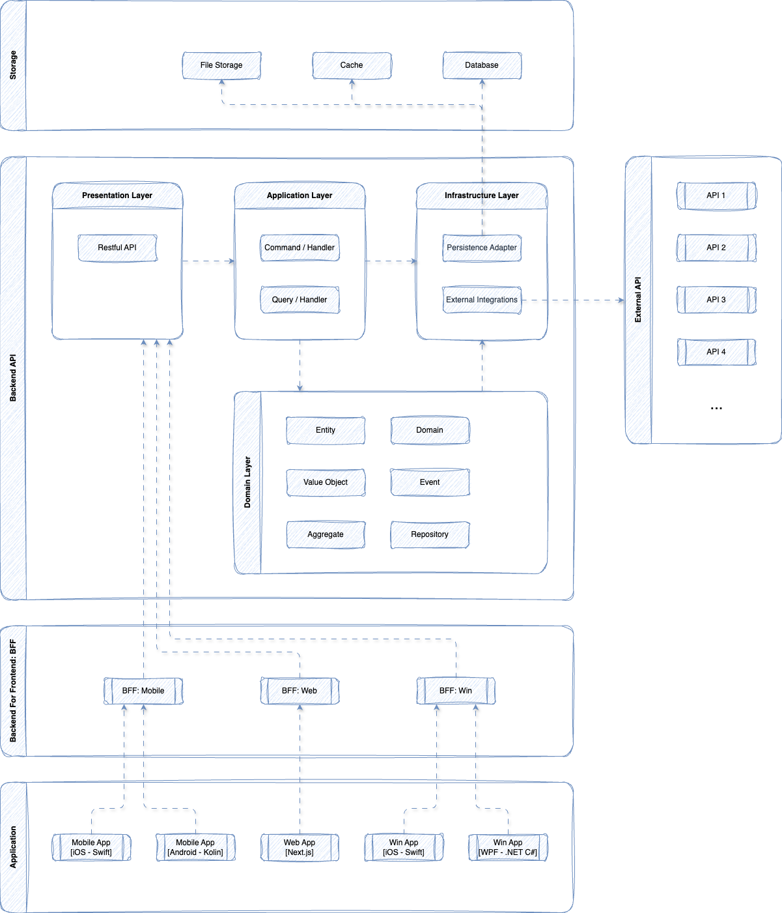
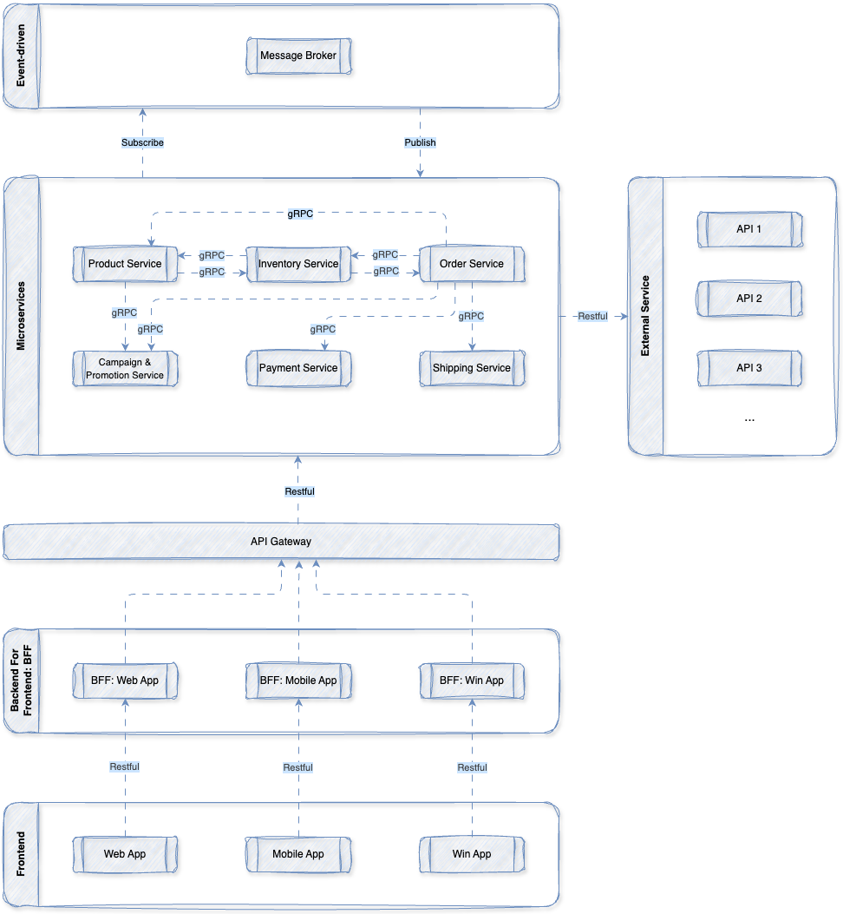
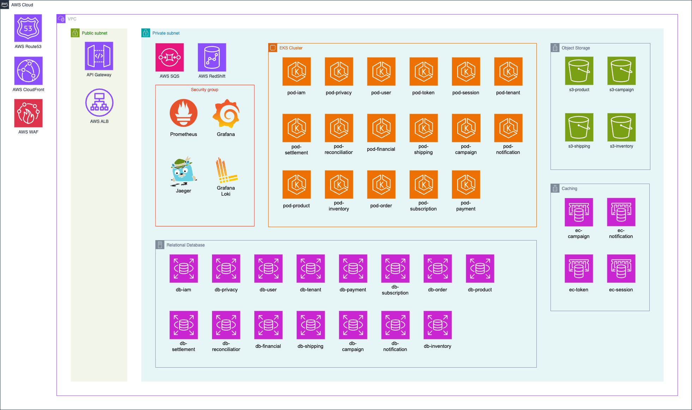

# TECHNICAL DESIGN

## ARCHITECTURE SNAPSHOT

### MICROSERVICES ARCHITECTURE

#### CODE STRUCTURE

- Domain-Driven Design (DDD) + Clean Architecture
  - ใช้ DDD เพื่อแยก Business Domain ของ e-commerce เช่น Order, Product, Inventory, Payment, Campaign และ Fulfillment ออกเป็น Bounded Context
  - แต่ละ Domain สามารถพัฒนาและ deploy แยกกันได้ ลด coupling และเพิ่ม scalability
  - Clean Architecture ใช้เพื่อแยก layer ของ code ให้ maintain และ test ได้ง่าย
  - Layers:
    - Presentation Layer:
      - รับ request จาก BFF / API Gateway
      - ทำ validation และ map request → use case
      - ไม่มี business logic
    - Application Layer:
      - orchestrate use case ภายใน service เช่น Create Order, Apply Promotion
      - เรียก Domain + Repository
      - publish domain event
    - Domain Layer:
      - เก็บ business logic หลักของระบบ
      - ประกอบด้วย Entity, Value Object, Aggregate และ Domain Service
      - เช่น:
        - Order Aggregate (order, items, pricing, status)
        - Inventory Aggregate (stock, reservation)
    - Infrastructure Layer:
      - เชื่อมต่อ database, cache, message queue และ external services
      - implement repository และ integration
  - Tactical Patterns:
    - เป็น pattern สำหรับจัดโครงสร้าง Domain Model และ Business Logic
    - Entity - Object ที่มี identity และมี lifecycle
      - เช่น Order, Product, User
    - Value Object - Object ที่ไม่มี identity และ immutable
      - เช่น Money, Address, Discount
    - Aggregate - กลุ่มของ Entity/Value Object ที่ควบคุมผ่าน Aggregate Root
      - เช่น Order Aggregate (Order + OrderItem)
    - Domain Event - เหตุการณ์ที่สะท้อนการเปลี่ยนแปลงใน domain
      - เช่น OrderCreated, PaymentCompleted
    - Repository - abstraction สำหรับ persist aggregate
  - CQRS:
    - Command: สำหรับ write เช่น Create Order, Reserve Inventory
    - Query: สำหรับ read เช่น Product Listing, Order History
    - แยก read/write model เพื่อ optimize performance
  - Event-driven:
    - ใช้ Domain Event + Message Queue เพื่อ decouple service
    - รองรับ eventual consistency
    - flow ตัวอย่าง: Order → Inventory → Payment → Shipping

#### PROTOCOL

- gRPC (Service-to-Service)
  - ใช้สำหรับ synchronous communication ระหว่าง microservices
  - ใช้ protobuf (schema-first) และ HTTP/2 → latency ต่ำ
  - เหมาะกับ service ที่เรียกกันบ่อย เช่น Order ↔ Inventory ↔ Payment
- RESTful (Client-to-System)
  - ใช้สำหรับ Client (Web / Mobile / Partner) ผ่าน API Gateway หรือ BFF
  - ใช้ resource-based + JSON
  - รองรับ authentication เช่น JWT, OAuth2
- Event-driven (Async Communication)
  - ใช้สำหรับ async workflow ระหว่าง service
  - ใช้ Message Broker เช่น Kafka / RabbitMQ / NATS
  - ตัวอย่าง flow:
    - OrderCreated → InventoryReserved → PaymentCompleted → OrderShipped
  - ลด coupling และรองรับ scalability
- Fault Tolerance
  - Retry: retry เมื่อเกิด transient failure
    - ใช้ exponential backoff และ jitter เพื่อลด load
  - Circuit Breaker: ป้องกัน cascading failure
    - เปิด circuit เมื่อ failure rate สูง และปิดเมื่อระบบกลับมา
  - Timeout: ป้องกัน request ค้าง
    - กำหนด timeout ที่เหมาะสมสำหรับแต่ละ call
  - Idempotency: ป้องกันการประมวลผลซ้ำ (เช่น payment)
    - ใช้ idempotency key และตรวจสอบก่อนประมวลผล

### ARCHITECTURE PATTERN

- Event Driven Architecture
  - ใช้ Domain Event เพื่อสื่อสารระหว่าง Microservices
  - service publish/subscribe event แทน synchronous call
  - ลด coupling และรองรับ scalability
  - Example:
    - OrderCreated → Inventory reserve stock
    - InventoryReserved → Payment charge
    - PaymentCompleted → Shipping process
- Saga Pattern (Choreography-based)
  - ใช้จัดการ distributed transaction ผ่าน event-driven flow
  - แต่ละ service ทำงานเป็น step และ publish event ต่อ
  - หากล้มเหลว ใช้ compensation action
  - Example:
    - Order → Create Order
    - Inventory → Reserve Stock
    - Payment → Process Payment (fail)
    - Compensation:
      - Inventory → Release Stock
      - Order → Cancel Order
- Outbox Pattern
  - บันทึก event ลง database ก่อน (outbox table)
  - worker publish event ไป message broker
  - ป้องกัน event loss และ data inconsistency
- Idempotent Consumer
  - รองรับ at-least-once delivery
  - event ซ้ำต้องไม่ทำให้เกิด side effect
  - ใช้ event id / unique constraint ตรวจสอบความซ้ำ

### BACKEND API

#### Identity & Access Layer

**IAM Service**:

- Description: Manage authentication, authorization, and access control for users and services, including role-based access control (RBAC) and permission management.
- Stack: GoLang
- Database: PostgreSQL
- Integration:
  - User Service
  - Token Service
  - Session Service
  - Tenant Service

**Privacy Service**:

- Description: Manage personally identifiable information (PII) and sensitive user data in compliance with PDPA and GDPR, including data encryption, masking, access control, audit logging, and data subject rights (excluding consent management).
- Stack: GoLang
- Database: PostgreSQL (with field-level encryption)
- Integration:
  - User Service
  - Tenant Service
  - IAM Service

**User Service**:

- Description: Manage user accounts, profiles, authentication data, and user-related domain logic.
- Stack: GoLang
- Database:
  - PostgreSQL
  - S3 (for profile images)
- Integration:
  - Tenant Service
  - Notification Service

**Token Service**:

- Description: Issue and validate access/refresh tokens, handle authentication tokens lifecycle.
- Stack: GoLang
- Database: Redis
- Integration:
  - User Service
  - Session Service

**Session Service**:

- Description: Manage user sessions, session state, and session lifecycle (login/logout/expiry).
- Stack: GoLang
- Database: Redis
- Integration:
  - User Service
  - Token Service

**Tenant Service**:

- Description: Manage multi-tenant configuration, tenant isolation, and tenant-level settings.
- Stack: GoLang
- Database: PostgreSQL
- Integration:
  - User Service
  - Product Service
  - Order Service
  - Subscription Service

---

#### Core e-Commerce

**Product Service**:

- Description: Manage product catalog, categories, attributes, and product search indexing.
- Stack: NestJS
- Database:
  - PostgreSQL
  - ElasticSearch
  - S3 (for profile images)
- Integration:
  - Inventory Service
  - Campaign & Promotion Service
  - Tenant Service

**Inventory Service**:

- Description: Handle stock levels, reservation, allocation, and inventory consistency.
- Stack: GoLang
- Database:
  - PostgreSQL
  - S3 (for shelf images)
- Integration:
  - Order Service
  - Product Service

**Order Service**:

- Description: Manage order lifecycle and coordinate order-related workflows across services.
- Stack: NestJS
- Database: PostgreSQL
- Integration:
  - User Service
  - Product Service
  - Inventory Service
  - Payment Service
  - Shipping Service
  - Campaign & Promotion Service
  - Notification Service

---

#### Payment & Financial

**Subscription Service**:

- Description: Manage subscription plans, billing cycles, and subscription lifecycle (trial, active, expired).
- Stack: .NET
- Database: PostgreSQL
- Integration:
  - Payment Service
  - Tenant Service
  - Notification Service

**Payment Service**:

- Description: Process payments, handle transactions, and manage payment execution and status.
- Stack: .NET
- Database: PostgreSQL
- Integration:
  - Order Service
  - Settlement Service
  - Reconciliation Service
  - Financial Service
  - Notification Service

**Settlement Service**:

- Description: Aggregate and calculate settlement amounts for financial reconciliation and payouts.
- Stack: .NET
- Database: PostgreSQL
- Integration:
  - Payment Service
  - Financial Service
  - Reconciliation Service

**Reconciliation Service**:

- Description: Compare and verify transaction records between internal systems and external payment data.
- Stack: .NET
- Database: PostgreSQL
- Integration:
  - Payment Service
  - Financial Service
  - Settlement Service

**Financial Service**:

- Description: Maintain financial ledger, accounting records, and ensure auditability of all transactions.
- Stack: .NET
- Database: PostgreSQL
- Integration:
  - Payment Service
  - Settlement Service
  - Reconciliation Service
  - Order Service

---

#### Fulfillment

**Shipping Service**:

- Description: Manage shipment creation, delivery tracking, and logistics coordination.
- Stack: NestJS
- Database:
  - PostgreSQL
  - S3 (for shipping label images)
- Integration:
  - Order Service
  - Inventory Service

---

#### Growth / Marketing

**Campaign & Promotion Service**:

- Description: Evaluate promotion rules, discounts, and campaign eligibility for orders and products.
- Stack: GoLang
- Database:
  - PostgreSQL
  - Redis
  - S3 (for campaign images)
- Integration:
  - Product Service
  - Order Service
  - Tenant Service

---

#### Communication

**Notification Service**:

- Description: Handle asynchronous notifications (email, SMS, push) and message delivery workflows.
- Stack: Python (FastAPI)
- Database:
  - Redis
  - PostgreSQL
- Integration:
  - User Service
  - Order Service
  - Payment Service

---

### BACKEND FOR FRONTEND (BFF)

- แยก BFF layer ออกจาก Mobile และ Web เพื่อ optimize response และ handle client-specific logic
- Responsibilities:
  - Aggregate data จาก microservices หลายๆ ตัวให้เป็น response เดียวสำหรับ client
  - Optimize response per client type
  - Handle client-specific logic
- Stack: GraphQL

### FRONTEND

#### Mobile Application

- iOS: Swift
- Android: Kotlin

#### Web Application

- Next.js

---

### OPERATIONAL INFRASTRUCTURE

- Container & Orchestration:
  - Docker
  - Kubernetes
- Networking & Gateway:
  - Kong (API Gateway)
  - Istio (Service Mesh, Load Balancing)
- Messaging:
  - Kafka
- Caching:
  - Redis
- Observability:
  - Prometheus
  - Grafana
  - Loki
  - Jaeger
  - OpenTelemetry
- Secrets Management:
  - AWS Secrets Manager

---

## CLOUD ARCHITECTURE

### Cloud Provider

- AWS (Amazon Web Services)

---

### Network Architecture

- VPC (Virtual Private Cloud)
  - แยก environment: dev / staging / production
  - ใช้ Multi-AZ เพื่อ high availability

- Subnets:
  - Public Subnet:
    - Load Balancer (ALB)
    - API Gateway (Kong)
  - Private Subnet:
    - Kubernetes Nodes (EKS)
    - Internal Services
    - Databases

- Security:
  - Security Groups และ NACLs ควบคุม traffic
  - Private communication ระหว่าง services ผ่าน internal network

---

### Compute Layer

- Amazon EKS (Kubernetes)
  - ใช้ deploy microservices ทั้งหมด
  - รองรับ auto-scaling (HPA / Cluster Autoscaler)
  - แยก namespace ตาม domain หรือ environment

- Container Runtime:
  - Docker

---

### API & Traffic Management

- AWS Application Load Balancer (ALB)
  - รับ traffic จาก client (Web / Mobile)
  - Forward ไปยัง API Gateway

- Kong API Gateway
  - Routing ไปยัง BFF
  - Handle authentication (JWT), rate limiting, request validation

- BFF (GraphQL)
  - Deploy บน EKS
  - Aggregate data จาก microservices

- Istio Service Mesh
  - Service-to-service communication (mTLS)
  - Traffic control, retry, circuit breaking

---

### Data Layer

- Relational Database:
  - Amazon RDS (PostgreSQL)
    - ใช้สำหรับ service หลัก (Order, Payment, User, etc.)
    - Multi-AZ + automated backup

- Search:
  - Amazon OpenSearch (ElasticSearch)
    - ใช้สำหรับ product search

- Cache:
  - Amazon ElastiCache (Redis)
    - ใช้สำหรับ caching, session, token

---

### Messaging & Event Streaming

- Apache Kafka (Amazon MSK)
  - ใช้สำหรับ event-driven architecture
  - รองรับ async communication ระหว่าง services
  - ใช้ร่วมกับ Outbox Pattern

---

### Storage

- Amazon S3
  - เก็บ static assets (product images, documents)
  - ใช้เป็น object storage

---

### Security & Secrets

- AWS Secrets Manager
  - เก็บ secrets เช่น database credentials, API keys

- AWS KMS (Key Management Service)
  - จัดการ encryption keys

- IAM (AWS Identity and Access Management)
  - ควบคุมสิทธิ์ของ service และ resource

---

### Observability

- Metrics:
  - Prometheus + Grafana

- Logging:
  - Loki

- Tracing:
  - Jaeger + OpenTelemetry

---

### CI/CD (Optional - Recommended)

- Source Control:
  - GitHub / GitLab

- CI/CD Pipeline:
  - GitHub Actions / GitLab CI

- Deployment:
  - ArgoCD (GitOps)
  - Helm Charts สำหรับ Kubernetes

---

### High Availability & Scalability

- Multi-AZ deployment
- Auto Scaling (EKS + HPA)
- Load Balancing (ALB + Istio)
- Stateless services + externalized state

---

### Disaster Recovery

- Database backup (RDS automated snapshots)
- S3 versioning
- Multi-region replication (optional)

---
