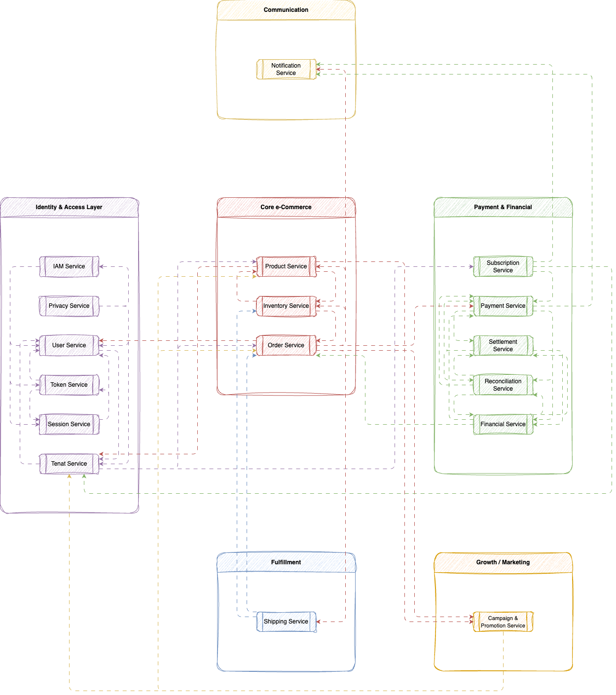

# e-Commerce Platform – Module Breakdown

เอกสารนี้อธิบายการแบ่ง **Modules (Domain-based Microservices)** ของระบบ e-Commerce Platform โดยออกแบบตามแนวคิด **Domain-Driven Design (DDD)** และรองรับ **Event-driven Architecture + Multi-tenant SaaS**

---

## Overview

เอกสารนี้แบ่งออกเป็น 2 ส่วนหลัก:

1. **Microservices Feature Breakdown** → แสดง feature-level (source of truth)
2. **Module Design (Derived)** → สรุปเป็น service-level สำหรับ implement จริง

> แนวคิดหลัก: Table = Fact, Module = Interpretation

---

## Microservices Feature Breakdown

### Table View (Source of Truth)

> Note: **Integrations** ในตารางนี้หมายถึง *Outbound dependencies* (service ที่ module นี้เรียกใช้งานออกไป)

| Domain        | Microservice           | Key Features               | Description                                                                                                                                                 | Integrations                                                                             |
| ------------- | ---------------------- | -------------------------- | ----------------------------------------------------------------------------------------------------------------------------------------------------------- | ---------------------------------------------------------------------------------------- |
| Identity      | IAM Service            | Login / SSO / OAuth2       | Provide authentication via username/password, SSO providers (Google, Microsoft, etc.), and OAuth2 flows including authorization code and client credentials | User Profile Service (fetch user), Tenant Service (tenant context), BFF (login endpoint) |
| Identity      | IAM Service            | Token management           | Issue, refresh, validate, and revoke JWT/Access tokens including expiration, scopes, and signature validation                                               | All services (token validation middleware)                                               |
| Identity      | IAM Service            | RBAC/ABAC                  | Manage roles, permissions, and attribute-based access control rules and enforce authorization at API level                                                  | All services (authorization layer)                                                       |
| Identity      | IAM Service            | Session management         | Maintain login sessions, refresh tokens, logout, and concurrent session control                                                                             | BFF (session usage), User Profile                                                        |
| Identity      | Tenant Service         | Tenant creation            | Create organization/tenant including default config, admin user, and initial setup                                                                          | IAM Service (admin user), Subscription Service                                           |
| Identity      | Tenant Service         | Tenant config              | Manage tenant-level configuration เช่น feature flags, branding, limits                                                                                       | All services (read tenant config)                                                        |
| Identity      | Tenant Service         | Isolation                  | Enforce tenant isolation at DB/schema/query level to prevent data leakage                                                                                   | All services (data access layer)                                                         |
| Identity      | Tenant Service         | Subscription binding       | Bind tenant to subscription plan and enforce limits เช่น quota, features                                                                                     | Subscription Service                                                                     |
| Identity      | User Profile Service   | User profile               | Store and manage user identity data เช่น name, email, contact                                                                                                | IAM Service                                                                              |
| Identity      | User Profile Service   | Preferences                | Store user preferences เช่น language, notification settings                                                                                                  | BFF, Notification Service                                                                |
| Identity      | User Profile Service   | User metadata              | Store extensible attributes เช่น tags, roles mapping, custom fields                                                                                          | IAM Service, Campaign Service                                                            |
| Identity      | Privacy & Consent      | Consent management         | Record and track user consent for data usage and marketing permissions                                                                                      | User Profile Service                                                                     |
| Identity      | Privacy & Consent      | PDPA/GDPR handling         | Support data privacy operations เช่น consent withdrawal, data export, deletion                                                                               | All services (data compliance)                                                           |
| Identity      | Privacy & Consent      | Data policy                | Enforce retention, masking, and access policies for sensitive data                                                                                          | All services                                                                             |
| Commerce      | Product Service        | Product CRUD               | Create, update, delete, and retrieve product catalog including attributes and media                                                                         | Inventory Service                                                                        |
| Commerce      | Product Service        | Category/Tag               | Manage product categorization and tagging for search and filtering                                                                                          | BFF, Search Service                                                                      |
| Commerce      | Product Service        | SKU/Variant                | Define product variants เช่น size/color and SKU-level attributes                                                                                             | Inventory Service                                                                        |
| Commerce      | Product Service        | Pricing (base)             | Maintain base price before discount including currency and price rules                                                                                      | Promotion Service                                                                        |
| Commerce      | Inventory Service      | Stock tracking             | Maintain real-time stock levels per SKU and location                                                                                                        | Order Service                                                                            |
| Commerce      | Inventory Service      | Reservation (soft lock)    | Reserve stock during checkout flow to prevent overselling                                                                                                   | Order Service                                                                            |
| Commerce      | Inventory Service      | Warehouse stock            | Manage stock across multiple warehouses and locations                                                                                                       | Fulfillment Service                                                                      |
| Commerce      | Order Service          | Create order               | Validate cart, calculate totals, and create order with initial state                                                                                        | Inventory Service, Payment Service, Promotion Service                                    |
| Commerce      | Order Service          | Cancel order               | Handle cancellation logic including refund trigger and stock release                                                                                        | Inventory Service, Payment Service                                                       |
| Commerce      | Order Service          | Order state machine        | Manage lifecycle เช่น CREATED → PAID → SHIPPED → COMPLETED → CANCELLED                                                                                       | Payment Service, Shipping Service                                                        |
| Commerce      | Order Service          | Orchestration              | Coordinate workflow across services using sync (API) and async (events)                                                                                     | All services via Event Backbone                                                          |
| Commerce      | Order Service          | Order history              | Provide query for user order history and details                                                                                                            | BFF                                                                                      |
| Financial     | Payment Service        | Payment processing         | Handle payment initiation, authorization, capture, and failure handling                                                                                     | Order Service                                                                            |
| Financial     | Payment Service        | Gateway integration        | Integrate with external payment providers เช่น Stripe, Omise                                                                                                 | External Payment Gateway                                                                 |
| Financial     | Payment Service        | Payment status             | Update and publish payment result เช่น success/fail/refund                                                                                                   | Order Service, Event Backbone                                                            |
| Financial     | Settlement Service     | Commission calculation     | Calculate platform fees, commission, and revenue per order                                                                                                  | Payment Service                                                                          |
| Financial     | Settlement Service     | Revenue split              | Split revenue between platform and vendors based on rules                                                                                                   | Payment Service                                                                          |
| Financial     | Settlement Service     | Vendor settlement          | Trigger payout process to vendors and record settlement status                                                                                              | Financial Ledger Service                                                                 |
| Financial     | Reconciliation Service | Transaction validation     | Validate internal transaction data against expected rules                                                                                                   | Payment Service                                                                          |
| Financial     | Reconciliation Service | Payment gateway comparison | Compare internal records with external gateway reports                                                                                                      | External Payment Gateway                                                                 |
| Financial     | Reconciliation Service | Error detection            | Detect mismatch, missing transactions, and anomalies                                                                                                        | Financial Ledger Service                                                                 |
| Financial     | Financial Ledger       | Double-entry accounting    | Record all financial transactions using debit/credit model                                                                                                  | Payment Service, Settlement Service                                                      |
| Financial     | Financial Ledger       | Audit log                  | Maintain immutable audit trail for all financial operations                                                                                                 | All services                                                                             |
| Financial     | Financial Ledger       | Financial traceability     | Enable tracing from order → payment → settlement → ledger                                                                                                   | Reconciliation Service                                                                   |
| Fulfillment   | Shipping Service       | Shipping fee calculation   | Calculate shipping cost based on rules เช่น distance, weight                                                                                                 | Order Service                                                                            |
| Fulfillment   | Shipping Service       | Carrier integration        | Integrate with logistics providers เช่น Kerry, DHL                                                                                                           | External Carrier APIs                                                                    |
| Fulfillment   | Shipping Service       | Tracking                   | Track shipment status and update delivery progress                                                                                                          | Notification Service                                                                     |
| Fulfillment   | Fulfillment Service    | Picking/packing            | Handle warehouse picking and packing process                                                                                                                | Inventory Service                                                                        |
| Fulfillment   | Fulfillment Service    | Shipment workflow          | Manage end-to-end shipment process from warehouse to carrier                                                                                                | Shipping Service                                                                         |
| Fulfillment   | Fulfillment Service    | Warehouse operation        | Manage warehouse activities เช่น inbound/outbound, stock movement                                                                                            | Inventory Service                                                                        |
| Growth        | Campaign Service       | Campaign setup             | Create and manage marketing campaigns with schedule and scope                                                                                               | Promotion Service                                                                        |
| Growth        | Campaign Service       | Rule engine                | Define dynamic rules เช่น discount condition, eligibility                                                                                                    | Order Service                                                                            |
| Growth        | Campaign Service       | Targeting                  | Target specific users or segments based on attributes                                                                                                       | User Profile Service                                                                     |
| Growth        | Promotion Service      | Coupon/discount logic      | Apply discounts เช่น percentage, fixed amount, bundle                                                                                                        | Order Service                                                                            |
| Growth        | Promotion Service      | Validation                 | Validate coupon usage เช่น expiry, limit, eligibility                                                                                                        | Order Service                                                                            |
| Growth        | Promotion Service      | Usage tracking             | Track redemption usage per user/campaign                                                                                                                    | Analytics Service                                                                        |
| Communication | Notification Service   | Email/SMS/Push             | Send notifications across channels based on events                                                                                                          | All services via Event Backbone                                                          |
| Communication | Notification Service   | Template engine            | Manage reusable notification templates                                                                                                                      | Campaign Service                                                                         |
| Communication | Notification Service   | Event trigger              | Subscribe to events and trigger notifications accordingly                                                                                                   | Event Backbone                                                                           |
| Experience    | BFF (GraphQL)          | Aggregation                | Aggregate data from multiple services into single response                                                                                                  | All services                                                                             |
| Experience    | BFF (GraphQL)          | Client-specific API        | Provide tailored APIs for web/mobile clients                                                                                                                | All services                                                                             |
| Experience    | BFF (GraphQL)          | Performance optimization   | Optimize queries using batching, caching, and partial response                                                                                              | Cache Layer                                                                              |
| Platform      | Event Backbone         | Kafka event streaming      | Publish/subscribe events across services asynchronously                                                                                                     | All services                                                                             |
| Platform      | Event Backbone         | Saga orchestration         | Manage distributed transactions using choreography pattern                                                                                                  | Order Service, Payment Service                                                           |
| Platform      | Event Backbone         | Async communication        | Enable decoupled communication between services                                                                                                             | All services                                                                             |
| Platform      | Outbox                 | Reliable event publishing  | Ensure events are published reliably with DB consistency                                                                                                    | Event Backbone                                                                           |
| Platform      | Idempotency            | Duplicate prevention       | Prevent duplicate processing using idempotency keys                                                                                                         | All services                                                                             |

---

## Service Design

> This section groups the feature-level definitions from the table above into service boundaries and implementation responsibilities.

---

## 1. Identity & Access Domain

### IAM Service

**Scope:** Authentication + Authorization Core

**Responsibilities:**

- Login / SSO / OAuth2 flow
- Token lifecycle (issue / refresh / revoke)
- RBAC / ABAC enforcement
- Session management

**Key Integrations:**

- User Profile Service
- Tenant Service
- BFF
- All services (auth middleware)

---

### Tenant Service

**Scope:** Multi-tenant management

**Responsibilities:**

- Tenant creation & bootstrap
- Tenant configuration (feature flags, limits)
- Data isolation enforcement
- Subscription binding

**Key Integrations:**

- IAM Service
- Subscription Service
- All services

---

### User Profile Service

**Scope:** User data management

**Responsibilities:**

- User profile data
- Preferences (language, notification)
- Extensible metadata

**Key Integrations:**

- IAM Service
- Notification Service
- Campaign Service

---

### Privacy & Consent Service

**Scope:** Compliance & data governance

**Responsibilities:**

- Consent tracking
- PDPA/GDPR operations (export/delete)
- Data policy enforcement

**Key Integrations:**

- All services

---

## 2. Commerce Domain

### Product Service

**Scope:** Product catalog

**Responsibilities:**

- Product CRUD
- Category / Tag
- SKU / Variant
- Base pricing

**Key Integrations:**

- Inventory Service
- Promotion Service
- BFF
- Search Service

---

### Inventory Service

**Scope:** Stock management

**Responsibilities:**

- Stock tracking (real-time)
- Reservation (soft lock)
- Multi-warehouse support

**Key Integrations:**

- Order Service
- Fulfillment Service

---

### Order Service (Core)

**Scope:** Business orchestration

**Responsibilities:**

- Order creation / cancellation
- Order state machine
- Cross-service orchestration (sync + async)
- Order history query

**Key Integrations:**

- Inventory Service
- Payment Service
- Promotion Service
- Shipping Service
- Event Backbone

---

## 3. Financial Domain

### Payment Service

**Scope:** Payment processing

**Responsibilities:**

- Payment lifecycle (authorize/capture)
- External gateway integration
- Payment status event publishing

**Key Integrations:**

- Order Service
- External Payment Gateway
- Event Backbone

---

### Settlement Service

**Scope:** Revenue calculation

**Responsibilities:**

- Commission calculation
- Revenue split
- Vendor settlement

**Key Integrations:**

- Payment Service
- Financial Ledger Service

---

### Reconciliation Service

**Scope:** Financial validation

**Responsibilities:**

- Transaction validation
- Gateway comparison
- Error detection

**Key Integrations:**

- Payment Service
- External Gateway
- Financial Ledger

---

### Financial Ledger Service

**Scope:** Accounting system

**Responsibilities:**

- Double-entry accounting
- Audit log
- Financial traceability

**Key Integrations:**

- Payment Service
- Settlement Service
- Reconciliation Service

---

## 4. Fulfillment Domain

### Shipping Service

**Scope:** Delivery handling

**Responsibilities:**

- Shipping fee calculation
- Carrier integration
- Shipment tracking

**Key Integrations:**

- Order Service
- External Carrier APIs
- Notification Service

---

### Fulfillment Service

**Scope:** Warehouse execution

**Responsibilities:**

- Picking / Packing
- Shipment workflow
- Warehouse operations

**Key Integrations:**

- Inventory Service
- Shipping Service

---

## 5. Growth Domain

### Campaign Service

**Scope:** Marketing engine

**Responsibilities:**

- Campaign setup
- Rule engine
- Targeting

**Key Integrations:**

- Promotion Service
- Order Service
- User Profile Service

---

### Promotion Service

**Scope:** Discount engine

**Responsibilities:**

- Coupon / discount logic
- Validation
- Usage tracking

**Key Integrations:**

- Order Service
- Analytics Service

---

## 6. Communication Domain

### Notification Service

**Scope:** Messaging system

**Responsibilities:**

- Email / SMS / Push sending
- Template engine
- Event-driven notification

**Key Integrations:**

- Event Backbone
- All services

---

## 7. Experience Layer

### BFF (GraphQL)

**Scope:** Client abstraction layer

**Responsibilities:**

- Aggregation
- Client-specific API
- Performance optimization (cache/batching)

**Key Integrations:**

- All services
- Cache Layer

---

## 8. Platform Layer

### Event Backbone

**Scope:** Async communication core

**Responsibilities:**

- Kafka event streaming
- Saga choreography
- Decoupled communication

**Key Integrations:**

- All services

---

### Outbox

**Scope:** Reliability layer

**Responsibilities:**

- Reliable event publishing
- Transactional consistency

**Key Integrations:**

- Event Backbone

---

### Idempotency

**Scope:** Consistency protection

**Responsibilities:**

- Prevent duplicate processing
- Ensure safe retries

**Key Integrations:**

- All services

---

## Design Principle (Derived)

- Table = **Single Source of Truth**
- Module = **Logical grouping of features**
- Integration = **System contract (implicit)**
- Architecture = **Event-driven + Distributed consistency (Saga)**

---

## Next Step

- Define API Contract per feature
- Define Event Catalog (Kafka topics + payload)
- Define Service Ownership per team
- Define Deployment boundary (per microservice)

---

## Summary

- Table = Detailed Feature Specification (ละเอียดระดับ implement)
- Module Design = Service Boundary (ระดับ deploy/service)
- Integrations = Dependency Graph (พื้นฐานของ system flow)

---
