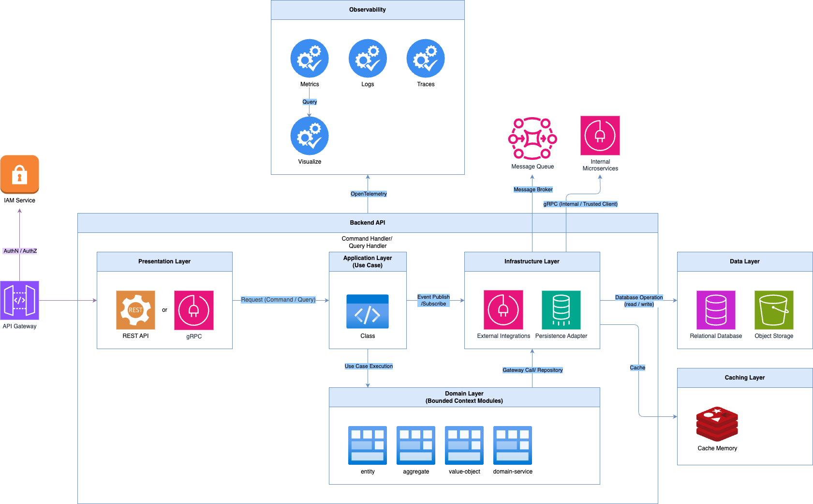
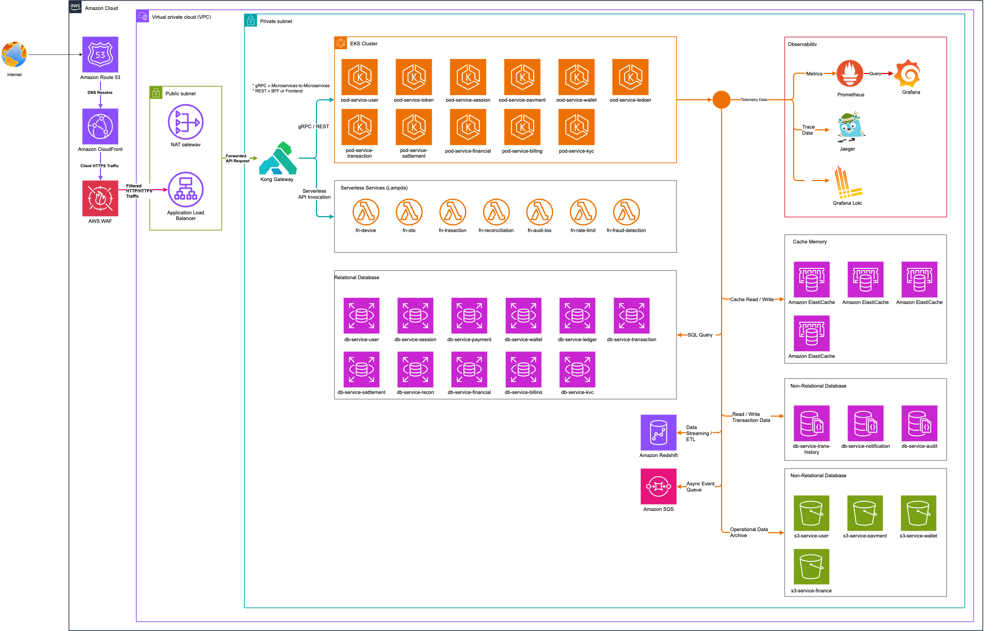

# TECHNICAL DESIGN

## ARCHITECTURE SNAPSHOT

### MICROSERVICES ARCHITECTURE

#### CODE STRUCTURE

- Domain Driven-Design (DDD)

  - ใช้เพื่อจัดการระบบที่มีหลาย Business Domain โดยแยกแต่ละ Domain ออกเป็น Bounded Context (ขอบเขตของ Domain)
  - เพื่อลด Complexity ของ System และป้องกัน Business Logic Overlap (หรือ Cross-domain coupling) ระหว่าง Domain
  - แต่ละ Domain สามารถถูกพัฒนา ดูแล และ deploy แยกกันได้ ทำให้ทีมสามารถมี Service Owner ของแต่ละ Domain ได้อย่างชัดเจน
  - DDD Layers
    - Presentation Layer: Layer สำหรับรับและตอบสนอง request เช่น Web API หรือ gRPC endpoint โดยไม่ควรมี Business Logic
    - Application Layer: ทำหน้าที่ orchestrate use case ของระบบ เช่น การเรียก Domain Service, Aggregate หรือ Repository เพื่อให้ business flow ทำงานครบ
    - Domain Layer: เก็บ Business Logic หลักของ Domain เช่น Entity, Value Object, Aggregate และ Domain Service
    - Infrastructure Layer: Layer ที่เชื่อมต่อกับระบบภายนอก เช่น Database, Message Queue หรือ External Services
  - DDD Tactical Patterns
    - Entity: Object ที่มี Identity ชัดเจน และสามารถเปลี่ยนแปลงสถานะ (state) ได้ตลอด lifecycle
    - Value Object: Object ที่ไม่มี Identity ใช้แทนค่าทาง domain เช่น Money หรือ Email โดยเมื่อค่ามีการเปลี่ยนแปลงจะสร้าง object ใหม่แทน
    - Aggregate: กลุ่มของ Entity และ Value Object ที่ถูกควบคุมผ่าน Aggregate Root เพื่อบังคับใช้ Business Rules ภายใน domain
    - Domain Event: Event ที่สะท้อนเหตุการณ์สำคัญใน Business Domain ซึ่งเกิดจากการเปลี่ยนแปลงของ Business Logic
    - Repository: abstraction layer สำหรับจัดการการอ่านและบันทึกข้อมูลของ Aggregate โดยซ่อนรายละเอียดของ database

- CQRS
  - ใช้เพื่อแยกการทำงานของ Command และ Query ออกจากกัน
    - Command: ใช้สำหรับการเปลี่ยนแปลงข้อมูล เช่น Create, Update, Delete
    - Query: ใช้สำหรับการอ่านข้อมูล เช่น Inquiry หรือ Reporting
  - การแยกนี้ช่วยให้สามารถออกแบบ Read Model และ Write Model ให้เหมาะกับลักษณะการใช้งานของแต่ละฝั่ง
  - รวมถึงช่วยให้ Business Logic ของฝั่ง Command ซึ่งมักมีความซับซ้อนมากกว่าฝั่ง Query ถูกจัดการอย่างชัดเจนและสามารถทดสอบได้ง่ายขึ้น

#### PROTOCOL

- gRPC (Service Mesh) - Microservices-to-Microservices
  - เป็น Strong Contract (schema-first) โดยใช้ Protocol Buffers (protobuf) ทำให้รู้ว่า method ใดสามารถเรียกใช้ได้ และมี request / response model แบบใด
  - Support Service ที่พัฒนาด้วยคนละภาษาได้ สามารถสื่อสารกันด้วย Protocol Buffers (protobuf)
  - ใช้ HTTP/2 และ Binary Protocol ทำให้มี latency ต่ำ และ payload ขนาดเล็กกว่า REST (JSON)
  - เหมาะสำหรับ Microservice-to-Microservice Communication ที่มีการเรียกใช้งานระหว่าง Service อยู่บ่อยครั้ง
- RESTful - External API / Client-to-Service
  - ใช้สำหรับการสื่อสารระหว่าง Client (Web / Mobile / Third-party) กับระบบผ่าน HTTP API
  - ใช้รูปแบบ Resource-based API เช่น /users, /wallets, /transactions
  - ใช้ HTTP Methods มาตรฐาน เช่น GET, POST, PUT, PATCH, DELETE เพื่อสื่อความหมายของ operation
  - ใช้ JSON เป็น payload format เนื่องจากเป็นมาตรฐานที่รองรับได้ดีใน Web และ Mobile ecosystem
  - เหมาะสำหรับ Public API, Partner Integration และ Client-facing API ผ่าน API Gateway
  - สามารถทำ Authentication ผ่านมาตรฐาน เช่น OAuth2, JWT หรือ API Key
  - สามารถทำ Rate Limiting, Request Validation และ API Security ผ่าน API Gateway (Kong)
- Fault Tolerance (Code Layer)
  - ใช้เพื่อเพิ่มความทนทานของระบบเมื่อเกิด network failure หรือ service dependency มีปัญหา
  - Retry: ใช้สำหรับ retry request เมื่อเกิด transient failure
  - Circuit Breaker: ป้องกัน cascading failure เมื่อ downstream service ล้ม
  - Timeout: ป้องกัน request ค้างนานเกินไป
  - Idempotency: ป้องกันการประมวลผลซ้ำในกรณีที่ request ถูก retry

### ARCHITECTURE PATTERN

- Event Driven Architecture
  - เมื่อมี Command ที่เปลี่ยนแปลงข้อมูลสำเร็จ ระบบสามารถ publish Domain Event และให้ Service อื่น ๆ subscribe เพื่อทำงานต่อได้
- Saga Pattern (Distributed Transaction Management): ใช้ Compensation Action แทน Distributed Transaction
  - ใช้สำหรับจัดการ Transaction ที่ต้องทำงานข้ามหลาย Microservices
  - แต่ละ Service จะทำงานเป็นลำดับของ Step
  - หาก Step ใดล้มเหลว จะใช้ Compensation Action ของแต่ละ Service เพื่อย้อนการทำงานก่อนหน้า แทนการใช้ Distributed Transaction
  - Example
    - Payment Service → Create Payment
    - Wallet Service → Debit Wallet
    - Ledger Service → Record Ledger (ล้มเหลว)
    - [Compensation Action]
    - Wallet Service → Refund Wallet
    - Payment Service → Cancel Payment
- Outbox Pattern: บันทึก event ลง DB ก่อน แล้ว worker ค่อย publish เมื่อ process สำเร็จแล้ว
- Idempotent Consumer: ถ้า Event เดิมถูกส่งมาซ้ำ ระบบต้องไม่ประมวลผลซ้ำ (unique constraint)

### BACKEND API

- User Service: จัดการข้อมูลผู้ใช้งาน เช่น profile, account status และข้อมูลพื้นฐานของผู้ใช้
  - Stack: GoLang
  - Database: 
    - Postgres (AWS RDS | Primary Node (Write), Read Replica)
    - AWS S3
  - Integration:
    - OTP Service
    - Device Service
    - KYC Service
    - Wallet Service
    - Notification Service
- Device Service: จัดการข้อมูลอุปกรณ์ของผู้ใช้ เช่น device fingerprint และ trusted device
  - Stack: Python (Lampda)
  - Database: Redis
  - Integration:
    - User Service
    - Session Service
    - Fraud Detection Service
    - OTP Service
- OTP Service: สร้างและตรวจสอบ OTP สำหรับ authentication และ transaction verification
  - Stack: Python (Lampda)
  - Database: Redis
  - Integration:
    - User Service
    - Device Service
    - Payment Service
    - Transaction Service
- Token Service: สร้างและตรวจสอบ Access Token สำหรับระบบ authentication
  - Stack: GoLang
  - Database: Redis
  - Integration:
    - Session Service
    - User Service
    - API Gateway
- Session Service: จัดการ user session เช่น refresh token, revoke session และ device session tracking
  - Stack: GoLang
  - Database:
    - Redis: Access Token Cache
    - Postgres: Refresh Token (Revork, Audit, Track Device)
  - Integration:
    - Token Service
    - User Service
    - Device Service
    - Fraud Detection Service
- Payment Service: จัดการ payment flow เช่น create payment, authorize payment และ cancel payment
  - Stack: GoLang
  - Database:
    - Postgres (AWS RDS | Primary Node (Write), Read Replica)
    - AWS S3
  - Integration:
    - Wallet Service
    - Transaction Service
    - Fraud Detection Service
    - Settlement Service
    - Notification Service
- Wallet Service: จัดการ wallet balance เช่น debit, credit และ wallet inquiry
  - Stack: GoLang
  - Database:
    - Postgres (AWS RDS | Primary Node (Write), Read Replica)
    - Redis: Cache Balance
    - AWS S3
  - Integration:
    - Transaction Service
    - Ledger Service
    - Payment Service
    - Settlement Service
    - Fraud Detection Service
- Ledger Service: บันทึกบัญชีทางการเงินแบบ double-entry ledger เพื่อรักษาความถูกต้องของข้อมูลทางบัญชี
  - Stack: GoLang
  - Database: Postgres (AWS RDS | Primary Node (Write), Read Replica)
  - Integration:
    - Wallet Service
    - Transaction Service
    - Financial Service
    - Settlement Service
    - Reconciliation Service
- Transaction Service: จัดการ lifecycle ของ transaction เช่น create, processing, success และ failed
  - Stack: GoLang
  - Database:
    - MongoDB (AWS DocumentDB - MongoDB-compatible)
    - Redis: Support Case Idempotency Key
  - Integration:
    - Wallet Service
    - Payment Service
    - Ledger Service
    - Fraud Detection Service
    - Transaction History Service
    - Settlement Service
- Transaction History Service: เก็บ transaction history สำหรับ query และ reporting โดย optimized สำหรับ read-heavy workload
  - Stack: Python (Lampda)
  - Database: MongoDB (AWS DocumentDB - MongoDB-compatible)
  - Integration:
    - Transaction Service
    - Wallet Service
    - Financial Service
- Settlement Service: จัดการ settlement ระหว่างระบบ เช่น settlement กับธนาคารหรือ merchant
  - Stack: GoLang
  - Database:
    - Postgres (AWS RDS | Primary Node (Write), Read Replica)
      - ACID
      - Financial Integrity
      - Relational Data
  - Integration:
    - Payment Service
    - Ledger Service
    - Financial Service
    - Reconciliation Service
- Reconciliation Service: ตรวจสอบความถูกต้องของข้อมูล transaction ระหว่างระบบภายในและ external systems
  - Stack: GoLang
  - Database:
    - Postgres (AWS RDS | Primary Node (Write), Read Replica)
    - Redis
  - Integration:
    - Settlement Service
    - Ledger Service
    - Payment Service
    - Financial Service
- Financial Service: จัดการ financial reporting และ accounting related operations
  - Stack: GoLang
  - Database:
    - Postgres (AWS RDS | Primary Node (Write), Read Replica)
    - AWS S3
  - Integration:
    - Ledger Service
    - Settlement Service
    - Billing Service
    - Transaction Service
- Billing Service: จัดการ billing เช่น service fee, commission และ invoice generation
  - Stack: GoLang
  - Database: Postgres (AWS RDS | Primary Node (Write), Read Replica)
  - Integration:
    - Payment Service
    - Financial Service
    - Transaction Service
    - Settlement Service
- KYC Service: จัดการกระบวนการยืนยันตัวตนของผู้ใช้ เช่น document verification และ KYC status
  - Stack: GoLang
  - Database: Postgres (AWS RDS | Primary Node (Write), Read Replica)
  - Integration:
    - User Service
    - Fraud Detection Service
    - Payment Service
    - Notification Service
- Notification Service: จัดการการส่ง notification เช่น email, SMS และ push notification
  - Stack: GoLang
  - Database: MongoDB (AWS DocumentDB - MongoDB-compatible)
  - Integration:
    - User Service
    - Payment Service
    - Transaction Service
    - KYC Service
- Audit Log Service: เก็บ audit trail ของทุก action ในระบบเพื่อ compliance และ security investigation
  - Stack: Python (Lampda)
  - Database:
    - MongoDB (AWS DocumentDB - MongoDB-compatible)
    - S3
  - Integration:
    - User Service
    - Payment Service
    - Transaction Service
    - KYC Service
    - Fraud Detection Service
- Rate Limiting Service: ควบคุมจำนวน request ต่อ user หรือ IP เพื่อป้องกัน abuse และ DDoS
  - Stack: Python (Lampda)
  - Database: Redis
  - Integration:
    - API Gateway
    - User Service
    - Token Service
- Fraud Detection Service: ตรวจจับธุรกรรมที่มีความเสี่ยงหรือพฤติกรรมผิดปกติของผู้ใช้งาน
  - Stack: Python (Lampda)
  - Database: Redis
  - Integration:
    - Transaction Service
    - Wallet Service
    - Payment Service
    - Device Service
    - User Service

- WEB APPLICATION: Next.js

### OPERATIONAL INFRASTRUCTURE

- CACHE: Redis
  - Fraud Detection Cache
  - Wallet Balance Cache
- ORCHESTRATION: Kubernetes
- CONTAINERIZATION: Docker
- SECRETS MANAGER: AWS Secrets Manager
  - AWS KMS
- API GATEWAY: Kong
- LOAD BALANCE: Istio
  - Service Mesh
  - Traffic Management
- MESSAGE QUEUE: Kafka
- LOGGING & OBSERVABILITY:
  - METRICS: Prometheus
  - VISUALIZATION: Grafana
  - LOGGING: Grafana Loki
  - TRACING: Jaeger
  - TELEMETRY: OpenTelemetry
- DATA WAREHOUSE: AWS Redshift

## CLOUD ARCHITECTURE

ระบบถูก deploy บน Amazon Web Services (AWS) โดยแยก Infrastructure ตาม Layer และระบุว่าแต่ละ resource ใช้กับ service ใดในระบบ

### Edge Layer

- Amazon Route 53 (Domain Name System - DNS)
  - Purpose:
    - จัดการ Domain
    - DNS Routing
  - Used By:
    - Web Application
    - Public API Endpoint

- Amazon CloudFront (Content Delivery Network - CDN)
  - Purpose:
    - Cache Static Assets
    - ลด Latency สำหรับผู้ใช้
  - Used By:
    - Next.js Web Application
  - Origin:
    - Amazon Simple Storage Service (S3)
    - Application Load Balancer (ALB)

- AWS Web Application Firewall (WAF)
  - Purpose:
    - ป้องกัน OWASP Top 10
    - Block malicious requests
  - Attached To:
    - CloudFront
    - Application Load Balancer (ALB)

### Traffic Entry Layer

- AWS Application Load Balancer (ALB)
  - Instances:
    - 2 Nodes (Multi-AZ)
  - Purpose:
    - รับ HTTPS Traffic จาก Internet
    - Forward Request ไปยัง Kubernetes Cluster
  - Used By:
    - Kong API Gateway

- Kong API Gateway
  - Deployment:
    - Kubernetes (Amazon Elastic Kubernetes Service - EKS)
  - Instances:
    - 3 Pods
  - Purpose:
    - API Authentication
    - API Routing
    - Rate Limiting
  - Used By:
    - Mobile Application
    - Web Application
    - Partner API

### Container Platform

- Amazon Elastic Kubernetes Service (EKS)

Cluster Node Groups:

- General Services Node Group
  - Instance Type:
    - m6i.large
  - Nodes:
    - 3
  - Used By Services:
    - User Service
    - Notification Service
    - KYC Service
    - Billing Service

- Core Transaction Node Group
  - Instance Type:
    - c6i.xlarge
  - Nodes:
    - 4
  - Used By Services:
    - Wallet Service
    - Payment Service
    - Transaction Service
    - Ledger Service
    - Settlement Service

- Worker / Async Processing Node Group
  - Instance Type:
    - m6i.large
  - Nodes:
    - 2
  - Used By:
    - Kafka Consumer Workers
    - Background Processing Jobs

### Serverless Compute

- AWS Lambda

Used By Services:

- Device Service
  - Runtime:
    - Python
  - Instances:
    - Auto Scaling

- OTP Service
  - Runtime:
    - Python
  - Instances:
    - Auto Scaling

- Transaction History Service
  - Runtime:
    - Python
  - Instances:
    - Auto Scaling

- Reconciliation Service
  - Runtime:
    - Python
  - Instances:
    - Auto Scaling

- Audit Log Service
  - Runtime:
    - Python
  - Instances:
    - Auto Scaling

- Rate Limiting Service
  - Runtime:
    - Python
  - Instances:
    - Auto Scaling

- Fraud Detection Service
  - Runtime:
    - Python
  - Instances:
    - Auto Scaling

### Relational Database Layer

- Amazon Relational Database Service (RDS - PostgreSQL)

#### Core Transaction Database

- Instance Type:
  - db.r6g.large
- Primary Node:
  - 1
- Read Replica:
  - 2

Used By Services:

- User Service
- Wallet Service
- Payment Service
- Transaction Service

#### Financial Database

- Instance Type:
  - db.r6g.large
- Primary Node:
  - 1
- Read Replica:
  - 1

Used By Services:

- Ledger Service
- Settlement Service
- Billing Service
- Financial Service

#### Compliance Database

- Instance Type:
  - db.r6g.large
- Primary Node:
  - 1
- Read Replica:
  - 1

Used By Services:

- KYC Service
- Audit Log Service

#### NoSQL Database Layer

- Amazon DocumentDB (MongoDB Compatible)

Cluster Configuration:

- Instance Type:
  - db.r6g.large
- Nodes:
  - 3

Used By Services:

- Notification Service
- Transaction History Service
- Audit Log Service

Purpose:

- Flexible Schema
- Read-heavy Workload

### Cache Layer

- Amazon ElastiCache for Redis

#### Session Cache

- Node Type:
  - cache.r6g.large
- Nodes:
  - 2

Used By:

- Token Service
- Session Service

#### Wallet Balance Cache

- Node Type:
  - cache.r6g.large
- Nodes:
  - 2

Used By:

- Wallet Service
- Transaction Service

#### Fraud Detection Cache

- Node Type:
  - cache.r6g.large
- Nodes:
  - 2

Used By:

- Fraud Detection Service
- Transaction Service

### Event Streaming Layer

- Amazon Managed Streaming for Apache Kafka (MSK)

Cluster Configuration:

- Broker Nodes:
  - 3
- Instance Type:
  - kafka.m5.large

Used By Services:

- Transaction Service
- Wallet Service
- Payment Service
- Settlement Service
- Notification Service

Example Events:

- TransactionCreated
- WalletDebited
- PaymentCompleted
- SettlementCompleted

### Object Storage

- Amazon Simple Storage Service (S3)

Buckets:

- audit-log-storage
  - Used By:
    - Audit Log Service

- file-storage
  - Used By:
    - User Service
    - KYC Service

- analytics-data-lake
  - Used By:
    - Data Pipeline
    - Analytics

- system-backup
  - Used By:
    - Database Backup

### Data Warehouse

- Amazon Redshift

Cluster Configuration:

- Node Type:
  - ra3.large
- Nodes:
  - 2

Used For:

- Financial Reporting
- Transaction Analytics
- Business Intelligence

Data Pipeline:

Kafka → Data Processing → S3 → Redshift

### Security Layer

- AWS Secrets Manager

Used By:

- All Backend Services

Stores:

- Database Credentials
- API Keys
- External Service Secrets

---

- AWS Key Management Service (KMS)

Used For Encryption:

- RDS
- S3
- Secrets Manager

### Observability

- Prometheus
  - Used By:
    - Kubernetes Services
  - Purpose:
    - Metrics Collection

- Grafana
  - Used For:
    - Monitoring Dashboard

- Grafana Loki
  - Used For:
    - Centralized Logging

- Jaeger
  - Used For:
    - Distributed Tracing

- OpenTelemetry (OTel)
  - Used By:
    - All Microservices
  - Purpose:
    - Metrics
    - Tracing
    - Telemetry
