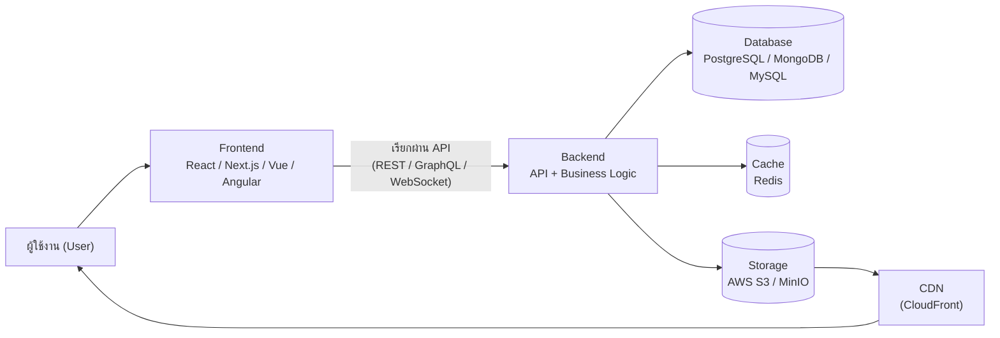
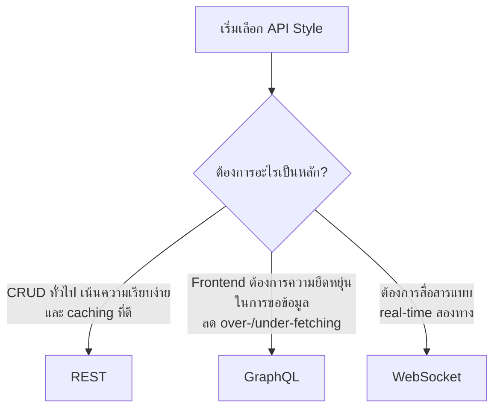
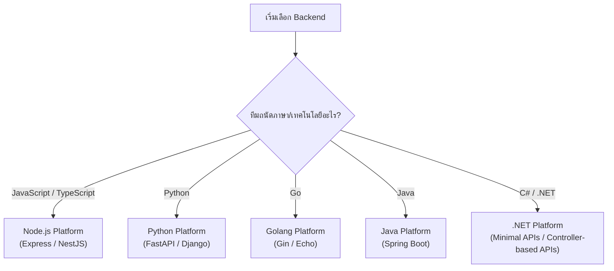
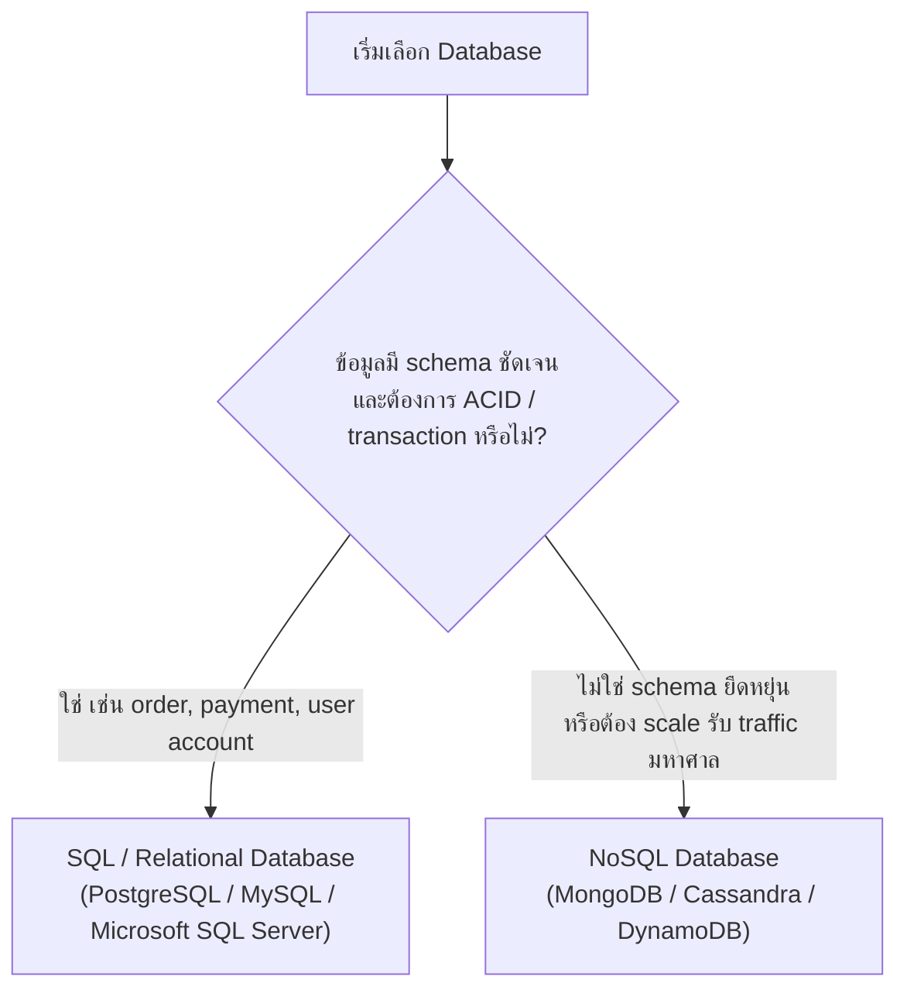

# Technology Stack Guide

เอกสารนี้จะช่วยให้คุณเลือก tech stack ที่เหมาะสมสำหรับสร้าง E-Commerce, E-Wallet หรือ Social Network Platform โดยสรุปข้อดี ข้อเสีย และสถานการณ์ที่เหมาะกับแต่ละตัวเลือก เพื่อให้ตัดสินใจได้ง่ายขึ้นโดยไม่ต้องไปหาข้อมูลกระจัดกระจาย

---

## Table of Contents

- [System Architecture Overview](#system-architecture-overview)
- [Terms and Definitions](#terms-and-definitions)
- Stack
  - [Backend](#backend)
  - [Frontend](#frontend)
  - [Database](#database)
  - [Storage](#storage)
  - [Cache](#cache)

---

## System Architecture Overview

ก่อนลงรายละเอียดแต่ละส่วน ลองดูภาพรวมก่อนว่าแต่ละ component ในระบบเชื่อมกันอย่างไร เพื่อให้เห็นว่า Backend, Frontend, Database, Storage และ Cache ที่จะพูดถึงต่อไปนี้ ทำหน้าที่อะไรในภาพใหญ่

อ่านแผนภาพนี้แบบง่าย ๆ ได้ตามนี้:

- **Frontend** คือสิ่งที่ผู้ใช้เห็นและกดใช้งาน แล้วส่ง request ไปหา Backend ผ่าน API
- **Backend** รับ request มาประมวลผลตาม business logic แล้วไปอ่าน/เขียนข้อมูลที่ **Database**
- **Cache** (เช่น Redis) ช่วยให้ Backend ดึงข้อมูลที่ใช้บ่อยได้เร็วขึ้น โดยไม่ต้องไปที่ Database ทุกครั้ง
- **Storage** (เช่น AWS S3) เก็บไฟล์อย่างรูปภาพหรือเอกสาร แล้วส่งต่อให้ผู้ใช้อย่างรวดเร็วผ่าน **CDN**

ส่วนถัดไปของเอกสารจะอธิบายแต่ละ component เหล่านี้ทีละส่วน พร้อมตัวเลือกที่แนะนำและเหตุผลประกอบ

---

## Terms and Definitions

ก่อนเข้าเนื้อหา มาทำความเข้าใจ technical term ที่จะเจอบ่อย ๆ ในเอกสารนี้กันก่อน เผื่อใครยังไม่คุ้น จะได้อ่านส่วนถัดไปได้ลื่นขึ้น

**ภาพรวมระบบ**

- **API (Application Programming Interface):** ช่องทางที่ frontend หรือระบบอื่นใช้คุยกับ backend เช่น ขอข้อมูลสินค้า, สั่งซื้อ, login
- **Backend / Frontend:** Backend คือส่วน "เบื้องหลัง" ที่จัดการข้อมูลและ logic ของระบบ ส่วน Frontend คือหน้าตาที่ผู้ใช้เห็นและกดใช้งาน
- **Business logic:** กฎและขั้นตอนการทำงานของระบบ เช่น เงื่อนไขการคำนวณส่วนลด หรือการตรวจสอบยอดเงินก่อนโอน
- **Authentication / Authorization:** Authentication คือการ "ยืนยันตัวตน" ว่าคุณเป็นใคร (เช่น login) ส่วน Authorization คือการ "ตรวจสิทธิ์" ว่าคุณทำอะไรได้บ้างหลัง login แล้ว
- **Microservices:** วิธีออกแบบระบบโดยแยกเป็นบริการย่อย ๆ ที่ทำงานอิสระจากกัน แทนที่จะรวมทุกอย่างไว้ในโปรแกรมเดียว
- **CRUD:** ย่อมาจาก Create, Read, Update, Delete คือการ เพิ่ม-อ่าน-แก้-ลบ ข้อมูล ซึ่งเป็นการทำงานพื้นฐานของระบบส่วนใหญ่
- **REST / GraphQL / WebSocket:** รูปแบบการสื่อสารระหว่าง frontend กับ backend — REST และ GraphQL เหมาะกับการขอ-ส่งข้อมูลทั่วไป ส่วน WebSocket เหมาะกับการสื่อสารแบบ real-time ที่ต้องอัปเดตข้อมูลตลอดเวลา เช่น แชทหรือแจ้งเตือน

**เกี่ยวกับ Backend Framework**

- **Framework:** เครื่องมือ/โครงสร้างตั้งต้นที่ช่วยให้เขียนโปรแกรมได้เร็วขึ้น โดยไม่ต้องสร้างทุกอย่างจากศูนย์
- **Lightweight / Opinionated:** Lightweight คือ framework ที่มีของให้น้อยแต่ยืดหยุ่นสูง ส่วน Opinionated คือ framework ที่มีแนวทางและโครงสร้างชัดเจนให้ทำตาม
- **Boilerplate:** โค้ดส่วนที่ต้องเขียนซ้ำ ๆ ในทุกโปรเจกต์ตามรูปแบบที่ framework กำหนด ยิ่งเยอะ ยิ่งใช้เวลาตั้งต้นนานขึ้น
- **Dependency Injection (DI):** เทคนิคที่ช่วยให้แต่ละส่วนของโปรแกรม "เรียกใช้" กันได้โดยไม่ผูกติดกันแน่นเกินไป ทำให้แก้ไขและทดสอบโค้ดง่ายขึ้น
- **Middleware:** โค้ดที่ทำงานคั่นกลางระหว่างการรับ request กับการประมวลผลจริง เช่น ตรวจสอบ token ก่อนเข้าระบบ
- **Type hints / TypeScript:** การระบุชนิดของข้อมูลในโค้ดให้ชัดเจน (เช่น ตัวเลข, ข้อความ) ช่วยลดบั๊กและทำให้ editor ช่วย autocomplete ได้ดีขึ้น
- **Async / await:** วิธีเขียนโค้ดให้ทำงานหลายอย่างพร้อมกันโดยไม่ต้องรอทีละขั้นตอน ช่วยให้ระบบตอบสนองเร็วขึ้นเมื่อมีงานที่ต้องรอ เช่น เรียก database
- **Validation:** การตรวจสอบว่าข้อมูลที่ส่งเข้ามาถูกต้องตามรูปแบบที่กำหนดก่อนนำไปใช้งานจริง
- **ORM (Object-Relational Mapping):** เครื่องมือที่ช่วยให้เขียนโค้ดคุยกับ database โดยไม่ต้องเขียนคำสั่ง SQL ตรง ๆ
- **Migration:** กระบวนการปรับโครงสร้างตาราง database อย่างเป็นระบบและติดตามย้อนหลังได้ เวลาต้องเพิ่ม/แก้ไขฟิลด์
- **Admin panel:** หน้าจอจัดการระบบสำหรับผู้ดูแล เช่น เพิ่มสินค้า ดูคำสั่งซื้อ จัดการผู้ใช้
- **Concurrency / Goroutines:** Concurrency คือความสามารถในการทำงานหลายอย่างพร้อมกัน ส่วน Goroutines คือกลไกของภาษา Go ที่ทำให้ทำสิ่งนี้ได้อย่างมีประสิทธิภาพและใช้ resource น้อย
- **Binding:** การแปลงข้อมูลที่ส่งเข้ามา (เช่น จาก JSON) ให้กลายเป็นรูปแบบที่โค้ดนำไปใช้งานต่อได้ทันที
- **Clean Architecture / Class Library:** แนวทางการแบ่งโค้ดออกเป็นชั้น ๆ (layer) ตามหน้าที่ เช่น แยกส่วนติดต่อ database ออกจากส่วน business logic เพื่อให้ดูแลรักษาและทดสอบง่ายขึ้นในระยะยาว
- **Minimal APIs / Controller-based APIs:** สองรูปแบบการเขียน API บน ASP.NET Core — Minimal APIs เขียนสั้นกระชับ ส่วน Controller-based APIs แยกเป็น Controller/Action ทำให้มีโครงสร้างชัดเจนกว่า

**เกี่ยวกับ Frontend**

- **Component-based:** การแบ่งหน้าเว็บออกเป็นชิ้นส่วนย่อย ๆ ที่ใช้ซ้ำได้ เช่น ปุ่ม, การ์ดสินค้า, แถบเมนู
- **SPA (Single Page Application):** เว็บแอปที่โหลดหน้าเดียวแล้วเปลี่ยนเนื้อหาด้วย JavaScript โดยไม่ต้องโหลดหน้าใหม่ทั้งหน้า ทำให้ใช้งานลื่นแบบแอป
- **State management:** วิธีจัดการ "ข้อมูลที่เปลี่ยนแปลงได้" ในหน้าเว็บ เช่น สินค้าที่ใส่ในตะกร้า หรือสถานะ login
- **Routing:** ระบบจัดการการเปลี่ยนหน้าในเว็บแอป เช่น จากหน้าแรกไปหน้ารายละเอียดสินค้า
- **SSR / SSG / ISR:** เทคนิคการสร้างหน้าเว็บไว้ล่วงหน้าฝั่ง server เพื่อให้โหลดเร็วและเป็นมิตรกับ SEO — SSR (Server-Side Rendering) สร้างหน้าใหม่ทุกครั้งที่มีคนเข้า, SSG (Static Site Generation) สร้างไว้ล่วงหน้าเลย, ส่วน ISR (Incremental Static Regeneration) คือลูกผสมที่อัปเดตหน้า static เป็นช่วง ๆ
- **SEO (Search Engine Optimization):** การทำให้เว็บไซต์ติดอันดับการค้นหาบน Google ได้ดีขึ้น
- **Bundle size:** ขนาดไฟล์ทั้งหมดที่ต้องโหลดตอนเปิดเว็บ ยิ่งเล็ก หน้าเว็บยิ่งโหลดเร็ว
- **Design system:** ชุดมาตรฐานของหน้าตาและ component ที่ใช้ร่วมกันทั้งโปรเจกต์ เช่น สี ฟอนต์ ปุ่ม ฟอร์ม เพื่อให้ UI ไปในทิศทางเดียวกัน
- **Vendor lock-in:** สถานการณ์ที่ผูกติดกับผู้ให้บริการรายใดรายหนึ่งจนย้ายออกยาก เช่น ใช้ฟีเจอร์เฉพาะของแพลตฟอร์มหนึ่งจนเปลี่ยนไปใช้เจ้าอื่นลำบาก

**เกี่ยวกับ Database**

- **Relational database / NoSQL:** Relational database (เช่น PostgreSQL, MySQL) เก็บข้อมูลเป็นตารางที่มีความสัมพันธ์กันชัดเจน ส่วน NoSQL (เช่น MongoDB) เก็บข้อมูลแบบยืดหยุ่นกว่า ไม่ต้องกำหนดโครงสร้างตายตัว
- **ACID compliance:** คุณสมบัติที่รับประกันว่าธุรกรรม (transaction) จะถูกต้องและปลอดภัย แม้เกิดข้อผิดพลาดระหว่างทาง สำคัญมากกับระบบที่เกี่ยวกับเงิน
- **Schema:** โครงสร้างของข้อมูลใน database เช่น ตารางมีฟิลด์อะไรบ้าง ชนิดข้อมูลอะไร
- **JSON / JSONB:** รูปแบบการเก็บข้อมูลแบบยืดหยุ่นคล้ายโครงสร้างข้อมูลใน JavaScript ส่วน JSONB คือเวอร์ชันที่ PostgreSQL ปรับให้ค้นหาข้อมูลได้เร็วขึ้น
- **Sharding / Horizontal scaling / Vertical scaling:** Sharding คือการแบ่งข้อมูลออกเป็นหลายส่วนแล้วกระจายไปเก็บในหลายเครื่อง Horizontal scaling คือการเพิ่มจำนวนเครื่องเพื่อรองรับโหลดที่มากขึ้น ส่วน Vertical scaling คือการอัปเกรดเครื่องเดิมให้แรงขึ้น

**เกี่ยวกับ Storage และ Cache**

- **CDN (Content Delivery Network):** เครือข่ายเซิร์ฟเวอร์ที่กระจายอยู่ทั่วโลก ช่วยส่งไฟล์ (รูปภาพ, วิดีโอ) ถึงผู้ใช้ได้เร็วขึ้นโดยส่งจากเซิร์ฟเวอร์ที่อยู่ใกล้ที่สุด
- **Durability:** ความน่าเชื่อถือว่าไฟล์ที่เก็บไว้จะไม่สูญหาย ยิ่งเปอร์เซ็นต์สูง ยิ่งมั่นใจได้ว่าข้อมูลปลอดภัย
- **Cache / In-memory:** การเก็บข้อมูลที่ใช้บ่อยไว้ในที่ที่เรียกได้เร็วเป็นพิเศษ (เช่นในหน่วยความจำ หรือ "in-memory") เพื่อลดเวลาที่ต้องไปดึงจาก database ทุกครั้ง
- **Pub/Sub (Publish/Subscribe):** รูปแบบการส่งข้อความที่ฝั่งหนึ่ง "ประกาศ" และอีกฝั่ง "รับฟัง" แบบ real-time เช่น แจ้งเตือนเมื่อมีข้อความใหม่
- **TTL (Time To Live):** ระยะเวลาที่ข้อมูลใน cache จะถูกเก็บไว้ก่อนหมดอายุและถูกลบอัตโนมัติ
- **Session storage:** พื้นที่เก็บข้อมูลชั่วคราวของผู้ใช้แต่ละคนระหว่างที่ใช้งานระบบอยู่ เช่น สถานะ login
- **Rate limiting:** การจำกัดจำนวนครั้งที่ผู้ใช้หรือระบบสามารถเรียก API ได้ในช่วงเวลาหนึ่ง เพื่อป้องกันการใช้งานเกินขอบเขตหรือการโจมตี
- **Reverse proxy:** เซิร์ฟเวอร์ตัวกลางที่รับ request จากผู้ใช้ก่อนส่งต่อไปยัง backend จริง มักใช้ช่วยเรื่อง cache, security และ load balancing

---

## API Style (REST / GraphQL / WebSocket)

ก่อนจะลงรายละเอียดเรื่อง backend framework ส่วนนี้จะช่วยให้เลือก "รูปแบบการสื่อสาร" ระหว่าง frontend กับ backend ก่อน เพราะมีผลต่อการออกแบบ API เครื่องมือที่ใช้ และวิธีคิดเรื่อง data fetching ตลอดทั้งระบบ

ทั้งสามแบบไม่ได้แยกขาดจากกัน ระบบจริงมักใช้ผสมกัน เช่น ใช้ REST หรือ GraphQL เป็นหลักแล้วเสริมด้วย WebSocket สำหรับ feature แบบ real-time เช่น แชทหรือการแจ้งเตือน

---

### 1. REST (Representational State Transfer)

มาตรฐานที่ใช้กันแพร่หลายที่สุด เรียบง่าย เข้าใจง่าย และมี ecosystem รองรับครบ

**น่าใช้เพราะ:**

- เป็น industry standard ที่นักพัฒนาส่วนใหญ่คุ้นเคย
- ใช้ HTTP method/status code ที่เข้าใจง่าย (GET, POST, PUT, DELETE)
- cache ได้ง่ายด้วย HTTP caching มาตรฐาน
- มี tooling, documentation และ library รองรับครบ

**ข้อดี:**

- เรียนรู้และเริ่มต้นได้ง่าย
- cache ที่ระดับ HTTP/CDN ได้ดี
- มี ecosystem และ tooling ใหญ่ที่สุด
- เหมาะกับงาน CRUD ทั่วไป
- debug และ monitor ได้ง่ายด้วยเครื่องมือมาตรฐาน

**ข้อเสีย:**

- มักเจอปัญหา over-fetching/under-fetching (ได้ข้อมูลเกินหรือขาดจากที่ต้องใช้)
- เวลาต้องการข้อมูลจากหลาย resource อาจต้องยิง request หลายครั้ง
- การทำ versioning ของ API ซับซ้อนขึ้นเมื่อระบบโตขึ้น
- schema/contract ระหว่าง frontend-backend ไม่ชัดเจนเท่า GraphQL

**เหมาะกับ:** งาน CRUD ทั่วไป, public API, ระบบที่ต้องการ caching ที่ดีและ tooling ที่เป็นมาตรฐาน

**💰 ช่วงเงินเดือนผู้ที่ชำนาญ REST API (Backend Engineer, กรุงเทพฯ, 2026):**

| ระดับ             | ประสบการณ์ | เงินเดือน/เดือน        |
| ---------------- | --------- | ------------------- |
| Junior (Jr.)     | 0-2 ปี     | ฿28,000 - ฿45,000   |
| Mid-level (Mid.) | 2-5 ปี     | ฿50,000 - ฿85,000   |
| Senior (Sr.)     | 5+ ปี      | ฿95,000 - ฿160,000+ |

> REST เป็นทักษะพื้นฐานที่ Backend Developer แทบทุกคนต้องมี จึงไม่ใช่ปัจจัยที่ทำให้เงินเดือนต่างจากฐาน Backend Engineer ทั่วไป

---

### 2. GraphQL

query language ที่ให้ frontend "ขอข้อมูลเท่าที่ต้องการ" ได้ในคำขอเดียว เหมาะกับระบบที่มีหน้าจอหลากหลายและซับซ้อน

**น่าใช้เพราะ:**

- frontend กำหนดเองได้ว่าต้องการ field ไหนบ้าง ลดปัญหา over-/under-fetching
- รวมข้อมูลจากหลาย resource ได้ในคำขอเดียว
- มี schema/type system ที่ชัดเจน ทำให้ frontend-backend ทำงานคู่กันง่ายขึ้น
- มี tooling อย่าง GraphiQL/Apollo ช่วยให้ explore และ debug API ได้สะดวก

**ข้อดี:**

- ลดจำนวน request ที่ frontend ต้องยิง โดยเฉพาะหน้าจอที่ซับซ้อน
- มี strong typing ทำให้ตรวจพบ error ได้ตั้งแต่ตอน develop
- ทำ versioning ได้ง่ายกว่า REST (เพิ่ม field ใหม่โดยไม่กระทบของเดิม)
- เหมาะกับทีมที่มีหลาย client (web, mobile) ที่ต้องการข้อมูลต่างรูปแบบกัน
- community และ ecosystem เติบโตต่อเนื่อง (Apollo, Hasura, Relay)

**ข้อเสีย:**

- เรียนรู้และตั้งค่าเริ่มต้นซับซ้อนกว่า REST
- cache ที่ระดับ HTTP/CDN ได้ยากกว่า เพราะมักใช้ endpoint เดียวเป็นหลัก
- ต้องระวังเรื่อง query ที่ซับซ้อนเกินไป ซึ่งอาจกระทบ performance ของ backend
- ต้องจัดการเรื่อง security เพิ่มเติม เช่น query depth/complexity limiting
- debug และ monitor ยากกว่า REST เล็กน้อยเพราะรวมอยู่ที่ endpoint เดียว

**เหมาะกับ:** ระบบที่มีหลาย client (web, mobile, partner API), หน้าจอที่ซับซ้อนและต้องการข้อมูลหลากหลาย, ทีมที่ frontend และ backend ทำงานคู่ขนานกันบ่อย

**💰 ช่วงเงินเดือนผู้ที่ชำนาญ GraphQL (Backend/Full-stack Engineer, กรุงเทพฯ, 2026):**

| ระดับ             | ประสบการณ์ | เงินเดือน/เดือน         |
| ---------------- | --------- | -------------------- |
| Junior (Jr.)     | 0-2 ปี     | ฿30,000 - ฿48,000    |
| Mid-level (Mid.) | 2-5 ปี     | ฿52,000 - ฿90,000    |
| Senior (Sr.)     | 5+ ปี      | ฿100,000 - ฿170,000+ |

> GraphQL เริ่มเป็นที่ต้องการมากขึ้น โดยเฉพาะในทีมที่มีหลาย client พร้อมกัน จึงมักได้ premium เล็กน้อยเหนือฐาน REST/Backend ทั่วไป แต่ในตลาดไทยยังไม่ใช่ตำแหน่งเฉพาะทางแยกต่างหาก มักรวมอยู่ในทักษะของ Backend/Full-stack Engineer

---

### 3. WebSocket

ช่องทางสื่อสารแบบสองทางและต่อเนื่อง (persistent connection) เหมาะกับงานที่ต้องอัปเดตข้อมูลแบบ real-time

**น่าใช้เพราะ:**

- สื่อสารแบบ real-time สองทางได้โดยไม่ต้อง poll ซ้ำ ๆ
- latency ต่ำ เหมาะกับ feature ที่ต้องอัปเดตทันที เช่น แชท, แจ้งเตือน, live feed
- ใช้ connection เดียวคุยกันต่อเนื่องได้ ลด overhead จากการเปิด-ปิด connection ใหม่ทุกครั้ง
- รองรับโดย browser และ framework ส่วนใหญ่อยู่แล้ว

**ข้อดี:**

- เหมาะกับงาน real-time เช่น แชท, notification, live feed, collaborative editing
- ลด overhead เมื่อเทียบกับการ polling ซ้ำ ๆ ผ่าน REST
- สื่อสารสองทางได้ (server ส่งข้อมูลหา client ได้โดยไม่ต้องรอ request)
- ผสานกับ Pub/Sub (เช่น Redis) เพื่อ scale ได้ดี

**ข้อเสีย:**

- ดูแล connection จำนวนมากซับซ้อนกว่า REST/GraphQL
- ทำ caching แบบ HTTP มาตรฐานไม่ได้
- ต้องดูแลเรื่อง scaling/load balancing ของ persistent connection เป็นพิเศษ
- ใช้กับงานที่ไม่ใช่ real-time จะเป็นการ overkill

**เหมาะกับ:** แชท, notification แบบ real-time, live feed (Social Network), การอัปเดตสถานะ order/payment แบบทันที (E-Commerce/E-Wallet)

**💰 ช่วงเงินเดือนผู้ที่ชำนาญ WebSocket / Real-time Systems (Backend Engineer, กรุงเทพฯ, 2026):**

| ระดับ             | ประสบการณ์ | เงินเดือน/เดือน        |
| ---------------- | --------- | ------------------- |
| Junior (Jr.)     | 0-2 ปี     | ฿28,000 - ฿48,000   |
| Mid-level (Mid.) | 2-5 ปี     | ฿50,000 - ฿88,000   |
| Senior (Sr.)     | 5+ ปี      | ฿95,000 - ฿165,000+ |

> เป็นทักษะเสริมของ Backend Engineer ที่ทำงานด้าน real-time feature ฐานใกล้เคียงกับ Backend ทั่วไป แต่ระบบที่เน้น real-time สูง เช่น แชทหรือ trading platform อาจให้ premium เพิ่มสำหรับผู้ที่มีประสบการณ์ตรง

---

### API Style Comparison

หลังจากดูแต่ละแบบไปแล้ว ส่วนนี้สรุปภาพรวมให้เทียบกันได้ในมุมกว้างขึ้น ว่าแต่ละแบบเด่นเรื่องอะไร และเหมาะกับสถานการณ์แบบไหน

| ปัจจัย           | REST                                    | GraphQL                            | WebSocket                      |
| -------------- | --------------------------------------- | ---------------------------------- | ------------------------------ |
| Communication  | Request-Response (HTTP)                 | Request-Response (single endpoint) | Persistent, สองทาง (real-time) |
| Data Fetching  | กำหนดตาม endpoint (อาจ over/under-fetch) | Frontend กำหนด field เองได้          | ส่งข้อมูลแบบ event/stream ต่อเนื่อง  |
| Caching        | ทำได้ง่ายด้วย HTTP caching                  | ทำได้ยากกว่า (endpoint เดียว)          | ทำ caching แบบ HTTP ไม่ได้        |
| Learning Curve | ต่ำ                                       | ปานกลางถึงสูง                        | ปานกลาง                        |
| Best Use Case  | CRUD ทั่วไป, public API                   | ระบบหลาย client, หน้าจอซับซ้อน        | แชท, notification, live feed   |

**เลือก REST ถ้า:**

- ต้องการความเรียบง่าย เริ่มต้นเร็ว และทีมคุ้นเคยอยู่แล้ว
- ระบบเน้นงาน CRUD ทั่วไปและต้องการ caching ที่ดีที่ระดับ HTTP/CDN
- ต้องการ tooling และ ecosystem ที่เป็นมาตรฐานและครบที่สุด

**เลือก GraphQL ถ้า:**

- มีหลาย client (web, mobile, partner) ที่ต้องการข้อมูลรูปแบบต่างกัน
- หน้าจอมีความซับซ้อนและมักต้องรวมข้อมูลจากหลาย resource
- ต้องการลด over-/under-fetching และมี schema/contract ที่ชัดเจนระหว่างทีม

**เลือก WebSocket ถ้า:**

- ต้องการ feature แบบ real-time สองทาง เช่น แชท, แจ้งเตือน, live feed
- ไม่ต้องการให้ client ต้อง polling ซ้ำ ๆ เพื่อเช็คข้อมูลใหม่
- ทีมพร้อมดูแล persistent connection และการ scale ของระบบ real-time

**สรุป:**

- [X] **REST** เป็นตัวเลือกหลักสำหรับ API ทั่วไป เพราะเรียบง่าย เป็นมาตรฐาน และ caching ได้ดี
- [ ] **GraphQL** เป็นทางเลือกเมื่อระบบมีหลาย client หรือหน้าจอที่ซับซ้อนและต้องการความยืดหยุ่นในการขอข้อมูล
- [X] **WebSocket** เป็นตัวช่วยเสริมสำหรับ feature แบบ real-time เช่น แชทหรือการแจ้งเตือน ใช้คู่กับ REST/GraphQL ได้

---

## Backend

Backend คือส่วนที่รับผิดชอบ API, business logic, authentication, authorization, transaction processing, การเชื่อมต่อ database/cache/storage และการสื่อสารระหว่าง services

ตอนเลือก backend stack ลองดูจากปัจจัยพวกนี้:

- ทีมถนัดอะไรอยู่แล้ว
- อยากให้พัฒนาเร็วแค่ไหน
- ต้องการ performance ระดับไหน
- business logic ซับซ้อนมากน้อยแค่ไหน
- เหมาะกับการทำ microservices หรือ enterprise system หรือเปล่า
- deploy และดูแลรักษาในระยะยาวง่ายแค่ไหน

แผนภาพด้านล่างเป็นจุดเริ่มต้นคร่าว ๆ สำหรับมองหา platform ที่เข้ากับทีม จากนั้นค่อยอ่านรายละเอียดแต่ละ framework เพื่อตัดสินใจอีกที:

ทุก platform ด้านล่างนี้จะอธิบายตามโครงสร้างเดียวกัน คือ แนะนำ framework แต่ละตัว → จุดเด่น/ข้อดี/ข้อเสีย/เหมาะกับอะไร → ตารางเปรียบเทียบ → เกณฑ์การเลือก → สรุป เพื่อให้เทียบกันได้ง่ายในแต่ละ platform

> 💰 **หมายเหตุเรื่องเงินเดือน:** ทุก stack ในเอกสารนี้ (Backend, Frontend, Database, Storage, Cache) จะมีตารางช่วงเงินเดือนโดยประมาณกำกับไว้ แบ่งเป็น Junior (Jr.), Mid-level (Mid.) และ Senior (Sr.) อ้างอิงจากข้อมูลตลาดงานสาย IT ในกรุงเทพฯ ช่วงปี 2026 (เช่น JobsDB, Nodeflair, Second Talent, PayScale) ตัวเลขเป็น**ช่วงโดยประมาณเพื่อใช้วางแผนงบประมาณคร่าว ๆ เท่านั้น** เพราะเงินเดือนจริงขึ้นอยู่กับบริษัท ทักษะเฉพาะตัว ภาษาอังกฤษ และทำเลที่ตั้งด้วย โดยทั่วไปแล้วเงินเดือนจะผูกกับ "ภาษา/แพลตฟอร์ม" ที่ถนัดมากกว่า framework เฉพาะตัว (เช่น Express กับ NestJS ใช้ฐานเงินเดือนเดียวกันเพราะเป็น Node.js เหมือนกัน) ตารางด้านล่างจึงแสดงไว้ที่ระดับ platform/เทคโนโลยีหลักของแต่ละหัวข้อ

---

### 1. Node.js Platform

Node.js เหมาะกับระบบที่ต้องการพัฒนาเร็ว มี ecosystem ใหญ่ และทีมคุ้นเคยกับ JavaScript/TypeScript อยู่แล้ว โดยเฉพาะระบบ API, real-time feature หรือ microservices ที่ต้องการความคล่องตัวสูง

**💰 ช่วงเงินเดือน Node.js Developer (กรุงเทพฯ, 2026):**

| ระดับ             | ประสบการณ์ | เงินเดือน/เดือน        |
| ---------------- | --------- | ------------------- |
| Junior (Jr.)     | 0-2 ปี     | ฿28,000 - ฿45,000   |
| Mid-level (Mid.) | 2-5 ปี     | ฿48,000 - ฿85,000   |
| Senior (Sr.)     | 5+ ปี      | ฿90,000 - ฿160,000+ |

#### Express

Express เป็น web framework แบบ lightweight ของ Node.js จุดเด่นคือเรียบง่าย ยืดหยุ่น และไม่บังคับโครงสร้างโปรเจกต์มาก เหมาะกับทีมที่อยากออกแบบ architecture เอง

**น่าใช้เพราะ:**

- เริ่มต้นง่ายและพัฒนาได้เร็ว
- framework เบา ไม่บังคับ pattern มาก
- เลือก library เองได้ตามต้องการ เช่น authentication, validation, ORM หรือ logging
- เหมาะกับ API ขนาดเล็กถึงกลาง
- ใช้กับ WebSocket หรือ real-time feature ได้ง่าย
- npm ecosystem ใหญ่มาก มี package ให้เลือกเยอะ

**ข้อดี:**

- lightweight และ overhead ต่ำ
- ยืดหยุ่นสูง ปรับโครงสร้างได้ตามทีม
- เหมาะกับ rapid prototyping
- รองรับ TypeScript ได้ดีถ้าจัดโปรเจกต์ให้ถูก
- community ใหญ่มาก หาคำตอบง่าย
- เหมาะกับ microservices ที่ scope ไม่ซับซ้อนมาก

**ข้อเสีย:**

- ต้องออกแบบ architecture เอง
- ถ้าไม่มี coding standard โปรเจกต์จะเละง่าย
- ต้องเลือก library เองหลายอย่าง เช่น validation, auth, error handling
- เมื่อระบบใหญ่ขึ้น boilerplate จะเพิ่มขึ้นเรื่อย ๆ
- ไม่เหมาะกับงานที่ใช้ CPU หนัก เพราะ Node.js เป็น single-threaded เป็นหลัก

**เหมาะกับ:** prototype, lightweight API, small-to-medium service, real-time API, startup project

---

#### NestJS

NestJS เป็น Node.js framework ที่ใช้ TypeScript เป็นหลัก และมีโครงสร้างชัดเจนกว่า Express เช่น module, controller, service, provider และมี dependency injection มาให้ในตัว เหมาะกับระบบที่ต้อง maintain ระยะยาวหรือมีทีมหลายคนทำงานร่วมกัน

**น่าใช้เพราะ:**

- มีโครงสร้างชัดเจนกว่า Express
- เป็น TypeScript-first
- มี dependency injection มาให้ในตัว
- เหมาะกับทีมขนาดใหญ่และ enterprise project
- มี pattern สำหรับ controller, service, module, guard, pipe และ interceptor
- ช่วยให้ codebase เป็นมาตรฐานเดียวกันมากขึ้น

**ข้อดี:**

- architecture ชัดเจน
- มี dependency injection ในตัว
- เหมาะกับระบบใหญ่และทีมหลายคน
- รองรับการ testing ได้ดี
- ใช้ TypeScript ได้เต็มรูปแบบ
- รองรับ REST, GraphQL, WebSocket และ microservices pattern
- ดูแลรักษาง่ายกว่า Express เมื่อโปรเจกต์ใหญ่ขึ้น

**ข้อเสีย:**

- learning curve สูงกว่า Express
- boilerplate มากกว่า
- อาจ overkill สำหรับ API เล็ก ๆ
- ต้องเข้าใจ concept ของ NestJS เช่น module, provider, decorator
- มี overhead ด้าน performance มากกว่า Express เล็กน้อย

**เหมาะกับ:** enterprise API, ทีมขนาดใหญ่, ระบบ backend ที่ซับซ้อน, microservices ที่ต้องการโครงสร้างชัดเจน

---

#### Express vs NestJS — เปรียบเทียบ

| ปัจจัย                 | Express                  | NestJS                   |
| -------------------- | ------------------------ | ------------------------ |
| Style                | Lightweight / Flexible   | Opinionated / Structured |
| Learning Curve       | ง่าย                      | ยากกว่า                   |
| Boilerplate          | ต่ำ                        | สูงกว่า                    |
| Built-in Features    | น้อย ต้องเลือกเอง           | เยอะกว่า                  |
| Architecture         | ต้องออกแบบเอง             | มี convention ชัดเจน       |
| Dependency Injection | ต้องใช้ library เพิ่มหรือทำเอง | มีในตัว (built-in)         |
| TypeScript Support   | ดี ถ้าตั้งค่าเอง              | ดีมาก                     |
| Large Projects       | ทำได้ แต่ต้องมี standard ชัด   | เหมาะกว่า                 |
| Development Speed    | เร็วมากตอนเริ่มต้น           | เร็วเมื่อทีมคุ้นกับ framework   |
| Maintainability      | ขึ้นอยู่กับวินัยของทีม           | ดีกว่าเมื่อระบบใหญ่ขึ้น         |

**เลือก Express ถ้า:**

- ต้องการ API เบา ๆ และ boilerplate น้อย
- ต้องการพัฒนา prototype เร็ว
- ทีมอยากออกแบบ architecture และเลือก dependency injection เองได้
- service มี scope เล็กหรือไม่ซับซ้อนมาก

**เลือก NestJS ถ้า:**

- ต้องการ backend ที่มี structure และ convention ชัดเจน
- ทีมมีหลายคนและอยากได้ dependency injection พร้อมใช้
- ระบบมี business logic ซับซ้อนและต้องใช้ TypeScript เต็มรูปแบบ
- ต้องการ maintain ระยะยาวแบบ enterprise

**สรุป:**

- [X] **NestJS** สำหรับ Node.js backend ที่ต้อง maintain ระยะยาวหรือมีทีมหลายคน
- [ ] **Express** เป็นทางเลือกสำหรับ lightweight API, prototype หรือ service ขนาดเล็ก

---

### 2. Python Platform

Python เหมาะกับระบบที่ต้องการความเร็วในการพัฒนาสูง อ่าน code ง่าย และเชื่อมต่อกับ data, automation, AI หรือ ML ecosystem ได้ดี

**💰 ช่วงเงินเดือน Python Developer (กรุงเทพฯ, 2026):**

| ระดับ             | ประสบการณ์ | เงินเดือน/เดือน        |
| ---------------- | --------- | ------------------- |
| Junior (Jr.)     | 0-2 ปี     | ฿28,000 - ฿45,000   |
| Mid-level (Mid.) | 2-5 ปี     | ฿48,000 - ฿85,000   |
| Senior (Sr.)     | 5+ ปี      | ฿90,000 - ฿150,000+ |

#### FastAPI

FastAPI เป็น modern Python framework สำหรับสร้าง API โดยเน้น async, type hints, validation และมี auto API documentation ในตัว เหมาะกับ microservices หรือ API-first system

**น่าใช้เพราะ:**

- เขียน API ได้เร็วและอ่านง่าย
- รองรับ async/await ตั้งแต่แรก
- มี auto API docs ผ่าน Swagger/OpenAPI
- ใช้ Pydantic ช่วย validate request/response
- เหมาะกับ data/AI/ML service
- เหมาะกับ microservices ที่ต้องการ API ชัดเจน

**ข้อดี:**

- developer experience ดีมาก
- auto documentation ใช้งานได้ทันที
- type hints ช่วยให้ code ปลอดภัยขึ้น
- validation ดีและชัดเจน
- performance ดีในกลุ่ม Python framework
- เชื่อมกับ Python ecosystem ได้ง่าย เช่น Pandas, NumPy, ML library
- เหมาะกับ API-first development

**ข้อเสีย:**

- built-in feature น้อยกว่า Django
- ต้องเลือก library เอง เช่น ORM, auth, migration
- ไม่มี admin panel มาให้ในตัว
- ต้องออกแบบ production architecture เอง
- async pattern อาจยากสำหรับทีมที่ไม่คุ้น

**เหมาะกับ:** modern API, microservices, AI/ML backend, data service, internal API

---

#### Django

Django เป็น full-featured Python web framework ที่มี ORM, admin panel, authentication, migration และ security feature พร้อมใช้งาน เหมาะกับระบบ web application ที่ต้องการของครบในตัวเดียว

**น่าใช้เพราะ:**

- มี feature หลักครบในตัว
- Django ORM ใช้งานง่าย
- มี admin panel พร้อมใช้
- security มีความ mature
- เหมาะกับระบบที่ใช้ CRUD เยอะ
- community และ documentation ใหญ่มาก

**ข้อดี:**

- batteries-included ไม่ต้องเลือก library เยอะ
- built-in admin panel ใช้งานดีมาก
- ORM และ migration พร้อมใช้
- authentication และ security feature ครบ
- เหมาะกับระบบ internal, CMS, back office
- production proven ใช้งานมายาวนาน

**ข้อเสีย:**

- หนักกว่า FastAPI ถ้าต้องการแค่ API
- async ไม่ใช่จุดแข็งหลัก
- real-time feature ต้องใช้เครื่องมือเพิ่ม เช่น Django Channels
- structure ค่อนข้าง opinionated
- อาจ overkill สำหรับ microservice เล็ก ๆ

**เหมาะกับ:** CMS, ระบบ admin, internal tool, ระบบที่ใช้ CRUD เยอะ, traditional web application

---

#### FastAPI vs Django — เปรียบเทียบ

| ปัจจัย              | FastAPI                    | Django                     |
| ----------------- | -------------------------- | -------------------------- |
| Use Case          | Modern API / Microservices | Full web application / CMS |
| Style             | API-first                  | Batteries-included         |
| Learning Curve    | ค่อนข้างง่าย                  | ปานกลาง                    |
| Async Support     | ดีมาก                       | มี แต่ไม่ใช่จุดเด่นหลัก           |
| Built-in Features | น้อยกว่า                     | เยอะมาก                    |
| Validation        | Pydantic built-in          | ใช้ form/serializer pattern |
| ORM               | เลือกเอง                    | Django ORM built-in        |
| Admin Panel       | ไม่มี                        | มีให้เลย                     |
| API Docs          | Built-in                   | ต้องใช้ library เพิ่ม          |
| AI/ML Integration | ดีมาก                       | ดี แต่ framework หนักกว่า      |

**เลือก FastAPI ถ้า:**

- ต้องการทำ API-first หรือ microservices
- ต้องการ async และ performance ที่ดีในฝั่ง Python
- ต้องเชื่อมกับงาน AI/ML/Data
- ต้องการ auto API documentation พร้อมใช้

**เลือก Django ถ้า:**

- ต้องการ full-featured web app ที่มี ORM และ admin panel ครบในตัว
- ระบบเน้น CRUD เป็นหลัก
- ทีมคุ้นเคยกับ Django อยู่แล้ว
- ต้องการ framework ที่ mature และมีของพร้อมใช้เยอะ

**สรุป:**

- [X] **FastAPI** สำหรับ API-first, microservices, AI/Data service
- [ ] **Django** สำหรับ CMS, ระบบที่เน้น admin หรือ traditional web application

---

### 3. Golang Platform

Go เหมาะกับ backend ที่ต้องการ performance สูง, ใช้ memory น้อย, มี concurrency ที่ดี และ deploy ง่าย เหมาะมากกับ high-throughput service, payment service, API gateway และ microservices

**💰 ช่วงเงินเดือน Go (Golang) Developer (กรุงเทพฯ, 2026):**

| ระดับ             | ประสบการณ์ | เงินเดือน/เดือน         |
| ---------------- | --------- | -------------------- |
| Junior (Jr.)     | 0-2 ปี     | ฿32,000 - ฿50,000    |
| Mid-level (Mid.) | 2-5 ปี     | ฿55,000 - ฿95,000    |
| Senior (Sr.)     | 5+ ปี      | ฿100,000 - ฿180,000+ |

> Go เป็นทักษะที่ตลาดต้องการแต่หาคนที่ชำนาญจริงได้ยากกว่า ภาษาอื่น ทำให้ฐานเงินเดือนมักสูงกว่า Node.js/Python ในระดับประสบการณ์เดียวกัน

#### Gin

Gin เป็น lightweight web framework ของ Go ที่เร็ว เรียบง่าย และเหมาะกับ API-first microservices

**น่าใช้เพราะ:**

- performance สูงมาก
- compile เป็น single binary deploy ง่าย
- goroutines ช่วยให้ concurrency ดี
- ใช้ memory น้อย
- routing เรียบง่าย
- เหมาะกับ API ที่มี traffic สูง

**ข้อดี:**

- เร็วและ lightweight
- startup เร็ว
- ใช้ resource น้อย
- deploy ง่ายด้วย single binary/container
- เหมาะกับ microservices
- middleware pattern ใช้งานง่าย

**ข้อเสีย:**

- ต้องเลือก library เพิ่มเอง เช่น ORM, validation, auth
- ecosystem เล็กกว่า Node.js/Python
- error handling ของ Go อาจต้องเขียนซ้ำเยอะ
- development speed ช้ากว่า Node.js/Python ตอนทำ prototype
- ต้องวาง guideline เรื่อง project structure เอง

**เหมาะกับ:** API ที่มี traffic สูง, payment service, microservices, ระบบที่ต้องการ low-latency

---

#### Echo

Echo เป็น Go web framework ที่มี built-in feature มากกว่า Gin เช่น binding, validation และ middleware utility เหมาะกับทีมที่อยากได้ความสะดวกเพิ่มขึ้น แต่ยังต้องการ performance สูง

**น่าใช้เพราะ:**

- performance ดีมาก
- มี built-in feature มากกว่า Gin
- request binding และ validation ใช้งานสะดวก
- รองรับ middleware ได้ดี
- เหมาะกับ API ที่ request handling ซับซ้อนกว่า Gin

**ข้อดี:**

- เร็วใกล้เคียง Gin
- มี built-in binding/validation ที่ดีกว่า
- จัด pattern เรื่อง error handling ได้ง่าย
- เหมาะกับ enterprise API มากขึ้น
- ยังได้ข้อดีของ Go เช่น single binary และใช้ memory อย่างมีประสิทธิภาพ

**ข้อเสีย:**

- มี framework concept มากกว่า Gin เล็กน้อย
- community อาจเล็กกว่า Gin ในบางพื้นที่
- ยังต้องเลือก library อื่นเพิ่มเอง
- ต้องเรียนรู้ Go เช่นเดียวกัน
- ecosystem ไม่ใหญ่เท่า Node.js

**เหมาะกับ:** enterprise API, ระบบที่ request handling ซับซ้อน, service ที่มี traffic สูง

---

#### Gin vs Echo — เปรียบเทียบ

| ปัจจัย              | Gin                          | Echo                              |
| ----------------- | ---------------------------- | --------------------------------- |
| Performance       | ดีเยี่ยม                        | ดีเยี่ยม                             |
| Learning Curve    | ค่อนข้างง่าย                    | ค่อนข้างง่าย                         |
| Built-in Features | น้อยกว่า                       | มากกว่า                            |
| Middleware        | ดี                            | ดีมาก                              |
| Validation        | ต้องจัดเพิ่มเอง                  | มี support ดีกว่า                    |
| Binding           | Simple                       | Advanced                          |
| Development Speed | เร็ว                          | เร็วกว่า Gin เล็กน้อย                 |
| Best Use Case     | Minimal high-performance API | Feature-rich high-performance API |

**เลือก Gin ถ้า:**

- ต้องการ framework ที่เบาและ built-in feature น้อย
- performance สำคัญมากเป็นอันดับแรก
- API ไม่ซับซ้อนเกินไป เรื่อง validation/binding ยังจัดเองได้
- ต้องการควบคุม architecture เอง

**เลือก Echo ถ้า:**

- ต้องการ built-in feature ที่มากขึ้น โดยเฉพาะ validation และ binding
- request handling ของระบบค่อนข้างซับซ้อน
- อยากได้ development speed ที่สูงขึ้นในฝั่ง Go
- ต้องการ middleware ที่ใช้งานสะดวกกว่า

**สรุป:**

- [X] **Gin** สำหรับ high-performance microservices ที่ต้องการ overhead น้อยที่สุด
- [ ] **Echo** เป็นทางเลือกเมื่ออยากได้ built-in feature มากกว่า Gin

---

### 4. Java Platform

Java เหมาะกับระบบ enterprise ที่ต้องการความมั่นคงสูง ใช้งานมายาวนาน และมี ecosystem ที่ผ่านการพิสูจน์แล้วในระบบขนาดใหญ่ระดับธนาคารหรือองค์กร

**💰 ช่วงเงินเดือน Java Developer (กรุงเทพฯ, 2026):**

| ระดับ             | ประสบการณ์ | เงินเดือน/เดือน        |
| ---------------- | --------- | ------------------- |
| Junior (Jr.)     | 0-2 ปี     | ฿30,000 - ฿48,000   |
| Mid-level (Mid.) | 2-5 ปี     | ฿50,000 - ฿90,000   |
| Senior (Sr.)     | 5+ ปี      | ฿95,000 - ฿170,000+ |

#### Spring Boot

Spring Boot เป็น framework หลักของฝั่ง Java สำหรับงาน enterprise โดยเฉพาะ จุดเด่นคือความมั่นคงสูง, ecosystem ครบ, security แข็งแรง และรองรับ business logic ที่ซับซ้อนในระยะยาว

**น่าใช้เพราะ:**

- เป็น enterprise-grade และ mature มาก
- Spring ecosystem ใหญ่ เช่น Spring Security, Spring Data, Spring Cloud
- มี strong typing และ architecture pattern ที่ชัดเจน
- dependency injection มีความ mature
- เหมาะกับทีมขนาดใหญ่และการดูแลรักษาในระยะยาว
- มี production tooling และ monitoring support ที่ดี

**ข้อดี:**

- มีความ stable และผ่านการใช้งานจริงมาเยอะ
- ecosystem ใหญ่มาก
- security feature แข็งแรง
- เหมาะกับ business logic ที่ซับซ้อน
- ใช้กับ enterprise architecture ได้ดี
- รองรับเรื่อง monitoring และ observability ได้ดี
- เหมาะกับระบบที่ต้อง maintain ไปอีกหลายปี

**ข้อเสีย:**

- learning curve สูง
- มี boilerplate มากกว่า stack สมัยใหม่บางตัว
- ใช้ memory มากกว่า Go หรือ .NET ในหลายกรณี
- startup ช้ากว่า lightweight service
- รอบการพัฒนาอาจช้ากว่า Node.js/FastAPI
- ต้องใช้ resource มากกว่า

**เหมาะกับ:** banking, payment, enterprise E-Commerce, ERP, CRM, ระบบ internal ขนาดใหญ่

> หมายเหตุ: ต่างจาก platform อื่นที่มีให้เลือกสองตัว ฝั่ง Java ส่วนใหญ่ทีมจะเลือก Spring Boot เป็นมาตรฐานอยู่แล้ว จึงไม่มีคู่เปรียบเทียบโดยตรงในระดับ framework — แต่ยังใช้เกณฑ์การพิจารณาแบบเดียวกับ platform อื่น (ความถนัดของทีม, performance, ความซับซ้อนของ business logic, การดูแลรักษาในระยะยาว) เพื่อช่วยตัดสินใจว่า platform นี้เหมาะกับโปรเจกต์หรือไม่

**เลือก Spring Boot ถ้า:**

- ทำระบบ enterprise ที่ต้องการความมั่นคงและความน่าเชื่อถือสูง เช่น banking หรือ payment
- ทีมคุ้นเคยกับ Java/Spring ecosystem อยู่แล้ว
- ต้องการ framework ที่ mature ผ่านการใช้งานจริงมานาน และมี security feature แข็งแรง
- ระบบมี business logic ซับซ้อนและต้อง maintain ไปอีกหลายปี

**สรุป:**

- [X] **Spring Boot** สำหรับระบบ enterprise ที่ต้องการความ mature และ ecosystem ครบ
- [ ] ไม่เหมาะกับ prototype หรือ service เล็ก ๆ ที่ต้องการความเบาและ development speed สูงสุด

---

### 5. .NET Core C# / ASP.NET Core

ASP.NET Core เหมาะกับ backend ที่ต้องการ performance ดี, strong typing, tooling ครบ และรองรับได้ทั้ง microservices และ enterprise system

**💰 ช่วงเงินเดือน .NET / C# Developer (กรุงเทพฯ, 2026):**

| ระดับ             | ประสบการณ์ | เงินเดือน/เดือน        |
| ---------------- | --------- | ------------------- |
| Junior (Jr.)     | 0-2 ปี     | ฿28,000 - ฿46,000   |
| Mid-level (Mid.) | 2-5 ปี     | ฿48,000 - ฿85,000   |
| Senior (Sr.)     | 5+ ปี      | ฿90,000 - ฿160,000+ |

สิ่งที่ควรเข้าใจก่อนคือ **Minimal APIs** และ **Controller-based APIs** ไม่ใช่คนละ framework แต่เป็นคนละรูปแบบการเขียน API บน ASP.NET Core เหมือนกัน ทั้งสองใช้ runtime, middleware, dependency injection และ ecosystem เดียวกัน

จุดแข็งอีกอย่างของ .NET คือสามารถแยกโปรเจกต์เป็น **Class Library** เพื่อแบ่ง layer เช่น `Domain`, `Application`, `Infrastructure`, `Shared` ได้ชัดเจน ทำให้ reuse code, share interface, DTO, validation และ common utility ระหว่าง service ได้ดี

---

#### Class Library / Layered Project Structure

Class Library คือโปรเจกต์แยกที่ไม่ได้ expose API โดยตรง แต่เก็บ business logic, interface, entity, DTO หรือ shared utility ไว้ให้โปรเจกต์อื่นนำไปใช้งาน

**ตัวอย่างการแบ่ง layer แบบเข้าใจง่าย:**

- **API Layer:** รับ request, validate input, ส่ง response กลับ
- **Application Layer:** จัดการ use case และ workflow ของระบบ
- **Domain Layer:** เก็บ entity, value object และ business rule
- **Infrastructure Layer:** เชื่อมต่อ database, Redis, external service และ file storage
- **Shared Layer:** เก็บ common model, constant, helper และ reusable utility

**น่าใช้เพราะ:**

- แบ่ง responsibility ของแต่ละ layer ได้ชัดเจน
- business logic ไม่ผูกติดกับ API framework
- ทำ unit test ได้ง่ายขึ้น
- reuse code ระหว่าง service ได้
- ลด duplicate code ในหลาย microservices
- เหมาะกับแนวทาง Clean Architecture
- เหมาะกับระบบที่ต้อง maintain ระยะยาว

**ข้อดี:**

- code organization ดี
- ดูแลรักษาง่ายขึ้น
- share interface, DTO, validation หรือ common utility ได้
- ควบคุม dependency direction ได้ง่ายกว่า
- แยก API layer ออกจาก business logic ได้ชัดเจน
- เหมาะกับ monorepo หรือ multi-project solution

**ข้อเสีย:**

- ต้องออกแบบ dependency ระหว่างโปรเจกต์ให้ดี
- ถ้า share library มากเกินไป service จะ coupling กันแน่นเกินไป
- ต้องจัดการ versioning ถ้าใช้หลาย repository
- อาจ overkill สำหรับ API ที่เล็กมาก
- ต้องมีวินัยในทีมว่าอะไรควรอยู่ layer ไหน

**เหมาะกับ:** Clean Architecture, enterprise system, microservices, ระบบที่ต้อง reuse code ระหว่าง service

---

#### Minimal APIs

Minimal APIs คือรูปแบบการเขียน API แบบสั้นและตรงไปตรงมา คล้าย Express/FastAPI แต่ยังได้ข้อดีของ C# เช่น strong typing, async/await และ dependency injection

**น่าใช้เพราะ:**

- เขียน endpoint ได้เร็ว
- boilerplate ต่ำกว่า Controller-based APIs
- เหมาะกับ microservices ที่ scope ชัดเจน
- performance ดีมาก
- ใช้ async/await ได้ดี
- ใช้ dependency injection, middleware และ authentication ที่มีในตัวได้เหมือน ASP.NET Core ปกติ
- จัดร่วมกับ Class Library ได้ดีถ้าวาง structure ให้ถูก

**ข้อดี:**

- lightweight
- setup เร็ว
- code สั้นและอ่านง่าย
- เหมาะกับ small service และ internal API
- performance ดีเยี่ยม
- ใช้งานข้าม platform ได้ (cross-platform)
- มี tooling ที่ดี เช่น Visual Studio, Rider, .NET CLI

**ข้อเสีย:**

- ถ้า endpoint เยอะ ต้องแยกไฟล์/feature ให้ดี
- ถ้าเอาทุกอย่างไว้ใน `Program.cs` จะดูแลรักษายาก
- มี convention น้อยกว่า Controller-based APIs
- validation, filter, versioning หรือ authorization ที่ซับซ้อนต้องวาง pattern เอง
- ทีมใหญ่ต้องมี coding standard ที่ชัดเจน

**เหมาะกับ:** microservices, lightweight API, internal service, rapid prototyping, ทีม .NET ที่ต้องการ API style แบบเบา ๆ

---

#### Controller-based APIs

Controller-based APIs คือรูปแบบ ASP.NET Core Web API ที่แยก endpoint เป็น Controller และ Action ทำให้ structure ชัดเจนกว่า เหมาะกับระบบใหญ่หรือทีมที่ต้องการ convention เดียวกัน

**น่าใช้เพราะ:**

- มี pattern แบบ Controller/Action ที่ชัดเจน
- เหมาะกับระบบขนาดกลางถึงใหญ่
- ทีมหลายคนทำงานร่วมกันได้ง่ายกว่า
- ใช้ attribute-based routing และ authorization ได้สะดวก
- เหมาะกับ business logic ที่ซับซ้อน
- ใช้ร่วมกับ Class Library และ Clean Architecture ได้ดี

**ข้อดี:**

- structure ชัดเจน
- เหมาะกับ project ขนาดใหญ่
- เป็น convention ที่ทีม .NET คุ้นเคย
- มี dependency injection ในตัว
- ใช้ authorization, validation, filter และ API versioning ได้สะดวก
- เหมาะกับ enterprise API
- performance ดีมากเช่นเดียวกับ Minimal APIs

**ข้อเสีย:**

- มี boilerplate มากกว่า Minimal APIs
- เริ่มต้นช้ากว่าเล็กน้อย
- อาจ overkill สำหรับ API ง่าย ๆ
- learning curve สูงกว่า
- ถ้าออกแบบไม่ดี Controller อาจมี logic เยอะเกินไป

**เหมาะกับ:** enterprise application, ทีมขนาดใหญ่, API ที่ซับซ้อน, ระบบในกลุ่ม Microsoft/.NET ecosystem

---

#### Minimal APIs vs Controller-based APIs — เปรียบเทียบ

| ปัจจัย                     | Minimal APIs            | Controller-based APIs   |
| ------------------------ | ----------------------- | ----------------------- |
| Framework                | ASP.NET Core            | ASP.NET Core            |
| Style                    | Endpoint-based          | Controller/Action-based |
| Boilerplate              | ต่ำ                       | สูงกว่า                   |
| Setup Time               | เร็ว                     | ปานกลาง                 |
| Convention               | ต้องกำหนดเอง              | ชัดเจนกว่า                |
| Dependency Injection     | มีในตัว (built-in)        | มีในตัว (built-in)        |
| Middleware               | ใช้ได้เหมือนกัน             | ใช้ได้เหมือนกัน             |
| Class Library / Layering | ใช้ร่วมกันได้ดี              | ใช้ร่วมกันได้ดี              |
| Large Projects           | ได้ ถ้ามี structure ชัดเจน  | เหมาะกว่า                |
| Performance              | Excellent               | Excellent               |
| Enterprise Features      | ทำได้ แต่ต้องจัด pattern เอง | พร้อมใช้มากกว่า            |

**เลือก Minimal APIs ถ้า:**

- ต้องการ API ที่เบาและเขียนเร็ว boilerplate ต่ำ
- ทำ microservices ที่ scope ชัดเจน
- ทีมมี coding standard เรื่อง folder structure อยู่แล้ว
- ต้องการ style คล้าย Express/FastAPI แต่ใช้ C#

**เลือก Controller-based APIs ถ้า:**

- ทำ enterprise application ที่มีหลาย module
- ทีมมีขนาดใหญ่และต้องการ convention ที่ชัดเจน
- business logic ซับซ้อน
- ต้องใช้ authorization, validation, filter หรือ API versioning เยอะ

**สรุป:**

- [X] **ASP.NET Core Minimal APIs + Class Library / Clean Architecture** สำหรับ microservices ที่ต้องการ performance, maintainability และ development speed
- [ ] **ASP.NET Core Controller-based APIs** เป็นทางเลือกสำหรับ enterprise API ขนาดใหญ่หรือทีมที่ต้องการ convention ที่ชัดมาก

---

### Backend Comparison

หลังจากดูแต่ละ platform ทีละตัวไปแล้ว ส่วนนี้สรุปภาพรวมให้เทียบกันได้ในมุมกว้างขึ้น ว่าแต่ละ platform เด่นเรื่องอะไร และเหมาะกับสถานการณ์แบบไหน

| ปัจจัย                 | Node.js                                         | Python                          | Go                                              | Java                        | .NET                                   |
| -------------------- | ----------------------------------------------- | ------------------------------- | ----------------------------------------------- | --------------------------- | -------------------------------------- |
| Frameworks ในเอกสารนี้ | Express / NestJS                                | FastAPI / Django                | Gin / Echo                                      | Spring Boot                 | Minimal APIs / Controller-based APIs   |
| Performance          | ดี                                               | พอใช้                            | ดีมาก                                            | ดี                           | ดีมาก                                   |
| Learning Curve       | ง่ายถึงปานกลาง                                    | ง่ายถึงปานกลาง                    | ปานกลาง                                         | สูง                          | ปานกลางถึงสูง                            |
| Development Speed    | เร็วมาก                                          | เร็วมาก                          | ปานกลาง                                         | ช้ากว่า platform อื่น           | เร็ว                                    |
| Concurrency Model    | Event loop (async/await)                        | async/await (โดยเฉพาะ FastAPI)  | Goroutines (จุดเด่นที่สุด)                           | Thread-based แบบ mature     | async/await + strong typing            |
| Typing               | TypeScript (เลือกใช้ได้)                           | Type hints (เลือกใช้ได้)           | Static typing                                   | Static typing               | Static typing                          |
| Ecosystem            | ใหญ่ที่สุด (npm)                                    | ใหญ่มาก โดยเฉพาะสาย AI/ML/Data   | ปานกลาง เน้น cloud-native                        | ใหญ่มาก ฝั่ง enterprise        | ใหญ่ ฝั่ง Microsoft/.NET                  |
| Best Use Case        | Rapid development, real-time API, microservices | API-first, data/AI service, CMS | High-performance microservices, payment service | Enterprise / banking system | Enterprise API, cross-platform service |

**เลือก Node.js Platform ถ้า:**

- ทีมถนัด JavaScript/TypeScript อยู่แล้ว และต้องการพัฒนาเร็ว
- ทำ API ทั่วไป, real-time feature หรือ microservices ที่ scope ไม่ใหญ่มาก
- ต้องการ build prototype หรือ MVP ให้เสร็จไว

**เลือก Python Platform ถ้า:**

- ระบบต้องเชื่อมกับงาน data, automation หรือ AI/ML
- ต้องการ API ที่อ่านง่าย พัฒนาเร็ว และมี auto documentation พร้อมใช้
- ระบบเน้น CRUD หรือ admin/CMS เป็นหลัก

**เลือก Golang Platform ถ้า:**

- performance และ concurrency สำคัญที่สุดเป็นอันดับแรก
- ทำ service ที่ traffic สูงมาก เช่น payment หรือ API gateway
- ต้องการ deploy ง่ายด้วย single binary และใช้ resource น้อย

**เลือก Java Platform ถ้า:**

- ทำระบบ enterprise ที่ต้องการความมั่นคงและความน่าเชื่อถือสูงสุด เช่น banking
- ทีมคุ้นเคยกับ Java/Spring ecosystem อยู่แล้ว
- ต้อง maintain ระบบไปอีกหลายปี และ business logic ซับซ้อนมาก

**เลือก .NET Platform ถ้า:**

- ทีมถนัด C#/.NET หรืออยู่ใน ecosystem ของ Microsoft อยู่แล้ว
- ต้องการทั้ง performance ที่ดีและ structure ที่ชัดเจนไปพร้อมกัน
- อยากแบ่ง layer ด้วย Class Library / Clean Architecture เพื่อ reuse code ระหว่าง service

**สรุป:**

- [X] **Node.js** หรือ **Go** เป็นตัวเลือกหลักสำหรับ API/microservices ทั่วไปที่ต้องการความเร็วในการพัฒนาและ performance ที่ดี
- [X] **Java (Spring Boot)** หรือ **.NET** เหมาะกับระบบ enterprise ที่ต้องการความมั่นคงสูงและ maintain ระยะยาว
- [ ] **Python** เป็นทางเลือกที่ดีเมื่อระบบต้องเชื่อมกับงาน data/AI/ML หรือเน้น CRUD จำนวนมาก

---

## Frontend

Frontend คือส่วนที่ผู้ใช้เห็นและโต้ตอบโดยตรง เช่น web application, admin portal, merchant portal, dashboard, marketplace UI หรือ internal operation tool

ตอนเลือก frontend stack ลองดูจากปัจจัยพวกนี้:

- ทีม frontend ถนัดอะไรอยู่แล้ว
- UI ของระบบซับซ้อนแค่ไหน
- ต้องการ SEO มากน้อยแค่ไหน
- จำเป็นต้องใช้ SSR/SSG หรือไม่
- ขนาดของทีมและการแบ่งงาน
- สร้าง component และ design system ได้ง่ายแค่ไหน
- ดูแลรักษาในระยะยาวได้ดีแค่ไหน

---

### 1. React

React เป็น UI library สำหรับสร้าง web application แบบ component-based จุดเด่นคือ ecosystem ใหญ่มาก ใช้กันแพร่หลาย และเหมาะกับงานหลายประเภท ตั้งแต่ dashboard, admin portal, E-Commerce ไปจนถึง social platform

**💰 ช่วงเงินเดือน React Developer (กรุงเทพฯ, 2026):**

| ระดับ             | ประสบการณ์ | เงินเดือน/เดือน        |
| ---------------- | --------- | ------------------- |
| Junior (Jr.)     | 0-2 ปี     | ฿27,000 - ฿42,000   |
| Mid-level (Mid.) | 2-5 ปี     | ฿45,000 - ฿75,000   |
| Senior (Sr.)     | 5+ ปี      | ฿85,000 - ฿140,000+ |

**น่าใช้เพราะ:**

- เป็นหนึ่งใน frontend ecosystem ที่ใหญ่ที่สุด
- เป็น component-based ทำให้ reuse UI ได้ดี
- มี library ให้เลือกเยอะ เช่น routing, state management, form, table, chart
- รองรับ TypeScript ได้ดี
- เหมาะกับทีมที่ต้องการความยืดหยุ่นสูง
- ต่อยอดไปใช้ Next.js ได้ถ้าต้องการ SEO หรือ SSR

**ข้อดี:**

- community ใหญ่มาก หาคนและหาคำตอบง่าย
- component นำกลับมาใช้ซ้ำได้ดี
- มี library และ tooling ให้เลือกเยอะ
- เหมาะกับทั้งแอปขนาดเล็กและขนาดใหญ่ ถ้าวาง architecture ดี
- ใช้ร่วมกับ design system ได้ดี
- โอกาสด้านงานและ ecosystem แข็งแรง

**ข้อเสีย:**

- React เป็น library ไม่ใช่ full framework ต้องเลือกเครื่องมือเองหลายอย่าง
- ถ้าไม่มี standard อาจทำให้ structure ต่างกันไปตามคนเขียน
- state management และ data fetching ต้องตัดสินใจเอง
- ecosystem เปลี่ยนเร็ว ต้องตาม update พอสมควร
- ตัวเลือกเยอะจนทีมอาจตัดสินใจยาก (choice paralysis)

**เหมาะกับ:** SPA, dashboard, admin portal, SaaS web app, E-Commerce frontend, social platform

---

### 2. Vue 3

Vue 3 เป็น frontend framework ที่เรียนรู้ง่าย อ่านง่าย และเหมาะกับทีมที่ต้องการความเร็วในการพัฒนาสูง โดยไม่ต้องแบกรับความซับซ้อนของ ecosystem ขนาดใหญ่เท่า React

**💰 ช่วงเงินเดือน Vue Developer (กรุงเทพฯ, 2026):**

| ระดับ             | ประสบการณ์ | เงินเดือน/เดือน        |
| ---------------- | --------- | ------------------- |
| Junior (Jr.)     | 0-2 ปี     | ฿25,000 - ฿40,000   |
| Mid-level (Mid.) | 2-5 ปี     | ฿42,000 - ฿70,000   |
| Senior (Sr.)     | 5+ ปี      | ฿80,000 - ฿130,000+ |

> ตำแหน่งที่ระบุ "Vue" ตรง ๆ ในตลาดไทยมีน้อยกว่า React จึงมักถูกรวมไว้ในตำแหน่ง "Frontend Developer" ทั่วไป ฐานเงินเดือนจึงใกล้เคียงกับ React แต่ demand อาจน้อยกว่าเล็กน้อย

**น่าใช้เพราะ:**

- learning curve ต่ำกว่า React/Angular สำหรับหลายทีม
- documentation ชัดเจน
- Single File Component ทำให้อ่าน component ได้ง่าย
- เป็น progressive framework ใช้น้อยหรือมากก็ได้ตามต้องการ
- Composition API ช่วยจัด logic ได้ดี
- เหมาะกับทีมเล็กถึงกลางที่ต้องการส่งงานเร็ว

**ข้อดี:**

- เรียนรู้ง่ายและเริ่มต้นได้เร็ว
- อ่าน code ได้ง่าย
- ระบบ reactivity ใช้งานง่าย
- bundle size ค่อนข้างเล็ก
- รองรับ TypeScript ได้ดีขึ้นมากใน Vue 3
- เหมาะกับ internal tool และแอปความซับซ้อนระดับกลาง

**ข้อเสีย:**

- community เล็กกว่า React
- โอกาสด้านงานน้อยกว่า React
- การใช้งานในระดับ enterprise ยังน้อยกว่า React/Angular
- ecosystem library เล็กกว่า
- ถ้าระบบใหญ่มากต้องมี architecture guideline ที่ชัดเจน

**เหมาะกับ:** โปรเจกต์ความซับซ้อนระดับกลาง, internal tool, admin portal, rapid prototyping, ทีมเล็กถึงกลาง

---

### 3. Next.js (React Framework)

Next.js เป็น framework ที่ต่อยอดจาก React โดยเพิ่ม routing, SSR, SSG, API routes/server actions, image optimization และ performance optimization เข้ามา เหมาะกับ production web app ที่ต้องการ SEO หรือ initial load ที่ดี

**💰 ช่วงเงินเดือน Next.js Developer (กรุงเทพฯ, 2026):**

| ระดับ             | ประสบการณ์ | เงินเดือน/เดือน        |
| ---------------- | --------- | ------------------- |
| Junior (Jr.)     | 0-2 ปี     | ฿28,000 - ฿45,000   |
| Mid-level (Mid.) | 2-5 ปี     | ฿48,000 - ฿80,000   |
| Senior (Sr.)     | 5+ ปี      | ฿90,000 - ฿150,000+ |

> เนื่องจาก Next.js มักใช้คู่กับงานฝั่ง server (API routes, server actions) ทักษะนี้จึงมักถูกนับเป็น "full-stack" บางส่วน ทำให้ฐานเงินเดือนสูงกว่า React ล้วน ๆ เล็กน้อย

**น่าใช้เพราะ:**

- ใช้ React ecosystem เดิม แต่มี framework convention ที่ชัดเจนขึ้น
- SSR/SSG/ISR ช่วยเรื่อง SEO และ performance
- เหมาะกับ public-facing web เช่น E-Commerce, marketplace, landing page
- มี file-based routing และ App Router
- มี image และ font optimization มาให้ในตัว
- ใช้ทำ full-stack web บางส่วนได้ในโปรเจกต์เดียว

**ข้อดี:**

- SEO ดีมากเมื่อเทียบกับ React SPA ทั่วไป
- เหมาะกับ content-heavy app และ E-Commerce
- มี performance optimization มาให้
- ใช้ React component ecosystem ได้ทั้งหมด
- รองรับ TypeScript ได้ดี
- deploy ง่าย โดยเฉพาะบน Vercel หรือแบบ container-based

**ข้อเสีย:**

- มีความซับซ้อนสูงกว่า React + Vite
- ต้องเข้าใจ rendering strategy เช่น SSR, SSG, ISR และ caching
- Server Components และ App Router มี learning curve เพิ่มขึ้น
- internal app แบบง่าย ๆ อาจ overkill
- workflow บางอย่างสะดวกมากบน Vercel จนอาจเกิดความเอนเอียงไปทาง vendor นั้น

**เหมาะกับ:** E-Commerce, marketplace, landing page, public website, เว็บที่เน้น SEO, content-heavy application

---

### 4. Angular

Angular เป็น frontend framework แบบครบเครื่องและ opinionated แยกต่างหากจาก React/Next.js จุดเด่นคือมี architecture, dependency injection, routing, form, HTTP client และ tooling ครบในตัว เหมาะกับ enterprise application และทีมใหญ่ที่ต้องการ convention ชัดเจน

**💰 ช่วงเงินเดือน Angular Developer (กรุงเทพฯ, 2026):**

| ระดับ             | ประสบการณ์ | เงินเดือน/เดือน        |
| ---------------- | --------- | ------------------- |
| Junior (Jr.)     | 0-2 ปี     | ฿27,000 - ฿42,000   |
| Mid-level (Mid.) | 2-5 ปี     | ฿45,000 - ฿75,000   |
| Senior (Sr.)     | 5+ ปี      | ฿85,000 - ฿140,000+ |

> ตำแหน่งงาน Angular ในไทยมักอยู่ในองค์กรขนาดใหญ่หรือ enterprise project ฐานเงินเดือนจึงใกล้เคียงกับ React/TypeScript ระดับเดียวกัน

**น่าใช้เพราะ:**

- เป็น full frontend framework ที่มีเครื่องมือหลักครบ
- เป็น TypeScript-first
- มี dependency injection ในตัว
- มี routing, form, HTTP client และ testing utility พร้อมใช้
- มี structure ชัดเจน เหมาะกับทีมขนาดใหญ่
- ความเป็น opinionated ช่วยให้ codebase เป็นมาตรฐานเดียวกันง่ายขึ้น

**ข้อดี:**

- พร้อมสำหรับงาน enterprise
- architecture ชัดเจน
- มี dependency injection ในตัว
- reactive form ใช้งานได้ทรงพลัง
- มี testing utility ที่ดี
- เหมาะกับ internal system ขนาดใหญ่
- ดีสำหรับทีมที่ต้องการ standard เดียวกัน

**ข้อเสีย:**

- learning curve สูงกว่า React/Vue
- มี boilerplate มากกว่า
- UI แบบง่าย ๆ อาจพัฒนาได้ช้ากว่า React/Vue
- มี framework concept เยอะ เช่น component, module, service, decorator, dependency injection
- bundle size และความซับซ้อนอาจสูงเกินไปสำหรับงานเล็ก

**เหมาะกับ:** enterprise application, internal system, admin portal, operation portal, banking/fintech back office, โปรเจกต์ทีมขนาดใหญ่

---

### Frontend Comparison

| ปัจจัย              | React               | Vue 3                       | Next.js                      | Angular                    |
| ----------------- | ------------------- | --------------------------- | ---------------------------- | -------------------------- |
| Type              | UI Library          | Frontend Framework          | React Framework              | Full Frontend Framework    |
| Learning Curve    | ปานกลาง             | ง่าย                         | ปานกลางถึงสูง                  | สูง                         |
| Built-in Features | น้อย ต้องเลือกเอง      | ปานกลาง                     | สูงกว่า React                  | สูงมาก                      |
| SEO               | ต้องใช้ framework เพิ่ม | ต้องใช้ Nuxt/SSR เพิ่ม          | ดีมาก                         | ทำได้ แต่ไม่ใช่จุดเด่นหลัก         |
| Structure         | Flexible            | ค่อนข้างชัดเจน                 | ชัดเจนกว่า React               | ชัดเจนมาก                   |
| Large Team        | ดี ถ้ามี standard      | ปานกลางถึงดี                  | ดี                            | ดีมาก                       |
| Ecosystem         | ใหญ่มาก              | ปานกลาง                     | ใหญ่มาก (จาก React ecosystem) | ใหญ่ในสาย enterprise        |
| Best Use Case     | SPA / dashboard     | Internal tool / medium apps | SEO / public web             | Enterprise internal system |

**เลือก React ถ้า:**

- ต้องการความยืดหยุ่นสูง
- ทำ SPA, dashboard หรือ admin portal
- ทีมมี frontend standard อยู่แล้ว
- ไม่จำเป็นต้องเน้น SSR/SEO เป็นหลัก

**เลือก Vue 3 ถ้า:**

- ทีมต้องการ learning curve ต่ำ
- ต้องการพัฒนาเร็ว
- ระบบเป็น internal tool หรือแอปความซับซ้อนระดับกลาง
- ทีมมีขนาดเล็กถึงกลาง

**เลือก Next.js ถ้า:**

- ต้องการ SEO ที่ดี
- ทำ E-Commerce, marketplace หรือ public website
- ต้องการ SSR/SSG/ISR
- อยากใช้ React แต่ต้องการ framework convention ที่ชัดเจนขึ้น

**เลือก Angular ถ้า:**

- ทำ enterprise application
- ทีมมีขนาดใหญ่หลายคน
- ต้องการ structure และ convention ที่ชัดเจนมาก
- ทำ internal/admin/operation portal ที่ business logic ซับซ้อน

**สรุป:**

- [X] **Next.js** สำหรับ public-facing web, E-Commerce, marketplace และเว็บที่เน้น SEO
- [X] **Angular** สำหรับ enterprise/internal/admin portal ที่ทีมใหญ่และต้องการ convention ชัดเจน
- [ ] **React + Vite** เป็นทางเลือกสำหรับ SPA, dashboard หรือ admin portal ที่ไม่ต้องใช้ SSR
- [ ] **Vue 3** เป็นทางเลือกสำหรับทีมเล็กถึงกลางที่ต้องการความเร็วในการพัฒนาและ learning curve ต่ำ

---

## Database

เลือก database ให้เหมาะกับลักษณะข้อมูลและ requirement ของระบบ คำถามแรกที่ควรตอบคือ "ข้อมูลของเรามี schema ที่ชัดเจนและต้องการ ACID/transaction แค่ไหน" เพราะคำตอบนี้จะช่วยตัดตัวเลือกให้แคบลงเหลือสองกลุ่มหลักก่อน คือ SQL (Relational) กับ NoSQL จากนั้นค่อยพิจารณาตัวเลือกในกลุ่มนั้นต่อ

ทั้งสองกลุ่มด้านล่างนี้จะอธิบายตามโครงสร้างเดียวกัน คือ แนะนำแต่ละตัวเลือก → จุดเด่น/ข้อดี/ข้อเสีย/เหมาะกับอะไร/ช่วงเงินเดือนตลาด → ตารางเปรียบเทียบภายในกลุ่ม → เกณฑ์การเลือก → สรุป เพื่อให้เทียบกันได้ง่ายทั้งภายในกลุ่มเดียวกันและข้ามกลุ่ม

---

### SQL / Relational Database

ฐานข้อมูลกลุ่มนี้เก็บข้อมูลเป็นตารางที่มี schema ชัดเจนและมีความสัมพันธ์ (relation) ระหว่างกัน รองรับ ACID compliance ทำให้ transaction ปลอดภัย เหมาะกับข้อมูลสำคัญของระบบ เช่น order, payment, user account

#### 1. PostgreSQL (Relational)

ต้องการ transaction ที่เชื่อถือได้สูงสุด? ตัวนี้คือคำตอบ

**น่าใช้เพราะ:**

- เป็น industry standard ของ relational database
- มี ACID compliance ทำให้ transaction ปลอดภัย
- มีพลังในการ query ด้วย SQL
- รองรับ JSON ด้วย
- เป็น free และ open source

**ข้อดี:**

- มี ACID compliance (สำคัญมากสำหรับงานด้าน wallet)
- ทำ complex join ได้
- มี SQL query language ที่ครบเครื่อง
- รองรับ JSON/JSONB
- รักษาความถูกต้องของข้อมูลทางการเงินได้ดีเยี่ยม
- ฟรีและมี community ที่ active
- มี documentation ให้ศึกษาเยอะ

**ข้อเสีย:**

- เน้น vertical scaling เป็นหลัก (ถ้าจะทำ horizontal ต้อง sharding เอง)
- ไม่เหมาะกับข้อมูลแบบ unstructured
- กับ dataset ที่ใหญ่มาก (>100GB) จะเริ่มช้า
- ต้องระวังเวลาทำ migration กับ schema ที่ fix ไว้แล้ว
- งาน real-time analytics ระดับ massive scale ค่อนข้างลำบาก

**เหมาะกับ:** E-Wallet (transaction), E-Commerce (order, product), ข้อมูลหลักของระบบ

---

#### 2. MySQL (Relational)

เก่าแต่เก๋า! ใช้กันเยอะ มี support ดี

**น่าใช้เพราะ:**

- เป็น industry standard สำหรับ web app
- performance ดีสำหรับ use case ส่วนใหญ่
- hosting provider รองรับแทบทุกที่
- setup และ maintain ง่าย
- พิสูจน์ตัวเองมาแล้วในระบบที่ scale ใหญ่

**ข้อดี:**

- มี ACID compliance (ผ่าน InnoDB)
- performance ดี
- มี hosting support ทั่วไป
- ฟรีและ open source
- setup ได้ง่าย
- community กว้างขวาง

**ข้อเสีย:**

- มี feature น้อยกว่า PostgreSQL เล็กน้อย
- รองรับ JSON แบบพื้นฐานเท่านั้น
- พลังในการ query ไม่แข็งแรงเท่า
- ทำ horizontal scaling ได้ยากกว่า
- มี advanced feature ค่อนข้างจำกัด

**เหมาะกับ:** E-Commerce (แบบไม่ซับซ้อนมาก), ข้อมูลทั่วไป

---

#### 3. Microsoft SQL Server (Relational)

องค์กรที่ใช้ ecosystem ของ Microsoft อยู่แล้ว และต้องการ relational database ระดับ enterprise พร้อม support เต็มรูปแบบ?

**น่าใช้เพราะ:**

- เป็น relational database ระดับ enterprise ที่เสถียรและมี support จาก Microsoft โดยตรง
- integrate กับ .NET / Azure ได้แนบสนิท
- มีเครื่องมือจัดการอย่าง SQL Server Management Studio (SSMS) ที่ใช้งานง่าย
- รองรับทั้งแบบ on-premise และ cloud (Azure SQL Database)
- มี feature ระดับ enterprise เช่น Always On Availability Groups, Transparent Data Encryption

**ข้อดี:**

- ACID compliance สูง เหมาะกับงาน transaction
- performance และ tooling สำหรับ enterprise ครบครัน
- security และ compliance feature แข็งแกร่ง ตอบโจทย์งานด้าน finance/banking
- support และเอกสารจาก Microsoft ครบถ้วน
- ทำงานร่วมกับ .NET stack ได้ลื่นไหล

**ข้อเสีย:**

- ค่า license สูง โดยเฉพาะ Enterprise edition ต่างจาก PostgreSQL/MySQL ที่เป็น open-source
- มีความเป็น vendor lock-in กับ ecosystem ของ Microsoft
- ใช้ resource (RAM/CPU) ค่อนข้างสูงเมื่อเทียบกับตัวเลือกอื่น
- แม้จะรองรับ Linux แล้ว แต่ tooling และ community ส่วนใหญ่ยังผูกกับ Windows Server

**เหมาะกับ:** องค์กรที่ใช้ .NET / Microsoft ecosystem อยู่แล้ว, ระบบ enterprise ที่ต้องการ support และ SLA ระดับสูง, งานที่เน้น security/compliance เช่น ระบบการเงินขององค์กรขนาดใหญ่

---

#### PostgreSQL vs MySQL vs Microsoft SQL Server — เปรียบเทียบ

| ปัจจัย                | PostgreSQL                   | MySQL                     | Microsoft SQL Server              |
| ------------------- | ---------------------------- | ------------------------- | --------------------------------- |
| License             | Open source ฟรี               | Open source ฟรี            | Commercial (มีค่า license)          |
| ACID Compliance     | สูงมาก                        | สูง (ผ่าน InnoDB)           | สูงมาก                             |
| Query Power         | สูงมาก (SQL เต็มรูปแบบ + JSONB) | สูง (SQL)                  | สูงมาก (T-SQL เต็มรูปแบบ)            |
| Ecosystem / Tooling | ใหญ่ ใช้ได้ทุก cloud             | ใหญ่มาก hosting รองรับทั่วไป  | ครบเครื่องในฝั่ง Microsoft/Azure      |
| Operational Effort  | ปานกลาง                      | ต่ำ ตั้งค่าง่าย                 | สูง ต้องดูแล license และ infra       |
| Best Use Case       | Transaction, ข้อมูลหลักของระบบ  | E-Commerce ทั่วไป, ข้อมูลทั่วไป | องค์กรที่ใช้ .NET/Microsoft ecosystem |

**เลือก PostgreSQL ถ้า:**

- ต้องการ ACID compliance สูงสุด เช่น งาน wallet หรือ transaction ทางการเงิน
- ข้อมูลมีความสัมพันธ์ซับซ้อนและต้องทำ complex query/join
- ต้องการ database หลักที่เชื่อถือได้และเป็น open source

**เลือก MySQL ถ้า:**

- ต้องการ relational database ที่ setup และ maintain ง่าย
- ระบบไม่ซับซ้อนมากและต้องการ hosting ที่รองรับได้ทั่วไป
- ทีมคุ้นเคยกับ MySQL อยู่แล้ว

**เลือก Microsoft SQL Server ถ้า:**

- ทีมหรือองค์กรใช้ .NET / Microsoft ecosystem (Azure, Windows Server) อยู่แล้ว
- ต้องการ relational database ระดับ enterprise ที่มี support และ SLA จาก Microsoft โดยตรง
- งบประมาณรองรับค่า license และให้ความสำคัญกับ security/compliance ระดับองค์กร

**สรุป:**

- [X] **PostgreSQL** เป็นตัวเลือกหลักของกลุ่ม SQL สำหรับข้อมูลที่ต้องการ ACID และความถูกต้องสูง เช่น wallet, order
- [ ] **MySQL** เป็นทางเลือกแทน PostgreSQL เมื่อต้องการความง่ายในการ setup/maintain
- [ ] **Microsoft SQL Server** เป็นทางเลือกเมื่อองค์กรอยู่ใน .NET/Microsoft ecosystem และต้องการ enterprise support

---

### NoSQL Database

ฐานข้อมูลกลุ่มนี้เก็บข้อมูลแบบยืดหยุ่น ไม่บังคับ schema ตายตัว และออกแบบมาให้รองรับ horizontal scaling ได้ดี เหมาะกับข้อมูลที่เปลี่ยนแปลงบ่อยหรือต้องรองรับ traffic/write throughput ระดับสูง เช่น catalog, content, event log

#### 1. MongoDB (NoSQL Document)

ชอบ schema ที่ยืดหยุ่น ยังไม่แน่ใจว่าจะวาง structure แบบไหน?

**น่าใช้เพราะ:**

- มี schema ที่ยืดหยุ่น (เหมาะกับ SaaS multi-tenancy)
- เก็บข้อมูลแบบ JSON document โดยตรง
- ทำ horizontal scaling ได้ดีเยี่ยม (sharding)
- query แบบ non-relational ได้เร็ว
- เหมาะกับงานด้าน catalog

**ข้อดี:**

- schema ยืดหยุ่น ปรับเปลี่ยนได้ง่าย
- รองรับ JSON document แบบ native
- ทำ horizontal scaling ได้ง่าย
- query แบบ non-relational ทำได้เร็ว
- เก็บ catalog และ content ได้ดี
- มี community ใหญ่

**ข้อเสีย:**

- ACID compliance ยังมีข้อจำกัด (ดีขึ้นมากตั้งแต่ 4.0+)
- ความสัมพันธ์ของข้อมูลที่ซับซ้อนจัดการยาก
- ใช้พื้นที่จัดเก็บค่อนข้างมาก
- multi-document transaction ทำได้แต่ซับซ้อน
- มีความเสี่ยงข้อมูลซ้ำซ้อนจากการทำ denormalization

**เหมาะกับ:** product catalog (E-Commerce), user profile

---

#### 2. Cassandra / DynamoDB (Time-Series / High Throughput)

ต้องรับมือกับ traffic ปริมาณมหาศาลและเพิ่มขึ้นเรื่อย ๆ?

**น่าใช้เพราะ:**

- ออกแบบมาเพื่อรองรับ scale ระดับมหาศาล
- รองรับ write throughput สูง
- ไม่มี single point of failure
- เหมาะกับ time-series data (event, log)
- DynamoDB เป็น AWS managed แบบ serverless

**ข้อดี:**

- scalability สูงมาก
- รองรับ write throughput สูง
- ไม่มี single point of failure
- เหมาะกับ time-series data
- DynamoDB เป็น fully managed service

**ข้อเสีย:**

- มี operational complexity สูง (Cassandra)
- learning curve ค่อนข้างชัน
- ความยืดหยุ่นในการ query มีจำกัด
- เป็นแบบ eventually consistent (ไม่ใช่ ACID)
- latency สูงกว่า
- DynamoDB มีค่าใช้จ่ายสูงและผูกกับ AWS

**เหมาะกับ:** event log, analytics (feed ของ Social Network), real-time event

---

#### MongoDB vs Cassandra/DynamoDB — เปรียบเทียบ

| ปัจจัย            | MongoDB                        | Cassandra / DynamoDB                  |
| --------------- | ------------------------------ | ------------------------------------- |
| Type            | NoSQL Document                 | NoSQL Wide-column / Key-value         |
| Schema          | ยืดหยุ่น เก็บแบบ JSON document     | ยืดหยุ่น เน้น write throughput            |
| ACID Compliance | มีข้อจำกัด (ดีขึ้นตั้งแต่ 4.0+)          | Eventually consistent (ไม่ใช่ ACID)     |
| Scaling         | Horizontal (sharding) ได้ดี      | Horizontal ระดับมหาศาล                 |
| Query Power     | ปานกลาง (query แบบ document)   | จำกัด เน้น key-based access              |
| Best Use Case   | Catalog, user profile, content | Event log, analytics, real-time event |

**เลือก MongoDB ถ้า:**

- schema ของข้อมูลยังไม่นิ่งหรือเปลี่ยนแปลงบ่อย
- ต้องการเก็บข้อมูลแบบ catalog หรือ content ที่มีโครงสร้างยืดหยุ่น
- ต้องการ horizontal scaling ที่ทำได้ง่ายในระดับกลาง ๆ

**เลือก Cassandra / DynamoDB ถ้า:**

- ต้องรองรับ traffic หรือ write throughput ระดับมหาศาล
- เก็บข้อมูลแบบ time-series เช่น event log หรือ analytics
- ยอมรับโมเดลแบบ eventually consistent ได้ และไม่ต้องการ ACID เต็มรูปแบบ

**สรุป:**

- [X] **MongoDB** เป็นตัวเลือกหลักของกลุ่ม NoSQL สำหรับ catalog, content หรือข้อมูลที่ schema ยืดหยุ่น
- [ ] **Cassandra / DynamoDB** เป็นทางเลือกสำหรับงาน event log หรือ analytics ที่ scale สูงมาก

---

### Database Comparison

หลังจากดูแต่ละตัวเลือกในแต่ละกลุ่มไปแล้ว ส่วนนี้สรุปภาพรวมให้เทียบกันได้ข้ามกลุ่ม ว่าแต่ละ database เด่นเรื่องอะไร และเหมาะกับข้อมูลแบบไหน

| ปัจจัย            | PostgreSQL                  | MongoDB                        | MySQL                     | Cassandra / DynamoDB                  | Microsoft SQL Server                          |
| --------------- | --------------------------- | ------------------------------ | ------------------------- | ------------------------------------- | --------------------------------------------- |
| Type            | Relational                  | NoSQL Document                 | Relational                | NoSQL Wide-column / Key-value         | Relational                                    |
| ACID Compliance | สูงมาก                       | มีข้อจำกัด (ดีขึ้นตั้งแต่ 4.0+)          | สูง (ผ่าน InnoDB)           | Eventually consistent (ไม่ใช่ ACID)     | สูงมาก                                         |
| Schema          | ตายตัว ชัดเจน                 | ยืดหยุ่น                          | ตายตัว ชัดเจน               | ยืดหยุ่น เน้น write throughput            | ตายตัว ชัดเจน                                   |
| Scaling         | เน้น Vertical                | Horizontal (sharding) ได้ดี      | เน้น Vertical              | Horizontal ระดับมหาศาล                 | เน้น Vertical (รองรับ Always On สำหรับ HA)        |
| Query Power     | สูงมาก (SQL เต็มรูปแบบ)        | ปานกลาง (query แบบ document)   | สูง (SQL)                  | จำกัด เน้น key-based access              | สูงมาก (T-SQL เต็มรูปแบบ)                        |
| Best Use Case   | Transaction, ข้อมูลหลักของระบบ | Catalog, user profile, content | E-Commerce ทั่วไป, ข้อมูลทั่วไป | Event log, analytics, real-time event | องค์กรที่ใช้ .NET/Microsoft ecosystem, enterprise |

**สรุป:**

- [X] **PostgreSQL** เป็นตัวเลือกหลักสำหรับข้อมูลที่ต้องการ ACID และความถูกต้องสูง เช่น wallet, order
- [X] **MongoDB** เป็นตัวเลือกเสริมสำหรับ catalog, content หรือข้อมูลที่ schema ยืดหยุ่น
- [ ] **MySQL** เป็นทางเลือกแทน PostgreSQL เมื่อต้องการความง่ายในการ setup/maintain
- [ ] **Cassandra / DynamoDB** เป็นทางเลือกสำหรับงาน event log หรือ analytics ที่ scale สูงมาก
- [ ] **Microsoft SQL Server** เป็นทางเลือกเมื่อองค์กรอยู่ใน .NET/Microsoft ecosystem และต้องการ enterprise support

---

## Storage

### 1. AWS S3 (หรือ MinIO, DigitalOcean Spaces)

industry standard ของ file storage

**น่าใช้เพราะ:**

- scalability ไม่จำกัด ไม่ต้องกังวลเรื่องพื้นที่
- เก็บได้ทั้งไฟล์ media และ backup
- คุ้มค่าเมื่อใช้งานในระดับ large scale
- มีความพร้อมใช้งานสูงมาก
- MinIO เป็นทางเลือกแบบ self-hosted

**ข้อดี:**

- scalability ไม่จำกัด
- durability สูงถึง 99.999999999% (S3)
- ราคาประหยัด ($0.023/GB/month)
- เชื่อมกับ CDN ได้ดี (CloudFront)
- ตั้งค่า policy ได้ง่าย
- มี encryption ให้ในตัว

**ข้อเสีย:**

- มีความเป็น vendor lock-in กับ AWS (S3)
- มีค่าใช้จ่ายพิเศษตอนดึงข้อมูลออก (data egress)
- เป็นแบบ eventually consistent
- ไม่สามารถรันไฟล์ตรง ๆ ได้ (ต้องดาวน์โหลดก่อน)
- ต้องดูแลเป็น service แยกต่างหาก

**เหมาะกับ:** รูปภาพสินค้า (E-Commerce), ไฟล์ที่ผู้ใช้อัปโหลด, ใบเสร็จ (E-Wallet), เนื้อหาที่ผู้ใช้สร้าง

---

### 2. Google Cloud Storage / Azure Blob

ถ้าคุณอยู่ใน ecosystem ของ GCP/Azure อยู่แล้ว ตัวนี้ตอบโจทย์

**ข้อดี:**

- คล้ายกับ S3 มาก
- บางพื้นที่ราคาดีกว่า
- มาตรฐานด้าน compliance ที่แข็งแรง (HIPAA, GDPR)
- มี CDN ที่ดี
- มี encryption ให้ในตัว

**ข้อเสีย:**

- มีความเป็น vendor lock-in (กับผู้ให้บริการรายอื่น)
- ecosystem เล็กกว่า
- มีค่าใช้จ่ายตอนดึงข้อมูลออก (egress)
- โครงสร้างราคาค่อนข้างซับซ้อน

**เหมาะกับ:** องค์กรที่ใช้งานอยู่บน GCP/Azure

---

### 3. MinIO (Self-Hosted S3-Compatible)

อยากควบคุมทุกอย่างเอง ไม่อยากผูกติดกับ AWS?

**ข้อดี:**

- มี API ที่ compatible กับ S3
- เป็น open source ใช้ฟรี
- ควบคุมและเป็นเจ้าของได้เต็มที่
- ไม่มี vendor lock-in
- รันที่ไหนก็ได้
- ต้นทุนต่ำกว่าสำหรับงานขนาดเล็กถึงกลาง

**ข้อเสีย:**

- ต้องดูแล infrastructure เอง
- ต้องรับผิดชอบเรื่อง high availability และ redundancy เอง
- การันตีเรื่อง durability น้อยกว่า
- มี operational overhead
- มีค่าใช้จ่ายด้าน bandwidth

**เหมาะกับ:** การทำ on-premise, private cloud, โปรเจกต์ที่ต้องคุมต้นทุน

---

### 4. SeaweedFS (Self-Hosted Distributed Storage)

ต้องเก็บไฟล์ขนาดเล็กจำนวนมหาศาล (เช่น รูปโปรไฟล์ thumbnail) และอยากได้ตัวเลือก self-hosted ที่ scale แบบ distributed ได้ดี?

**น่าใช้เพราะ:**

- ออกแบบมาเพื่อจัดการไฟล์ขนาดเล็กจำนวนมากโดยเฉพาะ ซึ่งเป็นจุดอ่อนของ object storage ทั่วไป
- มี S3-compatible API ใช้แทน AWS S3 ได้โดยแก้โค้ดน้อย
- เป็น open source ใช้ฟรี และมักใช้ resource น้อยกว่าตัวเลือก self-hosted อื่น
- รองรับสถาปัตยกรรมแบบ distributed ทำให้ scale แบบ horizontal ได้ดี

**ข้อดี:**

- จัดการไฟล์เล็กจำนวนมากได้อย่างมีประสิทธิภาพ (เก็บ metadata กระชับ ลด overhead)
- มี S3 gateway ทำให้ migrate จาก/ไปหา S3 ได้ง่าย
- เป็น open source ฟรี ไม่มี vendor lock-in
- รองรับการทำ tiered storage เช่น ย้ายไฟล์เก่าไปเก็บที่ cloud อัตโนมัติ
- scale แบบ horizontal ได้ดีด้วยสถาปัตยกรรมแบบ distributed

**ข้อเสีย:**

- community และ ecosystem เล็กกว่า MinIO มาก
- documentation และ tooling ยังไม่ครบเท่าตัวเลือกที่เป็น mainstream
- ต้องดูแล infrastructure แบบ distributed เอง ซึ่งมี operational complexity สูง
- การันตีเรื่อง durability และ high availability ขึ้นกับการตั้งค่าเอง
- หาผู้ที่มีประสบการณ์ตรงในตลาดได้ยากกว่า

**เหมาะกับ:** ระบบที่มีไฟล์ขนาดเล็กจำนวนมาก เช่น รูปโปรไฟล์ผู้ใช้, thumbnail, เนื้อหาแบบ user-generated ปริมาณสูง (Social Network, E-Commerce)

---

### Storage Comparison

หลังจากดูแต่ละตัวเลือกไปแล้ว ส่วนนี้สรุปภาพรวมให้เทียบกันได้ในมุมกว้างขึ้น ว่าแต่ละ storage เด่นเรื่องอะไร และเหมาะกับสถานการณ์แบบไหน

| ปัจจัย               | AWS S3                  | Google Cloud Storage / Azure Blob | MinIO (Self-Hosted)                 | SeaweedFS (Self-Hosted)                       |
| ------------------ | ----------------------- | --------------------------------- | ----------------------------------- | --------------------------------------------- |
| Type               | Managed object storage  | Managed object storage            | Self-hosted, S3-compatible          | Self-hosted, distributed, S3-compatible       |
| Vendor Lock-in     | มี (ผูกกับ AWS)            | มี (ผูกกับ GCP/Azure)                | ไม่มี                                 | ไม่มี                                           |
| Scalability        | ไม่จำกัด                   | ไม่จำกัด                             | ขึ้นกับ infrastructure ที่ดูแลเอง         | ดีมากสำหรับไฟล์ขนาดเล็กจำนวนมาก (distributed)       |
| Durability         | สูงมาก (99.999999999%)   | สูงมาก ใกล้เคียง S3                  | ขึ้นกับการตั้งค่าและ infrastructure เอง   | ขึ้นกับการตั้งค่าและ infrastructure เอง             |
| Operational Effort | ต่ำ (ผู้ให้บริการดูแลให้)       | ต่ำ (ผู้ให้บริการดูแลให้)                 | สูง (ต้องดูแลเอง)                      | สูง (ต้องดูแล distributed system เอง)            |
| Cost Model         | จ่ายตามการใช้งาน + egress | จ่ายตามการใช้งาน + egress           | ต้นทุน infrastructure + bandwidth เอง | ต้นทุน infrastructure + bandwidth เอง           |
| Best Use Case      | ระบบทั่วไปที่ใช้ AWS         | องค์กรที่อยู่บน GCP/Azure              | on-premise, private cloud, คุมต้นทุน   | ไฟล์ขนาดเล็กจำนวนมาก เช่น thumbnail, user content |

**เลือก AWS S3 (หรือ MinIO/DigitalOcean Spaces) ถ้า:**

- ต้องการ storage ที่เชื่อถือได้และ scale ได้ทันที โดยไม่ต้องดูแล infrastructure เอง
- ใช้งานร่วมกับ CDN อย่าง CloudFront เพื่อกระจายไฟล์ทั่วโลก
- ระบบ deploy บน AWS อยู่แล้ว

**เลือก Google Cloud Storage / Azure Blob ถ้า:**

- องค์กรใช้งานอยู่บน ecosystem ของ GCP หรือ Azure อยู่แล้ว
- ต้องการมาตรฐาน compliance ที่แข็งแรง เช่น HIPAA, GDPR
- ยอมรับความเป็น vendor lock-in กับผู้ให้บริการรายนั้นได้

**เลือก MinIO (Self-Hosted) ถ้า:**

- ไม่ต้องการผูกติดกับ cloud provider รายใดรายหนึ่ง
- ต้องการควบคุมต้นทุนและข้อมูลด้วยตัวเอง เช่น งาน on-premise หรือ private cloud
- ทีมพร้อมดูแล infrastructure และความพร้อมใช้งานเอง

**เลือก SeaweedFS ถ้า:**

- ระบบมีไฟล์ขนาดเล็กจำนวนมหาศาล เช่น รูปโปรไฟล์ผู้ใช้หรือ thumbnail ใน Social Network/E-Commerce
- ต้องการ self-hosted storage ที่ออกแบบมาเพื่อ scale แบบ distributed โดยเฉพาะ
- ทีมมีความพร้อมด้าน infra/DevOps และยอมรับ ecosystem ที่เล็กกว่า MinIO ได้

**สรุป:**

- [X] **AWS S3 + CloudFront** เป็นตัวเลือกหลักสำหรับงานทั่วไปที่ต้องการความเชื่อถือได้และ scale ง่าย
- [ ] **Google Cloud Storage / Azure Blob** เป็นทางเลือกเมื่อ organization อยู่ใน ecosystem นั้นอยู่แล้ว
- [ ] **MinIO** เป็นทางเลือกสำหรับ hybrid/on-premise หรือโปรเจกต์ที่ต้องคุมต้นทุนและไม่ต้องการ vendor lock-in
- [ ] **SeaweedFS** เป็นทางเลือกเฉพาะทางเมื่อระบบต้องจัดการไฟล์ขนาดเล็กจำนวนมหาศาลแบบ distributed

---

## Cache

### 1. Redis

ส่งข้อมูลกลับมาในระดับ microsecond ด้วยความเร็วที่น่าทึ่ง

**น่าใช้เพราะ:**

- เป็นแบบ in-memory ทำให้เร็วมาก
- รองรับ data หลายประเภท
- มี Pub/Sub สำหรับงาน real-time
- เป็น industry standard

**ข้อดี:**

- เร็วมาก (latency ระดับ microsecond)
- รองรับ data type หลายแบบ (string, list, set, sorted set, hash)
- มี Pub/Sub สำหรับงาน real-time
- รองรับ transaction และ Lua scripting
- เหมาะกับงาน session, leaderboard, counter
- มี TTL (expiration) ให้ในตัว
- รองรับ replication และ persistence

**ข้อเสีย:**

- ถูกจำกัดด้วย memory (ข้อมูลต้องพอดีกับ RAM)
- ไม่ persistent โดย default
- ต้องดูแลเรื่อง memory อย่างระมัดระวัง
- ไม่เหมาะกับการเก็บข้อมูลแบบ cold storage
- เป็นแบบ single-threaded (อาจเจอ bottleneck ที่ throughput สูงมาก ๆ)

**ใช้ได้กับ:**

- session storage
- real-time leaderboard
- shopping cart
- rate limiting
- counter
- Pub/Sub messaging

**เหมาะกับ:** ใช้ได้กับทั้งสามแพลตฟอร์ม

---

### 2. Memcached

เรียบง่ายตามธรรมชาติ และเร็วสำหรับงานแบบ key-value

**ข้อดี:**

- lightweight สุด ๆ
- ใช้ memory overhead ต่ำ
- เหมาะกับงาน key-value แบบง่าย ๆ
- ทำ distributed hashing ได้ดี
- ดึงข้อมูลได้เร็ว
- ความซับซ้อนต่ำ

**ข้อเสีย:**

- ทำได้แค่ key-value เท่านั้น
- ไม่มี persistence
- ไม่มี Pub/Sub
- ไม่มี transaction
- มี feature น้อยกว่า
- community เล็กกว่า

**ใช้ได้กับ:**

- cache object แบบง่าย ๆ
- session storage (แบบพื้นฐาน)
- cache ผลลัพธ์จาก query
- HTML fragment

**เหมาะกับ:** cache layer แบบง่าย, งานที่ต้องการ throughput สูง

---

### 3. ElastiCache (AWS Managed)

ไม่อยากดูแล operation เอง ให้ AWS จัดการแทน

**ข้อดี:**

- AWS ดูแล operation ให้ทั้งหมด
- มี automatic failover
- รองรับ multi-AZ replication
- มี auto backup
- scale ได้ง่าย
- เชื่อมต่อกับ AWS ได้ดี

**ข้อเสีย:**

- มีความเป็น vendor lock-in กับ AWS
- ค่าใช้จ่ายสูงกว่า
- ควบคุมได้น้อยกว่า
- อาจมี network latency
- ตัวเลือกค่อนข้างจำกัด

**เหมาะกับ:** ระบบที่ deploy บน AWS เป็นหลัก

---

### 4. Varnish (HTTP Cache)

reverse proxy cache เฉพาะทางสำหรับ HTTP

**ข้อดี:**

- cache HTTP ได้เร็วมาก
- ลดโหลดของ backend ได้อย่างมาก
- ใช้ VCL กำหนด rule ที่ซับซ้อนได้
- เหมาะกับเว็บไซต์ที่มี content เยอะ
- cache ตาม header หรือ URL ได้

**ข้อเสีย:**

- รองรับเฉพาะ HTTP response
- มี operational complexity
- community เล็กกว่า
- ใช้กับงานที่ไม่ใช่ HTTP ไม่ได้
- ต้องมี infrastructure แยกต่างหาก

**ใช้ได้กับ:**

- cache หน้าสินค้า
- cache หน้าโปรไฟล์ผู้ใช้
- เนื้อหาแบบ static ที่มีการ personalize บางส่วน

**เหมาะกับ:** E-Commerce ที่มี content เยอะ

---

### Cache Comparison

หลังจากดูแต่ละตัวเลือกไปแล้ว ส่วนนี้สรุปภาพรวมให้เทียบกันได้ในมุมกว้างขึ้น ว่าแต่ละตัวเด่นเรื่องอะไร และเหมาะกับงานแบบไหน

| ปัจจัย               | Redis                                                | Memcached                   | ElastiCache                        | Varnish                              |
| ------------------ | ---------------------------------------------------- | --------------------------- | ---------------------------------- | ------------------------------------ |
| Type               | In-memory data store                                 | In-memory key-value store   | Managed Redis/Memcached (AWS)      | HTTP reverse proxy cache             |
| Data Types         | หลากหลาย (string, list, set, hash ฯลฯ)               | Key-value แบบง่าย            | ตาม engine ที่เลือก (Redis/Memcached) | HTTP response เท่านั้น                  |
| Persistence        | มี (เลือกเปิดได้)                                        | ไม่มี                         | ขึ้นกับ engine ที่เลือก                  | ไม่มี (cache เฉพาะ HTTP)               |
| Pub/Sub            | มี                                                    | ไม่มี                         | ขึ้นกับ engine ที่เลือก                  | ไม่มี                                  |
| Operational Effort | ดูแลเอง (หรือใช้ managed service)                       | ดูแลเอง                      | ต่ำ (AWS ดูแลให้)                      | ต้องดูแล infrastructure แยก            |
| Best Use Case      | session, cart, leaderboard, rate limiting, real-time | cache แบบง่าย, throughput สูง | ระบบที่ deploy บน AWS เป็นหลัก         | cache หน้าเว็บ, content ที่ traffic เยอะ |

**เลือก Redis ถ้า:**

- ต้องการ cache ที่รองรับ data type หลากหลายและมี Pub/Sub สำหรับ real-time feature
- ใช้งานกับ session storage, shopping cart, rate limiting หรือ leaderboard
- ต้องการตัวเลือกที่เป็น industry standard และใช้ได้กับทุก platform

**เลือก Memcached ถ้า:**

- ต้องการ cache แบบ key-value ที่เรียบง่ายและ overhead ต่ำที่สุด
- ไม่จำเป็นต้องใช้ persistence, Pub/Sub หรือ feature ขั้นสูงอื่น ๆ
- เน้นความเร็วและความง่ายในการดูแลรักษา

**เลือก ElastiCache ถ้า:**

- ระบบ deploy บน AWS อยู่แล้วและไม่อยากดูแล operation ของ cache เอง
- ต้องการ automatic failover, replication และ backup แบบพร้อมใช้
- ยอมรับค่าใช้จ่ายที่สูงขึ้นเพื่อแลกกับความสะดวกในการดูแลรักษา

**เลือก Varnish ถ้า:**

- ต้องการ cache เฉพาะ HTTP response เพื่อลดโหลดของ backend
- เว็บไซต์มี content จำนวนมากและ traffic สูง เช่น E-Commerce
- ทีมพร้อมดูแล infrastructure ของ reverse proxy แยกต่างหาก

**สรุป:**

- [X] **Redis** เป็นตัวเลือกหลักสำหรับ cache ทั่วไป ใช้ได้กับทั้งสามแพลตฟอร์ม
- [ ] **Memcached** เป็นทางเลือกเมื่อทำงาน key-value แบบง่ายและต้องการความเรียบง่ายสูงสุด
- [ ] **ElastiCache** เป็นทางเลือกเมื่อไม่อยากดูแล operation เองและระบบอยู่บน AWS
- [ ] **Varnish** เป็นตัวช่วยเสริมสำหรับ cache หน้าเว็บที่มี content และ traffic เยอะ